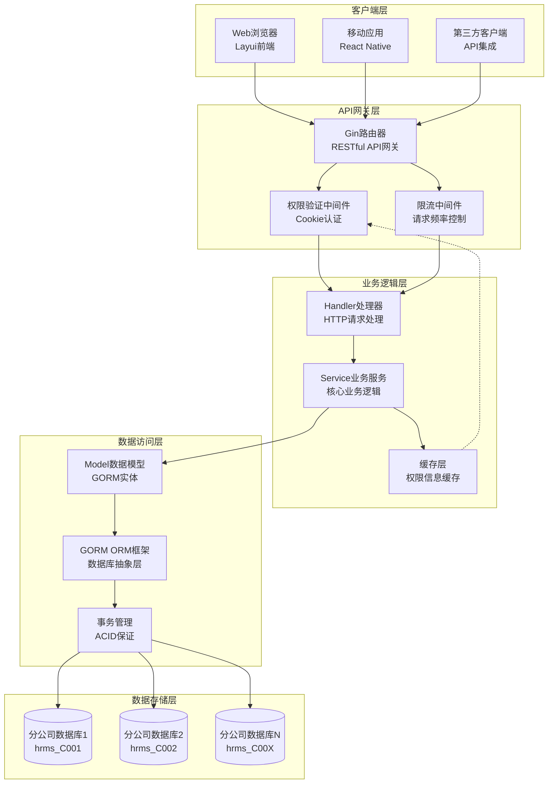
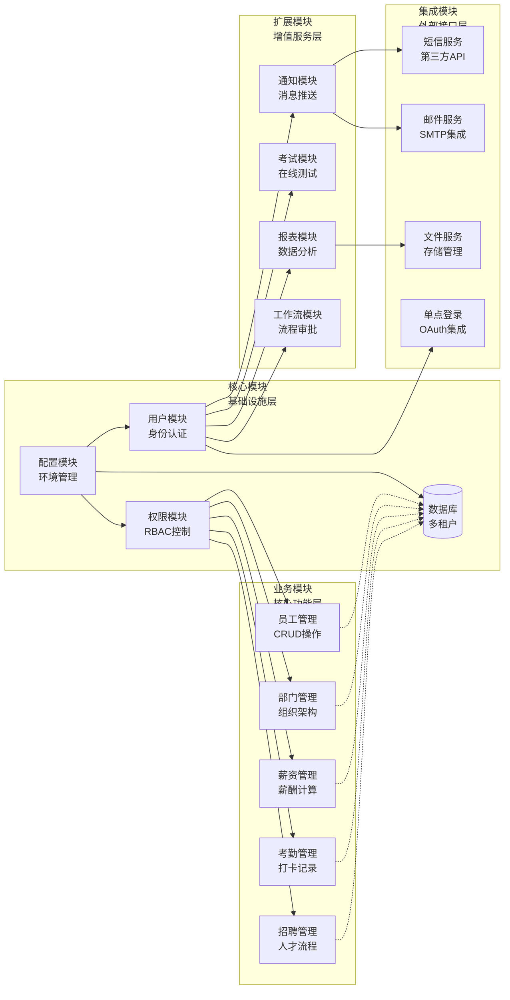
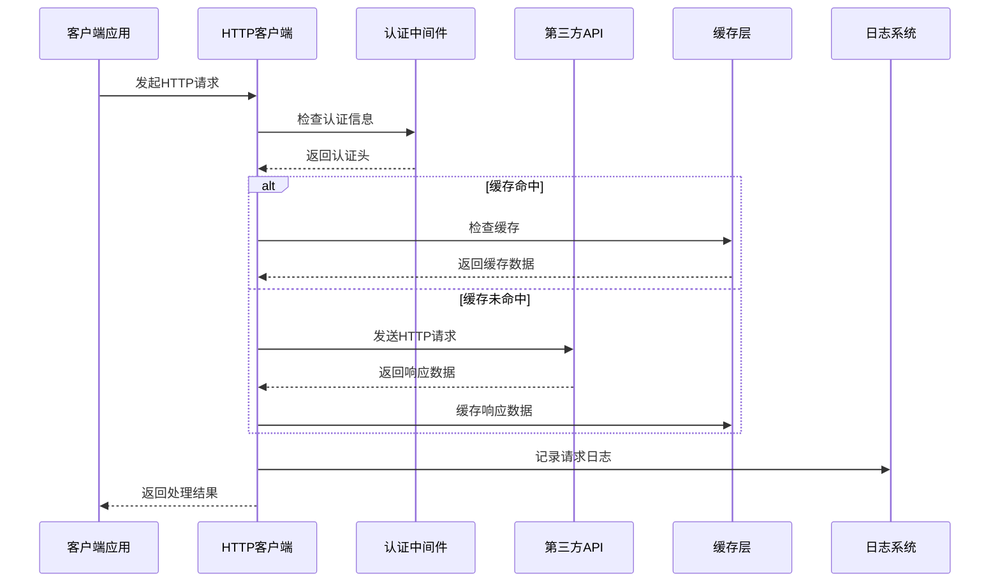
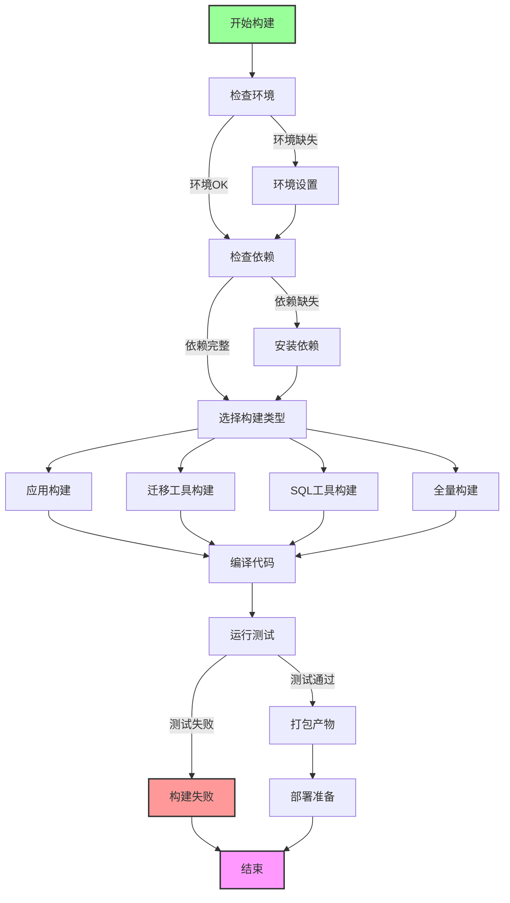
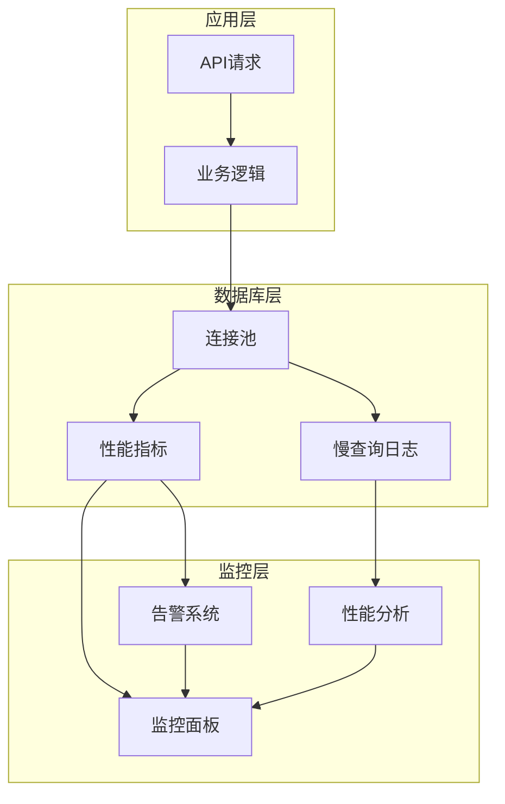
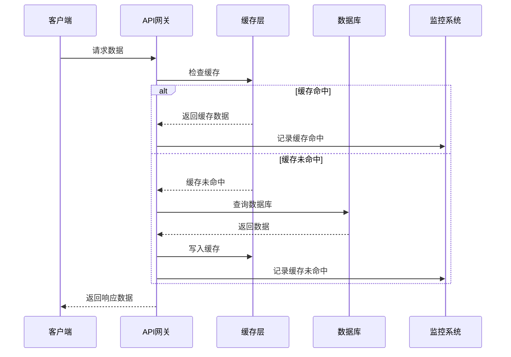
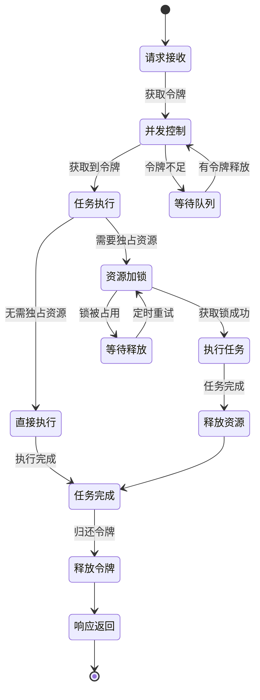
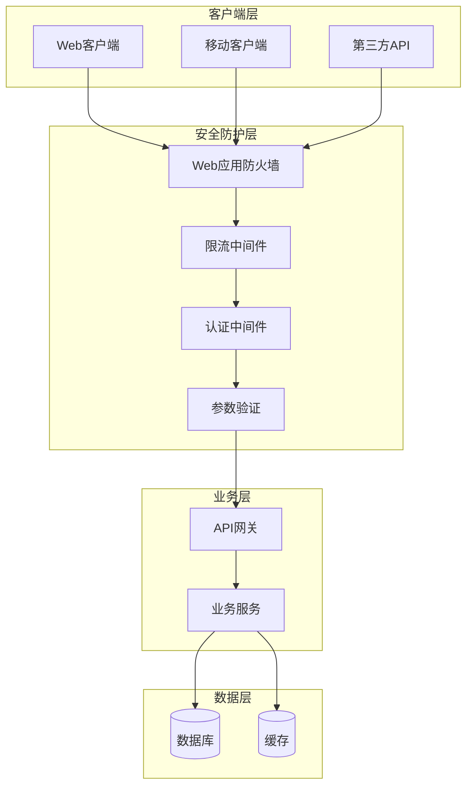

# 10、扩展与集成

<details>
<summary>相关源文件</summary>
main.go
handler/account.go
handler/authority.go
model/authority.go
service/authority.go
resource/resource.go
config/config-dev.yaml
handler/staff.go
model/staff.go
service/biz.go
sql/sqlite_init.sql
MIGRATION_GUIDE.md
go.mod
README.md
docs/sqlexec-usage.md
</details>

## 概述

HRMS系统采用分层架构设计，具备良好的扩展性和集成能力。系统基于Go语言开发，使用Gin框架作为HTTP服务器，GORM作为ORM框架，支持MySQL和SQLite数据库。系统设计遵循RESTful API规范，提供了完整的权限控制机制和多分公司数据隔离功能，为系统集成和二次开发提供了坚实的技术基础。

## 系统架构

### 架构概述

HRMS系统采用经典的三层架构模式：表现层（Handler）、业务逻辑层（Service）和数据访问层（Model），通过依赖注入和接口抽象实现了松耦合设计。系统支持多数据库实例，通过分公司ID进行数据隔离，实现了企业级的多租户架构。



### 核心架构特点

1. **多数据库架构**：系统通过`DbMapper`映射表管理多个分公司数据库，实现数据隔离
2. **基于Cookie的认证**：使用格式为`角色_工号_分公司ID_员工姓名(base64编码)`的Cookie进行身份验证
3. **动态权限控制**：通过`AuthorityDetail`表实现细粒度的功能权限控制
4. **配置驱动**：通过YAML配置文件支持多环境部署（dev/test/prod/self）

## 核心目录结构

```
hrms/
├─ cmd/                    # 命令行工具
│  ├─ createdb/           # 数据库创建工具
│  ├─ migrate/            # 数据库迁移工具
│  └─ sqlexec/            # SQL执行工具
├─ config/                # 配置文件
│  ├─ config-dev.yaml     # 开发环境配置
│  └─ config-prod.yaml    # 生产环境配置
├─ handler/               # HTTP处理器层
│  ├─ account.go          # 账户相关处理
│  ├─ authority.go        # 权限相关处理
│  └─ staff.go            # 员工相关处理
├─ model/                 # 数据模型层
│  ├─ authority.go        # 权限模型
│  └─ staff.go            # 员工模型
├─ resource/              # 资源和配置
│  └─ resource.go         # 全局资源和数据库映射
├─ service/               # 业务逻辑层
│  ├─ authority.go        # 权限业务逻辑
│  └─ biz.go              # 通用业务逻辑
├─ sql/                   # SQL脚本
│  └─ sqlite_init.sql     # SQLite初始化脚本
├─ static/                # 静态资源
└─ views/                 # 前端视图
├─ main.go                # 应用入口
├─ go.mod                 # Go模块定义
└─ build.sh               # 构建脚本
```

## API接口设计

### RESTful API设计原则

HRMS系统严格遵循RESTful API设计规范，采用统一的URL命名规则和HTTP方法语义，确保API的一致性和可预测性。

#### API路由结构

系统采用分组路由设计，按业务模块划分API端点：

```go
// 账户相关
accountGroup := server.Group("/account")
accountGroup.POST("/login", handler.Login)
accountGroup.POST("/quit", handler.Quit)

// 部门相关
departGroup := server.Group("/depart")
departGroup.POST("/create", handler.DepartCreate)
departGroup.DELETE("/del/:dep_id", handler.DepartDel)
departGroup.POST("/edit", handler.DepartEdit)
departGroup.GET("/query/:dep_id", handler.DepartQuery)

// 权限相关
authorityGroup := server.Group("/authority")
authorityGroup.POST("/create", handler.AddAuthorityDetail)
authorityGroup.POST("/edit", handler.UpdateAuthorityDetailById)
authorityGroup.GET("/query_by_user_type/:user_type", handler.GetAuthorityDetailListByUserType)
```

#### HTTP方法使用规范

- **GET**：用于查询资源，支持分页参数`page`和`limit`
- **POST**：用于创建资源，数据通过JSON请求体传递
- **PUT/POST**：用于更新资源，系统统一使用POST方法简化前端调用
- **DELETE**：用于删除资源，通过URL参数传递资源ID

#### 统一响应格式

所有API响应采用统一的JSON格式：

```json
{
  "status": 2000,         // 状态码：2000表示成功，其他值表示错误
  "result": "错误信息",    // 错误时的详细信息
  "msg": "返回数据",       // 成功时的数据内容
  "total": 100            // 分页查询时的总记录数
}
```

### API版本管理

当前系统采用URL路径版本控制策略，虽然当前版本为v1，但架构设计已为未来版本升级做好准备：

```go
// 未来版本扩展示例
v1 := server.Group("/api/v1")
v2 := server.Group("/api/v2")

// 版本中间件 - 实现向后兼容
func VersionMiddleware() gin.HandlerFunc {
    return func(c *gin.Context) {
        // 获取API版本
        version := c.Request.Header.Get("API-Version")
        if version == "" {
            version = "v1" // 默认版本
        }
        
        // 设置版本到上下文
        c.Set("api_version", version)
        c.Next()
    }
}

// 版本路由策略
func setupVersionedRoutes(server *gin.Engine) {
    // 使用版本中间件
    server.Use(VersionMiddleware())
    
    // v1 API - 保持向后兼容
    v1 := server.Group("/api/v1")
    setupV1Routes(v1)
    
    // v2 API - 新功能
    v2 := server.Group("/api/v2")
    setupV2Routes(v2)
    
    // 默认路由 - 重定向到最新版本
    server.Group("/api").GET("/", func(c *gin.Context) {
        c.Redirect(302, "/api/v2/")
    })
}
```

#### API版本兼容性策略

1. **向前兼容**：新版本API保持对旧版本的兼容性
2. **废弃通知**：通过HTTP头通知客户端API废弃信息
3. **渐进迁移**：提供迁移工具和文档，帮助客户端升级
4. **版本共存**：支持多版本API并存，逐步迁移

#### API版本控制最佳实践

1. **语义化版本**：遵循语义化版本控制规范（SemVer）
2. **变更分类**：区分破坏性变更和非破坏性变更
3. **文档维护**：为每个版本维护独立的API文档
4. **测试策略**：为每个版本建立独立的测试套件

### 错误处理机制

系统实现了完善的错误处理机制，包括：

1. **参数验证错误**：状态码5001，返回具体的参数错误信息
2. **权限验证错误**：状态码401，返回Unauthorized
3. **业务逻辑错误**：状态码5002，返回业务错误描述
4. **数据库操作错误**：状态码5000，返回数据库错误信息

### 权限验证API

系统提供专门的权限验证端点，用于动态检查用户权限：

```go
// 权限渲染端点
server.GET("/authority_render/:modelName", handler.RenderAuthority)
```

该端点根据用户角色和请求的模型名称，返回用户对该模型的操作权限（create|query|update|delete|excel_add）。

## 系统扩展性

### 模块化架构设计

HRMS系统采用模块化架构，各业务模块相对独立，便于扩展和维护：



### 数据库扩展机制

系统支持灵活的数据库扩展策略，采用多租户数据库架构实现数据隔离：

1. **多数据库支持**：通过`DbMapper`支持多个分公司数据库，时间复杂度为O(1)的哈希表查找
2. **数据库类型兼容**：同时支持MySQL和SQLite数据库，通过工厂模式实现数据库驱动切换
3. **自动迁移工具**：提供命令行工具支持数据库结构迁移，支持版本控制和回滚机制

```go
// 数据库映射表 - 使用哈希表实现O(1)时间复杂度的数据库查找
var DbMapper = make(map[string]*gorm.DB)

// 动态数据库连接 - 基于Cookie的分库路由策略
func HrmsDB(c *gin.Context) *gorm.DB {
    cookie, err := c.Cookie("user_cookie")
    if err != nil || cookie == "" {
        c.Abort()
        return nil
    }
    
    // Cookie解析：角色_工号_分公司ID_员工姓名(base64编码)
    parts := strings.Split(cookie, "_")
    if len(parts) < 3 {
        log.Printf("HrmsDB: cookie格式错误，期望格式为 'xxx_xxx_xxx'，实际为: %s", cookie)
        c.Abort()
        return nil
    }
    
    branchId := parts[2]
    dbName := fmt.Sprintf("hrms_%v", branchId)
    
    // O(1)时间复杂度的数据库查找
    if db, ok := DbMapper[dbName]; ok {
        return db
    }
    
    log.Printf("HrmsDB: 未找到分公司数据库 %s", dbName)
    c.Abort()
    return nil
}

// 数据库初始化过程 - 支持多种数据库类型的工厂模式
func InitGorm() error {
    dbType := strings.ToLower(resource.HrmsConf.Db.Type)
    if dbType == "" {
        dbType = "mysql" // 默认使用 MySQL
    }

    // 对每个分公司数据库进行连接 - O(n)时间复杂度，n为分公司数量
    dbNames := resource.HrmsConf.Db.DbName
    dbNameList := strings.Split(dbNames, ",")

    for index, dbName := range dbNameList {
        var db *gorm.DB
        var err error

        // 根据数据库类型选择不同的连接方式 - 策略模式
        switch dbType {
        case "sqlite":
            db, err = initSQLiteDB(dbName)
        default:
            db, err = initMySQLDB(dbName)
        }
        
        if err != nil {
            return err
        }

        // 添加到映射表
        resource.DbMapper[dbName] = db
        // 第一个是默认DB，用以启动程序选择分公司
        if index == 0 {
            resource.DefaultDb = db
        }
    }

    return nil
}
```

#### 数据库分片策略

系统采用基于分公司ID的水平分片策略，每个分公司对应独立的数据库实例：

1. **分片键**：使用分公司ID作为分片键，确保数据隔离
2. **路由算法**：基于Cookie中的分公司ID进行路由，时间复杂度为O(1)
3. **跨分片查询**：目前不支持跨分公司查询，符合业务需求
4. **分片扩展**：新增分公司只需在配置文件中添加数据库配置

#### 连接池优化

系统使用GORM内置的连接池机制，支持以下优化：

1. **最大连接数**：默认为100，可通过配置调整
2. **空闲连接数**：默认为10，可根据并发需求调整
3. **连接生命周期**：默认1小时，避免长连接问题
4. **连接健康检查**：定期检查连接有效性

### 配置扩展系统

系统采用基于Viper的配置管理，支持多环境配置和动态配置加载：

```yaml
# config-dev.yaml
gin:
  port: 8888
db:
  type: sqlite
  path: ./data
  dbName: hrms_C001
```

### 权限扩展机制

系统实现了灵活的基于角色的权限控制（RBAC），采用权限字符串模式实现细粒度权限控制：

1. **角色定义**：支持超级管理员(supersys)、系统管理员(sys)、普通员工(normal)
2. **权限粒度**：支持模型级别的权限控制（create|query|update|delete|excel_add）
3. **动态权限**：通过数据库配置权限，无需修改代码即可调整权限
4. **权限继承**：高级角色自动继承低级角色的所有权限
5. **权限缓存**：实现权限信息缓存机制，减少数据库查询

#### 权限验证算法

系统采用高效的权限验证算法，时间复杂度为O(1)：

```go
// 权限验证核心算法 - O(1)时间复杂度
func checkAuthority(userType, model, action string) bool {
    // 从权限表中获取用户权限
    authority, err := getAuthorityDetail(userType, model)
    if err != nil {
        return false
    }
    
    // 权限字符串解析 - 使用哈希表实现O(1)查找
    permissions := make(map[string]bool)
    for _, perm := range strings.Split(authority.AuthorityContent, "|") {
        permissions[perm] = true
    }
    
    // 权限检查 - O(1)时间复杂度
    return permissions[action]
}

// 权限渲染函数 - 动态生成前端权限控制
func RenderAuthority(c *gin.Context) {
    cookie, err := c.Cookie("user_cookie")
    if err != nil || cookie == "" {
        HTMLWithNoCache(c, http.StatusOK, "login.html", nil)
        return
    }
    
    modelName := c.Param("modelName")
    userType := strings.Split(cookie, "_")[0]
    
    // 获取用户权限 - O(1)时间复杂度
    autoContent, err := service.GetAuthorityDetailByUserTypeAndModel(c, &model.GetAuthorityDetailDTO{
        UserType: userType,
        Model:    modelName,
    })
    
    if err != nil {
        HTMLWithNoCache(c, http.StatusOK, "login.html", nil)
        return
    }
    
    // 权限字符串解析为布尔映射 - O(n)时间复杂度，n为权限数量
    autoMap := make(map[string]bool)
    autoList := strings.Split(autoContent, "|")
    for _, authority := range autoList {
        autoMap[authority] = true
    }
    
    // 返回权限映射给前端使用
    HTMLWithNoCache(c, http.StatusOK, modelName+".html", autoMap)
}
```

#### 权限数据结构

权限系统采用扁平化的字符串存储结构，便于扩展和维护：

```sql
-- 权限详情表结构
CREATE TABLE `authority_detail` (
    `id` INTEGER PRIMARY KEY AUTOINCREMENT,
    `user_type` varchar(32) NOT NULL,    -- 用户角色
    `model` varchar(32) NOT NULL,         -- 模型名称
    `authority_content` varchar(32) NOT NULL, -- 权限字符串
    `name` varchar(32) NOT NULL          -- 权限描述
);

-- 权限数据示例
INSERT INTO `authority_detail` VALUES
(NULL,'supersys','staff_manage','create|delete|update|query|excel_add','员工管理'),
(NULL,'sys','staff_manage','create|update|query','员工管理'),
(NULL,'normal','staff_manage','query|update','员工管理');
```

#### 权限扩展策略

系统支持多种权限扩展策略：

1. **横向扩展**：添加新的权限操作类型（如approve、export等）
2. **纵向扩展**：添加新的用户角色类型
3. **模块扩展**：为新业务模块添加权限配置
4. **条件权限**：基于业务条件的动态权限控制

#### 权限性能优化

1. **权限缓存**：使用内存缓存存储用户权限信息，减少数据库查询
2. **权限预计算**：系统启动时预计算所有角色的权限映射
3. **权限继承优化**：使用位图算法优化权限继承计算
4. **权限检查短路**：实现权限检查的短路逻辑，提高效率

## 第三方系统集成

### 短信服务集成

系统已集成第三方短信服务，用于发送通知和验证码：

```go
const SMS_URL = "https://api.apishop.net/communication/sms/send"

// 向指定手机号发放短信通知
func sendNoticeMsg(msgType string, phone int64, content []string) {
    if phone == 0 || phone != 15521306934 {
        // 给自己手机号发短信验证效果
        return
    }
    var templateID string
    switch msgType {
    case "notice":
        templateID = "10713"
    case "salary":
        templateID = "10714"
    }
    // 发送短信逻辑...
}
```

### 文件处理集成

系统集成了Excel文件处理功能，支持批量数据导入：

```go
// Excel导入功能
func ExcelExport(c *gin.Context) {
    file, err := c.FormFile("excel_staffs")
    if err != nil {
        log.Printf("ExcelExport err = %v", err)
        return
    }
    
    xfile, err := xlsx.OpenBinary(bytes)
    // 处理Excel文件逻辑...
}
```

### HTTP客户端集成

系统集成了第三方HTTP客户端库，便于与其他Web服务集成：

```go
import httpReq "github.com/kirinlabs/HttpRequest"

// HTTP请求示例
resp, err = httpReq.Post(SMS_URL, reqJSON)
```

#### HTTP客户端架构



#### HTTP客户端配置

```go
// HTTP客户端配置
type HTTPConfig struct {
    Timeout     time.Duration `json:"timeout"`      // 请求超时时间
    RetryCount  int          `json:"retry_count"`  // 重试次数
    RetryDelay  time.Duration `json:"retry_delay"`  // 重试间隔
    UserAgent   string       `json:"user_agent"`   // 用户代理
    Headers     map[string]string `json:"headers"`  // 默认请求头
}

// 创建HTTP客户端
func NewHTTPClient(config *HTTPConfig) *http.Client {
    client := &http.Client{
        Timeout: config.Timeout,
        Transport: &http.Transport{
            MaxIdleConns:        100,
            MaxIdleConnsPerHost: 10,
            IdleConnTimeout:     90 * time.Second,
        },
    }
    
    return client
}

// 请求包装器 - 添加重试和日志功能
func (c *HTTPClient) DoWithRetry(req *http.Request) (*http.Response, error) {
    var lastErr error
    
    for i := 0; i <= c.RetryCount; i++ {
        if i > 0 {
            time.Sleep(c.RetryDelay)
            log.Printf("HTTP请求重试 %d/%d: %s", i, c.RetryCount, req.URL.String())
        }
        
        resp, err := c.Do(req)
        if err == nil {
            return resp, nil
        }
        
        lastErr = err
        log.Printf("HTTP请求失败: %v", err)
    }
    
    return nil, lastErr
}
```

## 定制开发指南

### 开发环境搭建

1. **环境要求**：
   - Go 1.23.0+
   - MySQL 5.7+ 或 SQLite 3.0+
   - Git

2. **项目初始化**：
```bash
git clone <repository-url>
cd hrms
go mod tidy
```

3. **配置文件设置**：
```bash
# 复制并修改配置文件
cp config/config-dev.yaml.example config/config-dev.yaml
# 根据实际环境修改数据库连接信息
```

### 二次开发规范

#### 1. 新增业务模块

开发新的业务模块需要遵循以下步骤，系统采用分层架构和依赖注入模式：

1. **创建数据模型**（在`model/`目录下）：
```go
type NewModule struct {
    gorm.Model
    ModuleId   string `gorm:"column:module_id;uniqueIndex" json:"module_id"`
    ModuleName string `gorm:"column:module_name;size:100;not null" json:"module_name"`
    Status     int    `gorm:"column:status;default:1" json:"status"`
    CreatedBy  string `gorm:"column:created_by" json:"created_by"`
    // 其他字段...
    
    // 关联关系
    Creator    *Staff  `gorm:"foreignKey:CreatedBy;references:StaffId" json:"creator,omitempty"`
}

// 数据传输对象 - 用于API数据交换
type NewModuleDTO struct {
    ModuleId   string `json:"module_id" binding:"required"`
    ModuleName string `json:"module_name" binding:"required,max=100"`
    Status     int    `json:"status"`
}

// 查询DTO - 支持复杂查询条件
type NewModuleQueryDTO struct {
    ModuleName string `json:"module_name"`
    Status     *int   `json:"status"`
    Page       int    `json:"page" binding:"min=1"`
    Limit      int    `json:"limit" binding:"min=1,max=100"`
}

func (n NewModule) TableName() string {
    return "new_module"
}

// 业务逻辑方法 - 封装复杂业务规则
func (n *NewModule) IsActive() bool {
    return n.Status == 1
}

func (n *NewModule) CanEdit(userId string) bool {
    return n.CreatedBy == userId || n.Status == 1
}
```

2. **创建业务逻辑**（在`service/`目录下）：
```go
// 服务接口定义 - 支持依赖注入和单元测试
type NewModuleService interface {
    Create(c *gin.Context, dto *model.NewModuleDTO) (*model.NewModule, error)
    Update(c *gin.Context, id uint, dto *model.NewModuleDTO) (*model.NewModule, error)
    Delete(c *gin.Context, id uint) error
    Query(c *gin.Context, dto *model.NewModuleQueryDTO) ([]*model.NewModule, int64, error)
    GetById(c *gin.Context, id uint) (*model.NewModule, error)
}

// 服务实现 - 包含复杂业务逻辑
type newModuleService struct{}

func NewNewModuleService() NewModuleService {
    return &newModuleService{}
}

func (s *newModuleService) Create(c *gin.Context, dto *model.NewModuleDTO) (*model.NewModule, error) {
    // 参数验证
    if err := validateNewModuleDTO(dto); err != nil {
        return nil, fmt.Errorf("参数验证失败: %w", err)
    }
    
    // 获取数据库连接
    db := resource.HrmsDB(c)
    if db == nil {
        return nil, resource.ErrUnauthorized
    }
    
    // 业务逻辑：检查模块ID唯一性
    var existingModule model.NewModule
    if err := db.Where("module_id = ?", dto.ModuleId).First(&existingModule).Error; err == nil {
        return nil, fmt.Errorf("模块ID %s 已存在", dto.ModuleId)
    }
    
    // 创建模块实例
    module := model.NewModule{
        ModuleId:   dto.ModuleId,
        ModuleName: dto.ModuleName,
        Status:     1, // 默认激活状态
        CreatedBy:  getCurrentUserId(c), // 从上下文获取当前用户ID
    }
    
    // 数据库事务处理
    err := db.Transaction(func(tx *gorm.DB) error {
        // 创建主记录
        if err := tx.Create(&module).Error; err != nil {
            return err
        }
        
        // 创建审计日志
        auditLog := model.AuditLog{
            Action:     "CREATE",
            TableName:  "new_module",
            RecordId:   module.ID,
            UserId:     getCurrentUserId(c),
            CreatedAt:  time.Now(),
        }
        if err := tx.Create(&auditLog).Error; err != nil {
            return err
        }
        
        return nil
    })
    
    if err != nil {
        return nil, fmt.Errorf("创建模块失败: %w", err)
    }
    
    return &module, nil
}

// 复杂查询实现 - 支持多条件查询和分页
func (s *newModuleService) Query(c *gin.Context, dto *model.NewModuleQueryDTO) ([]*model.NewModule, int64, error) {
    db := resource.HrmsDB(c)
    if db == nil {
        return nil, 0, resource.ErrUnauthorized
    }
    
    // 构建查询条件
    query := db.Model(&model.NewModule{})
    
    if dto.ModuleName != "" {
        query = query.Where("module_name LIKE ?", "%"+dto.ModuleName+"%")
    }
    
    if dto.Status != nil {
        query = query.Where("status = ?", *dto.Status)
    }
    
    // 获取总数
    var total int64
    if err := query.Count(&total).Error; err != nil {
        return nil, 0, err
    }
    
    // 分页查询
    var modules []*model.NewModule
    offset := (dto.Page - 1) * dto.Limit
    
    if err := query.Preload("Creator").Offset(offset).Limit(dto.Limit).Find(&modules).Error; err != nil {
        return nil, 0, err
    }
    
    return modules, total, nil
}
```

3. **创建HTTP处理器**（在`handler/`目录下）：
```go
// 处理器结构体 - 支持依赖注入
type NewModuleHandler struct {
    service service.NewModuleService
}

func NewNewModuleHandler(service service.NewModuleService) *NewModuleHandler {
    return &NewModuleHandler{service: service}
}

// 创建模块处理器 - 包含完整的错误处理和参数验证
func (h *NewModuleHandler) Create(c *gin.Context) {
    var dto model.NewModuleDTO
    
    // 参数绑定和验证
    if err := c.ShouldBindJSON(&dto); err != nil {
        log.Printf("[NewModuleHandler.Create] 参数绑定失败: %v", err)
        c.JSON(http.StatusBadRequest, gin.H{
            "status": 5001,
            "msg":    "参数格式错误: " + err.Error(),
        })
        return
    }
    
    // 业务逻辑调用
    module, err := h.service.Create(c, &dto)
    if err != nil {
        log.Printf("[NewModuleHandler.Create] 创建失败: %v", err)
        
        // 根据错误类型返回不同的状态码
        if errors.Is(err, resource.ErrUnauthorized) {
            c.JSON(http.StatusUnauthorized, gin.H{
                "status": 401,
                "msg":    "未授权访问",
            })
        } else {
            c.JSON(http.StatusInternalServerError, gin.H{
                "status": 5002,
                "msg":    err.Error(),
            })
        }
        return
    }
    
    // 成功响应
    c.JSON(http.StatusOK, gin.H{
        "status": 2000,
        "msg":    module,
    })
}

// 查询模块处理器 - 支持复杂查询条件
func (h *NewModuleHandler) Query(c *gin.Context) {
    var dto model.NewModuleQueryDTO
    
    // 参数绑定
    if err := c.ShouldBindQuery(&dto); err != nil {
        c.JSON(http.StatusBadRequest, gin.H{
            "status": 5001,
            "msg":    "参数错误: " + err.Error(),
        })
        return
    }
    
    // 设置默认值
    if dto.Page == 0 {
        dto.Page = 1
    }
    if dto.Limit == 0 {
        dto.Limit = 10
    }
    
    // 业务逻辑调用
    modules, total, err := h.service.Query(c, &dto)
    if err != nil {
        c.JSON(http.StatusInternalServerError, gin.H{
            "status": 5002,
            "msg":    err.Error(),
        })
        return
    }
    
    // 成功响应
    c.JSON(http.StatusOK, gin.H{
        "status": 2000,
        "msg":    modules,
        "total":  total,
    })
}
```

4. **注册路由**（在`main.go`的`routerInit`函数中）：
```go
// 创建服务实例
newModuleService := service.NewNewModuleService()
newModuleHandler := handler.NewNewModuleHandler(newModuleService)

// 注册路由
newModuleGroup := server.Group("/new_module")
{
    newModuleGroup.POST("/create", newModuleHandler.Create)
    newModuleGroup.GET("/query", newModuleHandler.Query)
    newModuleGroup.GET("/:id", newModuleHandler.GetById)
    newModuleGroup.PUT("/:id", newModuleHandler.Update)
    newModuleGroup.DELETE("/:id", newModuleHandler.Delete)
}
```

#### 2. 数据库迁移

新增数据表后，需要更新数据库迁移工具：

1. 在`cmd/migrate/main.go`的`getModels()`函数中添加新模型：
```go
func getModels() []interface{} {
    return []interface{}{
        &model.Authority{},
        &model.Staff{},
        &model.NewModule{}, // 新增模型
        // 其他模型...
    }
}
```

2. 重新构建并运行迁移工具：
```bash
bash build.sh build-migrate
bash build.sh migrate
```

#### 3. 权限配置

为新模块添加权限配置：

1. 在`authority_detail`表中插入权限记录：
```sql
INSERT INTO authority_detail VALUES 
(NULL,'supersys','new_module_manage','create|delete|update|query','新模块管理'),
(NULL,'sys','new_module_manage','create|delete|update|query','新模块管理'),
(NULL,'normal','new_module_manage','query','新模块管理');
```

2. 在前端页面中添加权限控制：
```html
<div class="layui-btn-group" id="new_module_manage">
    <button class="layui-btn layui-btn-sm" lay-event="add">添加</button>
    <button class="layui-btn layui-btn-sm" lay-event="edit">编辑</button>
    <button class="layui-btn layui-btn-sm" lay-event="del">删除</button>
</div>
```

### 自定义功能实现

#### 1. 自定义中间件

系统支持自定义中间件，可用于实现横切关注点：

```go
// 自定义日志中间件
func LoggerMiddleware() gin.HandlerFunc {
    return func(c *gin.Context) {
        start := time.Now()
        c.Next()
        
        duration := time.Since(start)
        log.Printf("[%s] %s %s %v",
            c.Request.Method,
            c.Request.URL.Path,
            c.ClientIP(),
            duration,
        )
    }
}

// 在main.go中使用
server.Use(LoggerMiddleware())
```

#### 2. 自定义验证器

系统支持自定义参数验证器：

```go
// 自定义验证函数
func ValidateStaff(fl validator.FieldLevel) bool {
    staffId := fl.Field().String()
    // 自定义验证逻辑
    return len(staffId) >= 6 && len(staffId) <= 10
}

// 在模型中使用
type StaffCreateDTO struct {
    StaffId string `json:"staff_id" binding:"required,custom_staff"`
}
```

#### 3. 自定义错误处理

系统支持自定义错误处理逻辑：

```go
// 自定义错误处理中间件
func ErrorHandlerMiddleware() gin.HandlerFunc {
    return func(c *gin.Context) {
        c.Next()
        
        // 处理错误
        if len(c.Errors) > 0 {
            err := c.Errors.Last()
            log.Printf("Error: %v", err)
            
            c.JSON(http.StatusInternalServerError, gin.H{
                "status": 5000,
                "msg":    "内部服务器错误",
            })
        }
    }
}
```

### 系统集成最佳实践

#### 1. API集成

系统提供了标准的RESTful API，便于第三方系统集成：

```javascript
// 前端API调用示例
async function createStaff(staffData) {
    const response = await fetch('/staff/create', {
        method: 'POST',
        headers: {
            'Content-Type': 'application/json',
        },
        body: JSON.stringify(staffData),
    });
    
    const result = await response.json();
    if (result.status === 2000) {
        console.log('创建成功');
    } else {
        console.error('创建失败:', result.msg);
    }
}
```

#### 2. 数据同步集成

系统支持通过API进行数据同步：

```go
// 数据同步服务
func SyncStaffData(sourceDB, targetDB *gorm.DB) error {
    var staffs []model.Staff
    if err := sourceDB.Find(&staffs).Error; err != nil {
        return err
    }
    
    for _, staff := range staffs {
        var existingStaff model.Staff
        result := targetDB.Where("staff_id = ?", staff.StaffId).First(&existingStaff)
        if result.Error != nil {
            // 不存在则创建
            if err := targetDB.Create(&staff).Error; err != nil {
                return err
            }
        } else {
            // 存在则更新
            if err := targetDB.Model(&existingStaff).Updates(&staff).Error; err != nil {
                return err
            }
        }
    }
    
    return nil
}
```

#### 3. 单点登录集成

系统支持与第三方单点登录系统集成：

```go
// SSO集成示例
func SSOLogin(c *gin.Context) {
    token := c.Query("token")
    
    // 验证SSO token
    userInfo, err := verifySSOToken(token)
    if err != nil {
        c.JSON(http.StatusUnauthorized, gin.H{
            "status": 401,
            "msg":    "无效的SSO token",
        })
        return
    }
    
    // 创建本地会话
    session := createLocalSession(userInfo)
    
    c.JSON(http.StatusOK, gin.H{
        "status": 2000,
        "data":   session,
    })
}
```

## 扩展开发工具

### 数据库迁移工具

系统提供了完整的数据库迁移工具，支持：

1. **自动迁移**：`bash build.sh migrate`
2. **指定数据库迁移**：`bash build.sh migrate-db hrms_C001`
3. **数据库重置**：`bash build.sh migrate-reset`
4. **环境配置**：通过`HRMS_ENV`环境变量控制

详细使用方法请参考`MIGRATION_GUIDE.md`文件。

### SQL执行工具

系统提供了命令行SQL执行工具，支持：

1. **单条SQL执行**：`go run cmd/sqlexec/main.go -db hrms_C001 -sql "SELECT * FROM staff"`
2. **批量SQL执行**：`go run cmd/sqlexec/main.go -db hrms_C001 -file ./sql/queries.sql`
3. **多环境支持**：通过`HRMS_ENV`环境变量控制

详细使用方法请参考`docs/sqlexec-usage.md`文件。

### 构建脚本

系统提供了统一的构建脚本`build.sh`，支持多种构建模式：

1. **应用构建**：`bash build.sh build`
2. **迁移工具构建**：`bash build.sh build-migrate`
3. **SQL工具构建**：`bash build.sh build-sqlexec`
4. **帮助信息**：`bash build.sh help`

#### 构建流程架构



#### 构建脚本实现示例

```bash
#!/bin/bash

# 构建配置
APP_NAME="hrms"
VERSION=$(git describe --tags --always --dirty)
BUILD_TIME=$(date +%Y%m%d_%H%M%S)
LDFLAGS="-X main.Version=${VERSION} -X main.BuildTime=${BUILD_TIME}"

# 环境检查
check_environment() {
    echo "检查构建环境..."
    
    # 检查Go版本
    if ! command -v go &> /dev/null; then
        echo "错误: 未找到Go环境"
        exit 1
    fi
    
    # 检查依赖
    if [ ! -f "go.mod" ]; then
        echo "错误: 未找到go.mod文件"
        exit 1
    fi
    
    echo "环境检查完成"
}

# 依赖安装
install_dependencies() {
    echo "安装项目依赖..."
    go mod download
    go mod tidy
    echo "依赖安装完成"
}

# 应用构建
build_app() {
    echo "构建应用..."
    mkdir -p bin
    
    # 构建主应用
    go build -ldflags "${LDFLAGS}" -o bin/${APP_NAME} main.go
    
    # 构建各工具
    go build -ldflags "${LDFLAGS}" -o bin/migrate cmd/migrate/main.go
    go build -ldflags "${LDFLAGS}" -o bin/sqlexec cmd/sqlexec/main.go
    
    echo "应用构建完成"
}

# 测试运行
run_tests() {
    echo "运行测试..."
    go test -v ./...
    
    if [ $? -eq 0 ]; then
        echo "测试通过"
        return 0
    else
        echo "测试失败"
        return 1
    fi
}

# 主构建流程
main() {
    local command=${1:-"build"}
    
    case $command in
        "build")
            check_environment
            install_dependencies
            if run_tests; then
                build_app
            fi
            ;;
        "build-migrate")
            check_environment
            go build -ldflags "${LDFLAGS}" -o bin/migrate cmd/migrate/main.go
            ;;
        "build-sqlexec")
            check_environment
            go build -ldflags "${LDFLAGS}" -o bin/sqlexec cmd/sqlexec/main.go
            ;;
        "test")
            run_tests
            ;;
        "clean")
            rm -rf bin/
            echo "清理完成"
            ;;
        "help")
            echo "使用方法: $0 [命令]"
            echo "命令:"
            echo "  build         构建应用和工具"
            echo "  build-migrate 构建迁移工具"
            echo "  build-sqlexec 构建SQL工具"
            echo "  test          运行测试"
            echo "  clean         清理构建产物"
            echo "  help          显示帮助信息"
            ;;
        *)
            echo "未知命令: $command"
            echo "使用 '$0 help' 查看帮助信息"
            exit 1
            ;;
    esac
}

main "$@"
```

## 性能优化建议

### 1. 数据库优化

1. **索引优化**：为常用查询字段添加索引
2. **连接池配置**：合理配置数据库连接池大小
3. **查询优化**：避免N+1查询问题，使用预加载

#### 数据库性能监控架构



### 2. 缓存策略

1. **权限缓存**：缓存用户权限信息，减少数据库查询
2. **配置缓存**：缓存系统配置信息
3. **会话缓存**：使用Redis等缓存用户会话信息

#### 缓存架构设计



### 3. 并发处理

1. **并发控制**：使用协程池控制并发数量
2. **资源锁**：对关键资源加锁，避免并发冲突
3. **异步处理**：对耗时操作采用异步处理

#### 并发处理架构



## 安全扩展

### 1. API安全

1. **HTTPS**：生产环境强制使用HTTPS
2. **API限流**：实现API调用频率限制
3. **输入验证**：严格验证所有输入参数

#### API安全架构



### 2. 数据安全

1. **数据加密**：敏感数据加密存储
2. **访问控制**：细粒度的数据访问控制
3. **审计日志**：记录关键操作的审计日志

#### 数据安全实现示例

```go
// 数据加密服务
type EncryptionService interface {
    Encrypt(plaintext string) (string, error)
    Decrypt(ciphertext string) (string, error)
}

// 审计日志服务
type AuditService interface {
    LogAction(userId, action, resource string, details map[string]interface{}) error
}

// 数据访问控制
type DataAccessControl struct {
    encryptionService EncryptionService
    auditService     AuditService
}

func (dac *DataAccessControl) SaveSensitiveData(data *SensitiveData) error {
    // 数据加密
    encryptedData, err := dac.encryptionService.Encrypt(data.Value)
    if err != nil {
        return err
    }
    
    // 保存加密数据
    data.Value = encryptedData
    if err := db.Create(data).Error; err != nil {
        return err
    }
    
    // 记录审计日志
    return dac.auditService.LogAction(
        getCurrentUserId(),
        "CREATE",
        "sensitive_data",
        map[string]interface{}{
            "data_id": data.ID,
            "action":  "create_sensitive_data",
        },
    )
}
```

### 3. 身份认证扩展

1. **OAuth2集成**：支持第三方OAuth2登录
2. **多因素认证**：支持短信、邮箱等多因素认证
3. **JWT支持**：支持JWT token认证

#### OAuth2集成实现

```go
// OAuth2配置
type OAuth2Config struct {
    ClientID     string `json:"client_id"`
    ClientSecret string `json:"client_secret"`
    RedirectURL  string `json:"redirect_url"`
    AuthURL      string `json:"auth_url"`
    TokenURL     string `json:"token_url"`
    UserInfoURL  string `json:"user_info_url"`
}

// OAuth2服务
type OAuth2Service struct {
    config OAuth2Config
    client *http.Client
}

func (s *OAuth2Service) GetAuthURL(state string) string {
    params := url.Values{}
    params.Set("client_id", s.config.ClientID)
    params.Set("redirect_uri", s.config.RedirectURL)
    params.Set("response_type", "code")
    params.Set("scope", "read:user")
    params.Set("state", state)
    
    return fmt.Sprintf("%s?%s", s.config.AuthURL, params.Encode())
}

func (s *OAuth2Service) ExchangeCodeForToken(code string) (*OAuth2Token, error) {
    data := url.Values{}
    data.Set("client_id", s.config.ClientID)
    data.Set("client_secret", s.config.ClientSecret)
    data.Set("code", code)
    data.Set("grant_type", "authorization_code")
    data.Set("redirect_uri", s.config.RedirectURL)
    
    resp, err := s.client.PostForm(s.config.TokenURL, data)
    if err != nil {
        return nil, err
    }
    defer resp.Body.Close()
    
    var token OAuth2Token
    if err := json.NewDecoder(resp.Body).Decode(&token); err != nil {
        return nil, err
    }
    
    return &token, nil
}

// OAuth2登录处理器
func OAuth2Login(c *gin.Context) {
    state := generateRandomState()
    c.SetCookie("oauth_state", state, 3600, "/", "", false, true)
    
    authURL := oauth2Service.GetAuthURL(state)
    c.Redirect(http.StatusFound, authURL)
}

func OAuth2Callback(c *gin.Context) {
    code := c.Query("code")
    state := c.Query("state")
    
    cookieState, err := c.Cookie("oauth_state")
    if err != nil || state != cookieState {
        c.JSON(http.StatusBadRequest, gin.H{"error": "Invalid state"})
        return
    }
    
    token, err := oauth2Service.ExchangeCodeForToken(code)
    if err != nil {
        c.JSON(http.StatusInternalServerError, gin.H{"error": "Failed to exchange code"})
        return
    }
    
    userInfo, err := oauth2Service.GetUserInfo(token.AccessToken)
    if err != nil {
        c.JSON(http.StatusInternalServerError, gin.H{"error": "Failed to get user info"})
        return
    }
    
    // 创建或更新用户信息
    user, err := createOrUpdateUser(userInfo)
    if err != nil {
        c.JSON(http.StatusInternalServerError, gin.H{"error": "Failed to create user"})
        return
    }
    
    // 生成会话
    session := createSession(user)
    c.JSON(http.StatusOK, gin.H{"token": session.Token})
}
```

## 扩展与集成最佳实践

### 1. 开发规范

1. **代码规范**：遵循Go语言官方编码规范
2. **文档规范**：为所有公共接口编写文档
3. **测试规范**：单元测试覆盖率不低于80%
4. **版本控制**：使用语义化版本控制

### 2. 部署规范

1. **环境隔离**：开发、测试、生产环境严格隔离
2. **配置管理**：使用配置文件管理不同环境参数
3. **监控告警**：建立完善的监控和告警机制
4. **备份策略**：制定定期数据备份和恢复策略

### 3. 运维规范

1. **日志管理**：统一日志格式和收集策略
2. **性能监控**：关键指标实时监控
3. **安全审计**：定期安全漏洞扫描和修复
4. **容量规划**：根据业务增长进行容量规划

## 扩展与集成案例

### 案例1：OA系统集成

**需求**：将HRMS系统与现有OA系统进行集成，实现统一身份认证和数据同步。

**解决方案**：
1. **单点登录**：通过OAuth2实现OA系统的单点登录
2. **数据同步**：定期同步员工信息和组织架构
3. **流程集成**：将HR审批流程集成到OA工作流

**实现步骤**：
```go
// 1. 配置OAuth2客户端
oauth2Config := OAuth2Config{
    ClientID:     "hrms_client",
    ClientSecret: "client_secret",
    RedirectURL:  "https://hrms.company.com/oauth/callback",
    AuthURL:      "https://oa.company.com/oauth/authorize",
    TokenURL:     "https://oa.company.com/oauth/token",
}

// 2. 实现数据同步服务
type OASyncService struct {
    hrmsDB    *gorm.DB
    oaClient   *http.Client
    lastSync   time.Time
}

func (s *OASyncService) SyncEmployees() error {
    // 获取OA系统员工数据
    oaEmployees, err := s.getOAEmployees()
    if err != nil {
        return err
    }
    
    // 同步到HRMS系统
    for _, oaEmp := range oaEmployees {
        var hrmsEmp model.Staff
        result := s.hrmsDB.Where("staff_id = ?", oaEmp.ID).First(&hrmsEmp)
        
        if result.Error != nil {
            // 创建新员工
            hrmsEmp = model.Staff{
                StaffId:   oaEmp.ID,
                StaffName: oaEmp.Name,
                Email:     oaEmp.Email,
                Phone:     oaEmp.Phone,
                // 其他字段...
            }
            s.hrmsDB.Create(&hrmsEmp)
        } else {
            // 更新现有员工
            s.hrmsDB.Model(&hrmsEmp).Updates(map[string]interface{}{
                "staff_name": oaEmp.Name,
                "email":      oaEmp.Email,
                "phone":      oaEmp.Phone,
                "updated_at": time.Now(),
            })
        }
    }
    
    s.lastSync = time.Now()
    return nil
}

// 3. 实现定时同步
func StartSyncScheduler() {
    scheduler := cron.New()
    scheduler.AddFunc("0 2 * * *", func() {
        log.Println("开始执行OA系统数据同步")
        if err := oaSyncService.SyncEmployees(); err != nil {
            log.Printf("数据同步失败: %v", err)
        }
    })
    scheduler.Start()
}
```

### 案例2：财务系统集成

**需求**：将HRMS薪资模块与财务系统集成，实现薪资数据自动传递和凭证生成。

**解决方案**：
1. **API接口**：提供薪资数据查询接口
2. **数据格式**：采用标准JSON格式交换数据
3. **安全认证**：使用API密钥进行身份验证

**实现示例**：
```go
// 薪资数据API
func GetSalaryDataForFinance(c *gin.Context) {
    // 验证API密钥
    apiKey := c.GetHeader("X-API-Key")
    if !validateAPIKey(apiKey) {
        c.JSON(http.StatusUnauthorized, gin.H{"error": "Invalid API key"})
        return
    }
    
    // 获取查询参数
    month := c.Query("month")
    department := c.Query("department")
    
    // 构建查询条件
    db := resource.HrmsDB(c)
    query := db.Model(&model.SalaryRecord{}).Where("is_pay = ?", 1)
    
    if month != "" {
        query = query.Where("salary_date = ?", month)
    }
    
    if department != "" {
        query = query.Joins("JOIN staff ON salary_record.staff_id = staff.staff_id").
            Where("staff.dep_id = ?", department)
    }
    
    var salaryRecords []model.SalaryRecord
    if err := query.Find(&salaryRecords).Error; err != nil {
        c.JSON(http.StatusInternalServerError, gin.H{"error": "Query failed"})
        return
    }
    
    // 转换为财务系统格式
    financeData := make([]FinanceSalaryData, 0, len(salaryRecords))
    for _, record := range salaryRecords {
        financeData = append(financeData, FinanceSalaryData{
            EmployeeID:     record.StaffId,
            EmployeeName:   record.StaffName,
            BaseSalary:     record.Base,
            Subsidy:        record.Subsidy,
            Bonus:          record.Bonus,
            TotalAmount:    record.Total,
            PaymentDate:     record.SalaryDate,
            Department:      getDepartmentName(record.StaffId),
        })
    }
    
    c.JSON(http.StatusOK, gin.H{
        "status": 2000,
        "data":   financeData,
        "total":  len(financeData),
    })
}

// 财务系统数据格式
type FinanceSalaryData struct {
    EmployeeID   string  `json:"employee_id"`
    EmployeeName string  `json:"employee_name"`
    BaseSalary   float64 `json:"base_salary"`
    Subsidy      float64 `json:"subsidy"`
    Bonus        float64 `json:"bonus"`
    TotalAmount  float64 `json:"total_amount"`
    PaymentDate  string  `json:"payment_date"`
    Department   string  `json:"department"`
}
```

HRMS系统的扩展与集成设计为企业级应用提供了强大的技术基础，通过标准化的API接口、模块化的架构设计和完善的开发工具，支持快速定制开发和第三方系统集成，满足不同企业的个性化需求。系统采用分层架构和依赖注入模式，确保了良好的可扩展性和可维护性，为企业数字化转型提供了坚实的技术支撑。