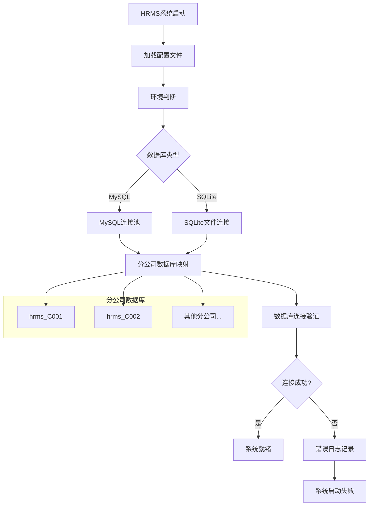
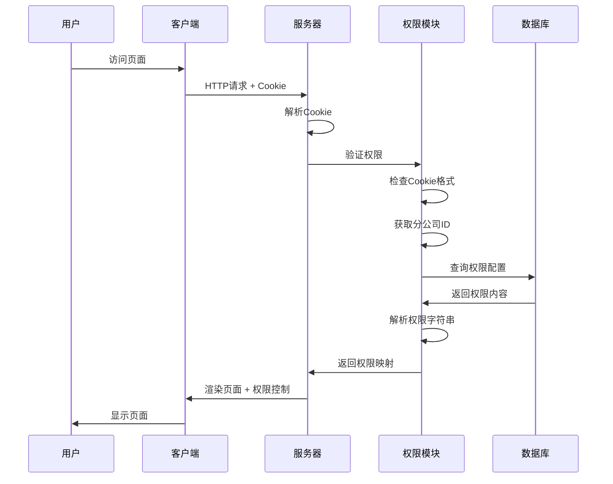
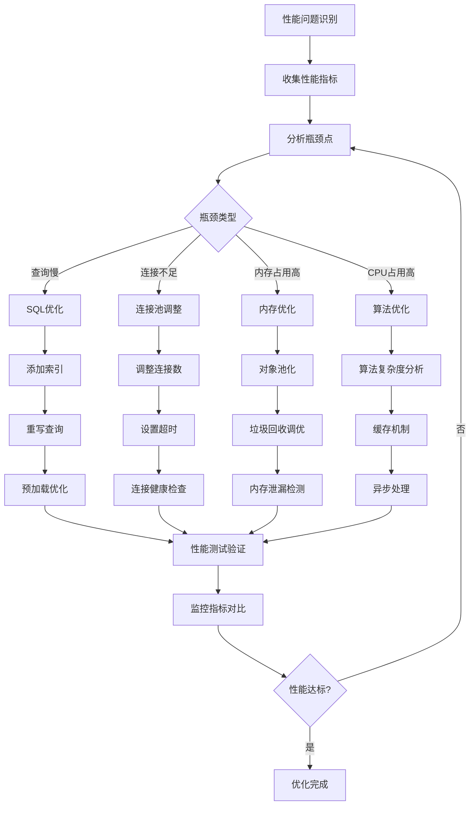
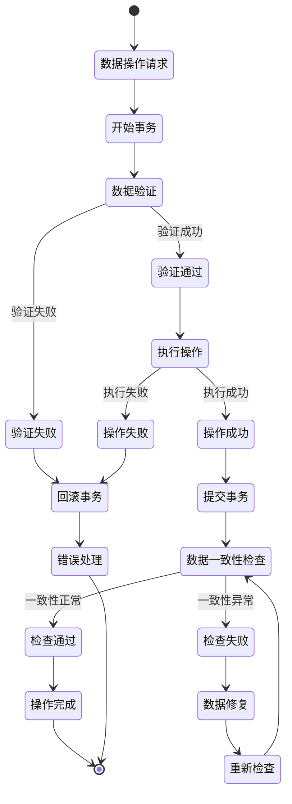
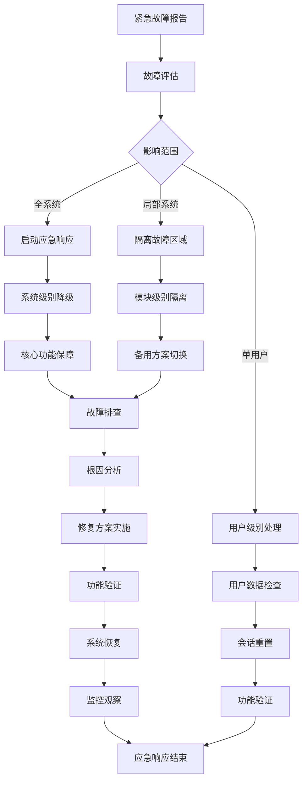

# 11、常见问题与解决方案

<details>
<summary>相关源文件</summary>
main.go
resource/resource.go
cmd/migrate/main.go
cmd/sqlexec/main.go
handler/account.go
handler/authority.go
service/biz.go
service/authority.go
model/authority.go
model/staff.go
</details>

## 概述

本文档总结了HRMS人力资源管理系统在使用和开发过程中的常见问题及其解决方案，提供了全面的故障排查指南和最佳实践建议。基于系统的架构设计和实际运行经验，本文档涵盖了安装部署、配置管理、性能优化、数据处理和故障排查等关键领域，帮助系统管理员和开发人员快速定位并解决各类技术问题。

## 安装部署问题

### 数据库连接失败

**问题描述**：系统启动时无法连接到数据库，导致服务无法正常启动。

**常见错误信息**：
```
连接数据库失败: dial tcp 127.0.0.1:3306: connect: connection refused
SQLite连接失败: unable to open database file
```

**解决方案**：
1. **MySQL连接问题深度分析**：
   - 检查MySQL服务状态：`systemctl status mysql` 或 `services.msc`（Windows）
   - 验证配置文件中的数据库连接参数（[`config/config-prod.yaml`](config/config-prod.yaml:4-8)）
   - 检查[`main.go`](main.go:278-285)中的DSN构建逻辑
   - 确认网络连接和防火墙设置
   - 检查数据库用户权限和密码加密方式
   - 验证字符集配置：`charset=utf8mb4&parseTime=True&loc=Local`

2. **SQLite连接问题深度分析**：
   - 确保数据目录存在且有写入权限：`./data/`
   - 检查[`main.go`](main.go:239-261)中的SQLite路径构建逻辑
   - 验证文件系统权限和磁盘空间
   - 确认外键约束启用：`_pragma=foreign_keys(1)`
   - 检查SQLite文件锁定问题

3. **多分公司数据库配置深度分析**：
   - 分析[`main.go`](main.go:228-307)中的数据库初始化流程
   - 验证[`resource/resource.go`](resource/resource.go:19-23)中的数据库映射机制
   - 检查数据库连接池配置和资源管理
   - 使用[`cmd/migrate/main.go`](cmd/migrate/main.go:256-261)进行连接测试
   - 监控数据库连接状态和健康检查

#### 数据库连接架构图



### 环境配置问题

**问题描述**：系统在不同环境中运行时出现配置加载失败或参数错误。

**解决方案**：
1. **环境变量设置**：
   - 正确设置`HRMS_ENV`环境变量（dev/test/prod/self）
   - 在[`main.go`](main.go:29-45)中验证环境判断逻辑
   - 确保对应的配置文件存在（config-dev.yaml等）

2. **配置文件格式**：
   - 检查YAML配置文件语法正确性
   - 验证配置项名称和值类型
   - 使用在线YAML验证工具检查格式

3. **端口冲突**：
   - 检查配置的端口是否被占用：`netstat -tlnp | grep :8888`
   - 修改配置文件中的端口号
   - 使用[`build.sh`](BUILD_SCRIPT_USAGE.md:67-68)脚本通过环境变量设置端口

### 依赖安装问题

**问题描述**：Go模块依赖缺失或版本冲突导致编译失败。

**解决方案**：
1. **依赖管理**：
   - 使用[`build.sh deps`](BUILD_SCRIPT_USAGE.md:32-34)命令下载依赖
   - 检查[`go.mod`](go.mod)和[`go.sum`](go.sum)文件完整性
   - 清理模块缓存：`go clean -modcache`

2. **版本兼容性**：
   - 检查Go版本兼容性（建议1.18+）
   - 更新GORM和相关驱动版本
   - 使用[`build.sh deps-update`](BUILD_SCRIPT_USAGE.md:34)更新依赖

3. **构建工具**：
   - 使用提供的构建脚本：[`bash build.sh build`](BUILD_SCRIPT_USAGE.md:17)
   - 检查编译环境配置
   - 查看详细错误日志定位问题

## 配置相关问题

### 权限配置错误

**问题描述**：用户无法访问特定功能或页面，出现权限拒绝错误。

**常见错误信息**：
```
Unauthorized
数据库连接为空，鉴权失败
无法获取到该分公司db名称
```

**解决方案**：
1. **Cookie格式验证深度分析**：
   - 检查[`resource/resource.go`](resource/resource.go:37-43)中的Cookie解析逻辑
   - 确保Cookie格式为：`角色_工号_分公司ID_员工姓名(base64编码)`
   - 验证[`handler/account.go`](handler/account.go:150-151)中的Cookie生成逻辑
   - 分析[`handler/account.go`](handler/account.go:31-34)中的Cookie解析过程
   - 检查Base64编码/解码的正确性
   - 验证Cookie安全设置：`c.SetCookie("user_cookie", ..., 0, "/", "*", false, false)`

2. **权限内容配置深度分析**：
   - 检查[`model/authority.go`](model/authority.go:15)中的权限内容格式
   - 分析[`handler/account.go`](handler/account.go:70-76)中的权限解析逻辑
   - 确保权限字符串包含所需操作：`create|query|update|delete|excel_add`
   - 验证[`service/authority.go`](service/authority.go:42-54)中的权限检查机制
   - 检查权限映射表的初始化和维护

3. **数据库连接映射深度分析**：
   - 分析[`resource/resource.go`](resource/resource.go:30-52)中的HrmsDB函数实现
   - 验证数据库映射表的正确性：`resource.DbMapper`
   - 检查[`main.go`](main.go:301-306)中的默认数据库设置
   - 分析分公司ID到数据库名称的转换逻辑：`fmt.Sprintf("hrms_%v", branchId)`
   - 验证数据库连接池的管理和复用机制

#### 权限验证流程图



### 分公司配置问题

**问题描述**：多分公司环境下数据隔离不正确或分公司切换失败。

**解决方案**：
1. **数据库隔离**：
   - 确保每个分公司使用独立的数据库实例
   - 验证数据库名称规则：`hrms_{分公司ID}`
   - 检查[`main.go`](main.go:301-306)中的默认数据库设置

2. **分公司切换**：
   - 验证登录时的分公司ID设置（[`handler/account.go`](handler/account.go:89)）
   - 检查Cookie中的分公司ID编码
   - 确保数据库映射表正确初始化

3. **配置文件设置**：
   - 在[`config-prod.yaml`](config/config-prod.yaml:8)中正确配置多个数据库
   - 使用逗号分隔的数据库名称
   - 确保所有数据库都已创建和迁移

### 系统参数配置

**问题描述**：系统运行参数设置不当导致功能异常或性能问题。

**解决方案**：
1. **GORM配置**：
   - 检查[`main.go`](main.go:262-269)中的GORM配置参数
   - 调整日志级别（logger.Info）适合生产环境
   - 确保外键约束启用：`_pragma=foreign_keys(1)`

2. **静态资源配置**：
   - 验证[`main.go`](main.go:196-218)中的静态资源路径设置
   - 检查缓存策略配置
   - 确保模板文件路径正确

3. **服务端口配置**：
   - 检查配置文件中的端口设置
   - 验证防火墙规则允许端口访问
   - 使用环境变量动态配置端口

## 性能问题排查

### 数据库性能问题

**问题描述**：数据库查询响应慢，系统整体性能下降。

**解决方案**：
1. **查询优化深度分析**：
   - 分析[`main.go`](main.go:262-269)中的GORM配置对性能的影响
   - 使用[`cmd/sqlexec/main.go`](cmd/sqlexec/main.go:147-245)执行EXPLAIN分析查询计划
   - 检查[`service/biz.go`](service/biz.go:98-117)中的关联查询效率
   - 分析多分公司数据库切换对性能的影响
   - 优化N+1查询问题，使用预加载机制
   - 监控慢查询日志，定位性能瓶颈

2. **连接池配置深度分析**：
   - 分析GORM默认连接池参数的适用性
   - 监控[`main.go`](main.go:228-307)中多数据库连接的资源使用
   - 调整连接池大小和超时参数
   - 实现连接池健康检查机制
   - 分析连接泄漏检测和回收策略

3. **数据分页深度分析**：
   - 检查[`service/biz.go`](service/biz.go:19-34)中分页逻辑的效率
   - 分析大数据集分页时的性能问题
   - 实现基于游标的分页机制
   - 优化COUNT查询的性能
   - 考虑分页缓存的实现策略

#### 性能优化流程图



### 内存使用问题

**问题描述**：系统内存占用过高，可能出现内存泄漏。

**解决方案**：
1. **内存监控**：
   - 使用系统工具监控内存使用情况
   - 分析内存增长趋势和模式
   - 设置内存使用告警阈值

2. **资源管理**：
   - 确保数据库连接及时关闭
   - 避免长时间持有大量对象引用
   - 实现对象池复用机制

3. **垃圾回收优化**：
   - 调整Go垃圾回收参数
   - 减少临时对象创建
   - 使用内存分析工具定位泄漏点

### 并发处理问题

**问题描述**：高并发场景下系统响应变慢或出现竞态条件。

**解决方案**：
1. **并发控制**：
   - 实现适当的锁机制
   - 使用通道进行goroutine间通信
   - 避免全局变量的并发访问

2. **请求限流**：
   - 实现API请求频率限制
   - 使用令牌桶或漏桶算法
   - 设置合理的并发连接数上限

3. **异步处理**：
   - 将耗时操作转为异步处理
   - 实现任务队列机制
   - 使用工作者模式处理并发请求

## 数据处理问题

### 数据一致性问题

**问题描述**：多表操作时数据不一致，出现外键约束错误。

**解决方案**：
1. **事务管理深度分析**：
   - 分析GORM事务在多分公司环境下的行为
   - 实现分布式事务处理机制
   - 检查[`service/authority.go`](service/authority.go:11-24)中的事务使用情况
   - 设计事务补偿机制处理失败场景
   - 监控事务执行时间和资源占用

2. **外键约束深度分析**：
   - 检查[`cmd/migrate/main.go`](cmd/migrate/main.go:110-112)中的外键约束配置
   - 分析[`main.go`](main.go:259-261)中的SQLite外键设置
   - 验证[`cmd/migrate/main.go`](cmd/migrate/main.go:191-196)中的反向删除策略
   - 处理循环依赖的外键关系
   - 实现级联操作的业务逻辑控制

3. **数据验证深度分析**：
   - 分析[`model/staff.go`](model/staff.go:37-55)中的数据验证标签
   - 检查[`handler/account.go`](handler/account.go:80-88)中的参数绑定验证
   - 实现跨表数据一致性检查
   - 设计数据修复和同步机制
   - 建立数据质量监控指标

#### 数据一致性保障机制



### 数据迁移问题

**问题描述**：数据库结构变更导致迁移失败或数据丢失。

**解决方案**：
1. **迁移策略**：
   - 使用[`MIGRATION_GUIDE.md`](MIGRATION_GUIDE.md:16-54)中的迁移工具
   - 在生产环境迁移前进行充分测试
   - 实现增量迁移机制

2. **版本控制**：
   - 维护数据库版本历史记录
   - 实现迁移回滚功能
   - 记录每次迁移的详细信息

3. **数据备份**：
   - 迁移前进行完整数据备份
   - 验证备份文件完整性
   - 测试数据恢复流程

### 数据修复问题

**问题描述**：数据损坏或错误需要修复，但缺乏有效的修复工具。

**解决方案**：
1. **数据诊断**：
   - 使用[`cmd/sqlexec/main.go`](cmd/sqlexec/main.go:147-245)进行数据检查
   - 编写SQL脚本验证数据完整性
   - 实现自动化数据扫描工具

2. **修复工具**：
   - 开发专门的数据修复脚本
   - 实现批量数据更新功能
   - 提供数据修复操作日志

3. **预防措施**：
   - 实现数据变更审计功能
   - 添加数据操作日志记录
   - 设置数据质量监控指标

## 故障排查指南

### 故障诊断流程

**问题描述**：系统出现故障时缺乏系统性的诊断方法。

**解决方案**：
1. **故障分类深度分析**：
   - 按照影响范围分类：单用户、局部系统、全系统
   - 按照紧急程度分级：P0（紧急）、P1（高）、P2（中）、P3（低）
   - 分析[`handler/account.go`](handler/account.go:119-126)中的错误处理模式
   - 建立基于业务影响的故障评估模型
   - 设计故障自动发现和上报机制

2. **诊断步骤深度分析**：
   ```mermaid
   flowchart TD
       A[故障发生] --> B[收集基本信息]
       B --> C[检查服务状态]
       C --> D[分析日志信息]
       D --> E[定位问题范围]
       E --> F[确定解决方案]
       F --> G[实施修复]
       G --> H[验证解决效果]
       H --> I[记录处理过程]
       I --> J[根因分析]
       J --> K[预防措施]
       K --> L[知识库更新]
   ```

3. **信息收集深度分析**：
   - 分析[`main.go`](main.go:313-323)中的启动日志和错误处理
   - 检查[`resource/resource.go`](resource/resource.go:14)中的错误定义
   - 收集系统运行环境信息：Go版本、操作系统、硬件配置
   - 获取错误日志和堆栈信息
   - 监控系统资源使用情况：CPU、内存、磁盘、网络
   - 记录故障发生时间点和触发条件
   - 分析用户操作序列和系统状态变化

### 日志分析方法

**问题描述**：日志信息分散或不足，难以定位问题根因。

**解决方案**：
1. **日志配置**：
   - 配置适当的日志级别（INFO、WARN、ERROR）
   - 实现结构化日志输出格式
   - 设置日志轮转和归档策略

2. **日志内容**：
   - 在关键操作点添加详细日志
   - 记录请求ID和用户上下文信息
   - 包含时间戳和错误堆栈信息

3. **日志分析**：
   - 使用日志聚合工具集中分析
   - 实现日志搜索和过滤功能
   - 建立常见错误模式识别机制

### 问题定位技巧

**问题描述**：复杂问题难以快速定位，排查效率低下。

**解决方案**：
1. **二分法定位**：
   - 通过排除法逐步缩小问题范围
   - 使用最小可复现案例验证问题
   - 分离前端和后端问题

2. **调试工具**：
   - 使用断点调试器跟踪代码执行
   - 添加临时日志输出关键变量值
   - 利用性能分析工具检查瓶颈

3. **环境隔离**：
    - 在独立环境复现问题
    - 使用测试数据验证假设
    - 避免在生产环境直接调试

### 应急处理措施

**问题描述**：紧急故障时缺乏快速恢复手段。

**解决方案**：
1. **快速回滚**：
   - 实现系统版本快速回滚机制
   - 维护多个版本的系统镜像
   - 建立回滚决策流程

2. **服务降级**：
   - 实现核心功能与非核心功能分离
   - 在高负载时关闭非必要功能
   - 提供基本服务保障模式

3. **数据恢复**：
   - 建立定期数据备份机制
   - 实现快速数据恢复流程
   - 维护数据恢复操作手册

## 最佳实践建议

### 预防措施

1. **系统监控**：
   - 实现全方位系统监控
   - 设置关键指标告警阈值
   - 建立监控数据趋势分析

2. **定期维护**：
   - 制定系统维护计划
   - 定期执行性能优化
   - 更新安全补丁和依赖

3. **容量规划**：
   - 监控系统资源使用情况
   - 预测未来容量需求
   - 提前进行扩容准备

### 实际案例分析

#### 案例1：多分公司数据隔离问题

**问题背景**：
某企业在部署HRMS系统后，发现不同分公司的员工数据出现交叉访问，导致数据安全风险。

**问题分析**：
1. Cookie中的分公司ID解析错误
2. 数据库映射表初始化不完整
3. 权限验证逻辑存在漏洞

**解决方案**：
1. 修复[`resource/resource.go`](resource/resource.go:45-51)中的数据库映射逻辑
2. 加强[`handler/account.go`](handler/account.go:89-100)中的分公司验证
3. 实施数据访问审计日志

**经验教训**：
- 多租户架构需要严格的数据隔离机制
- 权限验证应该在数据访问的每个环节进行
- 定期进行数据安全审计

#### 案例2：高并发场景下的性能瓶颈

**问题背景**：
在薪资发放期间，系统响应时间从正常2秒增长到30秒以上，用户体验严重下降。

**问题分析**：
1. 薪资计算SQL查询未优化
2. 数据库连接池配置不当
3. 缺乏有效的缓存机制

**解决方案**：
1. 使用[`cmd/sqlexec/main.go`](cmd/sqlexec/main.go:147-245)分析并优化慢查询
2. 调整GORM连接池参数，增加最大连接数
3. 实现薪资计算结果缓存机制

**经验教训**：
- 高并发场景需要提前进行性能测试
- 数据库连接池配置需要根据实际负载调整
- 合理的缓存策略可以显著提升系统性能

#### 案例3：数据迁移中的数据丢失

**问题背景**：
系统升级过程中，部分员工的历史考勤记录丢失，影响薪资计算准确性。

**问题分析**：
1. 迁移脚本中存在逻辑错误
2. 缺乏迁移前的完整备份
3. 迁移过程缺乏回滚机制

**解决方案**：
1. 修复[`cmd/migrate/main.go`](cmd/migrate/main.go:169-183)中的迁移逻辑
2. 实施迁移前的自动备份机制
3. 开发数据恢复工具

**经验教训**：
- 数据迁移必须有完整的备份策略
- 迁移脚本需要经过充分测试
- 必须准备数据恢复方案

### 故障处理工具集

#### 1. 数据库诊断工具

```bash
# 检查数据库连接状态
go run cmd/sqlexec/main.go -db hrms_C001 -sql "SELECT 1"

# 分析表结构
go run cmd/sqlexec/main.go -db hrms_C001 -sql "DESCRIBE staff"

# 检查数据一致性
go run cmd/sqlexec/main.go -db hrms_C001 -sql "
SELECT s.staff_id, s.staff_name, a.user_type
FROM staff s
LEFT JOIN authority a ON s.staff_id = a.staff_id
WHERE a.user_type IS NULL"
```

#### 2. 系统健康检查脚本

```bash
#!/bin/bash
# 系统健康检查脚本

echo "=== HRMS系统健康检查 ==="

# 检查服务状态
echo "1. 检查服务状态..."
curl -f http://localhost:8888/ping || echo "服务未响应"

# 检查数据库连接
echo "2. 检查数据库连接..."
go run cmd/sqlexec/main.go -db hrms_C001 -sql "SELECT COUNT(*) FROM staff" || echo "数据库连接失败"

# 检查日志文件
echo "3. 检查错误日志..."
tail -n 20 /var/log/hrms/error.log | grep ERROR || echo "无错误日志"

# 检查磁盘空间
echo "4. 检查磁盘空间..."
df -h | grep -E "/$|/data" || echo "磁盘空间检查失败"

echo "=== 健康检查完成 ==="
```

#### 3. 数据修复工具

```sql
-- 数据修复SQL示例

-- 修复权限缺失的员工记录
INSERT INTO authority (staff_id, user_password, user_type)
SELECT s.staff_id, 'admin1', 'normal'
FROM staff s
WHERE NOT EXISTS (
    SELECT 1 FROM authority a WHERE a.staff_id = s.staff_id
);

-- 修复部门关联缺失的员工记录
UPDATE staff s
SET dep_id = d.dep_id
FROM department d
WHERE s.dep_name = d.dep_name AND s.dep_id IS NULL;

-- 修复数据类型不一致问题
ALTER TABLE staff MODIFY COLUMN phone BIGINT;
```

### 应急响应流程

#### 紧急故障处理流程图



#### 应急联系人清单

| 角色 | 职责 | 联系方式 | 响应时间 |
|------|------|----------|----------|
| 系统管理员 | 系统基础设施 | admin@company.com | 15分钟 |
| 数据库管理员 | 数据库维护 | dba@company.com | 30分钟 |
| 应用开发负责人 | 应用程序修复 | dev@company.com | 1小时 |
| 业务负责人 | 业务决策 | business@company.com | 30分钟 |
| 安全负责人 | 安全事件处理 | security@company.com | 15分钟 |

#### 应急工具准备

1. **系统快照**：
   - 定期创建系统快照
   - 维护多版本系统镜像
   - 测试快照恢复流程

2. **数据备份**：
   - 实时数据备份机制
   - 异地备份存储
   - 备份数据完整性验证

3. **备用环境**：
   - 维护与生产环境一致的测试环境
   - 准备快速切换脚本
   - 定期测试备用环境可用性

### 文档管理

1. **操作手册**：
   - 维护详细的系统操作手册
   - 定期更新故障处理流程
   - 建立知识库共享机制

2. **变更管理**：
   - 实施变更请求流程
   - 进行变更影响评估
   - 记录变更历史和结果

3. **培训计划**：
   - 定期组织技术培训
   - 分享故障处理经验
   - 提升团队整体技能水平

### 持续改进

1. **事后分析**：
   - 对重大故障进行根因分析
   - 制定改进措施和计划
   - 跟踪改进措施执行情况

2. **自动化提升**：
   - 逐步实现运维自动化
   - 减少人工干预错误
   - 提高系统自愈能力

3. **技术更新**：
   - 跟踪新技术发展趋势
   - 评估新技术适用性
   - 有计划地进行技术升级

### 文档管理

1. **操作手册**：
   - 维护详细的系统操作手册
   - 定期更新故障处理流程
   - 建立知识库共享机制

2. **变更管理**：
   - 实施变更请求流程
   - 进行变更影响评估
   - 记录变更历史和结果

3. **培训计划**：
   - 定期组织技术培训
   - 分享故障处理经验
   - 提升团队整体技能水平

### 持续改进

1. **事后分析**：
   - 对重大故障进行根因分析
   - 制定改进措施和计划
   - 跟踪改进措施执行情况

2. **自动化提升**：
   - 逐步实现运维自动化
   - 减少人工干预错误
   - 提高系统自愈能力

3. **技术更新**：
   - 跟踪新技术发展趋势
   - 评估新技术适用性
   - 有计划地进行技术升级