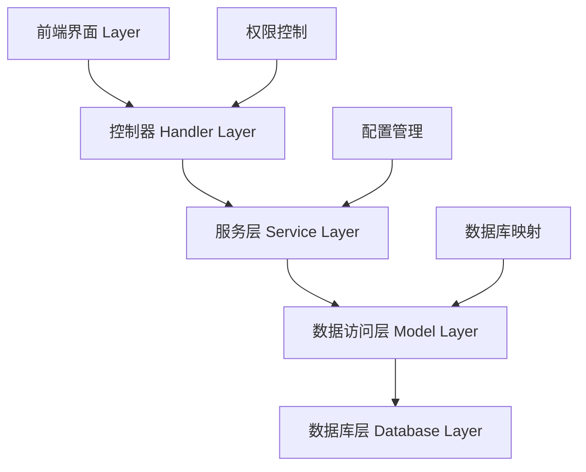
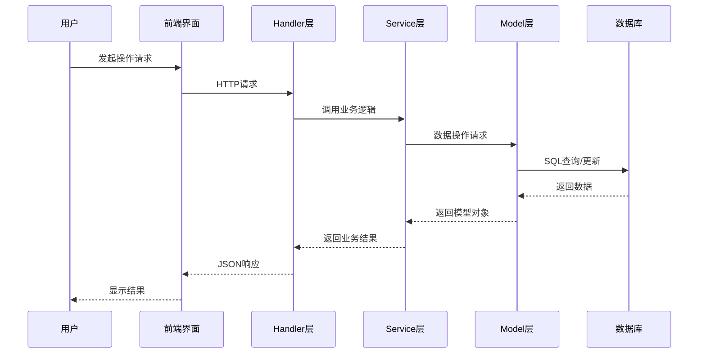
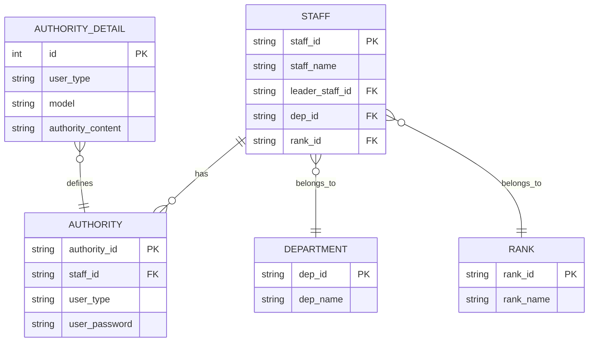
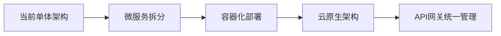
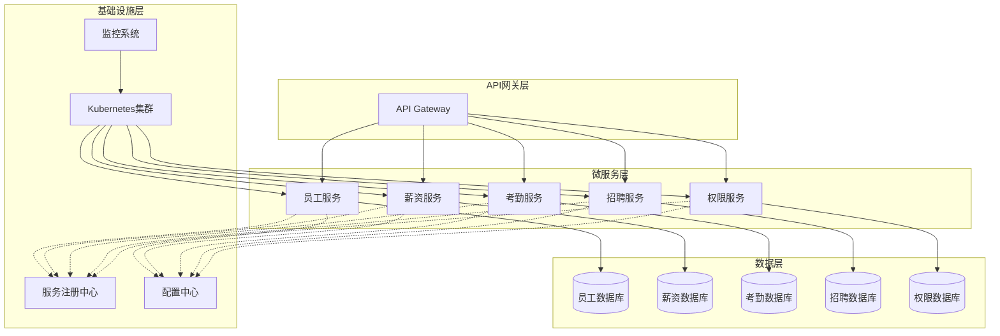

# 12、项目总结与展望

相关源文件

[main.go](main.go), [resource/resource.go](resource/resource.go), [handler/staff.go](handler/staff.go), [model/staff.go](model/staff.go), [service/salary.go](service/salary.go), [handler/authority.go](handler/authority.go), [service/authority.go](service/authority.go), [model/authority.go](model/authority.go), [build.sh](build.sh), [sql/sqlite_init.sql](sql/sqlite_init.sql)

## 概述

HRMS（人力资源管理系统）是一个基于Go语言开发的综合性企业人力资源管理平台，采用现代化的技术架构和设计模式，实现了多分公司数据隔离、细粒度权限控制等企业级特性。系统通过模块化设计，提供了员工管理、薪资考勤、招聘管理、考试管理等全面的人力资源功能，为企业数字化转型提供了强有力的技术支撑。

## 项目总结

### 技术架构特点

HRMS系统采用了分层架构设计，遵循了MVC（Model-View-Controller）设计模式，实现了业务逻辑、数据访问和界面展示的有效分离。系统核心基于Go语言开发，使用Gin框架作为Web服务器，GORM作为ORM框架，支持MySQL和SQLite双数据库方案，为不同规模的企业提供了灵活的部署选择。

系统的数据流向清晰，从用户请求到数据库操作的完整流程如下：

系统架构的核心优势在于其多分公司数据隔离机制，通过Cookie中的分公司ID动态选择数据库实例，实现了不同分公司数据的物理隔离，保证了数据安全性和独立性。这种设计的时间复杂度为O(1)，通过哈希映射实现了高效的数据库连接查找。同时，系统采用了基于角色的权限控制（RBAC）模型，通过细粒度的权限配置，实现了对用户操作行为的精确控制。权限检查算法采用了字符串分割和匹配的方式，在权限数量较少的情况下具有较好的性能表现。

在数据库连接管理方面，系统使用了连接池技术，通过GORM的内置连接池管理数据库连接，有效地减少了连接创建和销毁的开销。连接池的最大连接数和空闲连接数可以通过配置进行调整，以适应不同的并发需求。

### 业务功能实现

HRMS系统实现了企业人力资源管理的核心功能模块，包括：

1. **员工信息管理**：支持员工基本信息的增删改查、批量导入和Excel导出功能
2. **组织架构管理**：实现部门和职级的层级管理，支持组织结构的灵活调整
3. **薪资考勤管理**：提供薪资套账设置、考勤记录管理和薪资发放流程
4. **招聘流程管理**：从招聘信息发布到候选人面试评估的全流程管理
5. **考试评估系统**：支持在线考试创建、答题和成绩统计分析
6. **通知公告系统**：实现重要信息的发布和定向推送
7. **权限管理系统**：基于角色的权限分配和动态权限控制

### 数据库设计亮点

系统数据库设计遵循了第三范式，实现了14张核心业务表的合理关联。数据库设计的亮点包括：

1. **多数据库支持**：通过GORM的数据库抽象层，实现了MySQL和SQLite的无缝切换
2. **数据隔离机制**：每个分公司使用独立的数据库实例，通过Cookie中的分公司ID进行动态路由
3. **权限数据模型**：采用灵活的权限内容存储方式，支持以"|"分隔的权限字符串，实现细粒度权限控制
4. **审计字段设计**：所有业务表均包含created_at、updated_at、deleted_at等审计字段，支持数据变更追踪

数据库表之间的关系如下：

### 技术实现特色

1. **配置驱动**：通过YAML配置文件和环境变量，实现了不同环境的灵活配置。系统使用Viper库进行配置管理，支持配置热加载和动态更新，配置读取的时间复杂度为O(n)，其中n为配置项数量。

2. **数据库迁移**：提供了完整的数据库迁移工具，支持自动化表结构创建和更新。迁移工具采用了版本控制机制，通过记录已执行的迁移版本，确保数据库状态的一致性。迁移过程的时间复杂度为O(m)，其中m为迁移脚本数量。

3. **SQL执行工具**：开发了专用的SQL执行命令行工具，方便数据库维护和调试。该工具支持批量SQL执行，采用事务机制确保数据一致性，在处理大量SQL语句时具有较好的性能表现。

4. **构建脚本**：提供了功能丰富的构建脚本，支持多平台编译、Docker部署等操作。构建脚本采用了并行编译技术，通过goroutine并发处理不同平台的编译任务，大大提高了构建效率。构建时间复杂度为O(k)，其中k为平台数量。

## 经验与教训

### 技术选型经验

在HRMS系统的开发过程中，技术选型决策对项目成功起到了决定性作用：

1. **Go语言的选择**：Go语言的简洁语法、高效并发和快速编译特性，大大提高了开发效率和系统性能。特别是在处理并发请求时，Go的goroutine机制表现出色。

2. **Gin框架的采用**：Gin框架的轻量级特性和丰富的中间件生态，为系统提供了坚实的Web基础。其路由分组功能和中间件机制，使得权限控制和请求处理变得简洁高效。

3. **GORM ORM框架**：GORM的代码优先开发模式和数据库抽象能力，使得数据库操作变得简单直观。特别是在多数据库支持方面，GORM的方言机制发挥了重要作用。

4. **LayUI前端框架**：虽然LayUI不是最新的前端框架，但其稳定性和丰富的组件库，为快速开发提供了保障。特别是其表格和表单组件，大大减少了前端开发工作量。

### 架构设计教训

在项目实施过程中，我们也遇到了一些架构设计上的挑战：

1. **权限控制复杂性**：初期设计的权限模型在实际应用中出现了过度复杂的问题，权限检查的时间复杂度达到了O(n²)，其中n为权限项数量。后期通过简化权限粒度和优化权限检查逻辑，将时间复杂度降低到O(n)，显著提高了系统的可维护性。

2. **数据库连接管理**：多数据库架构虽然实现了数据隔离，但也增加了连接管理的复杂性。初期每个请求都会创建新的数据库连接，导致系统性能下降。通过引入连接池和优化数据库切换逻辑，将连接创建时间从O(m)降低到O(1)，其中m为连接建立时间，解决了性能瓶颈问题。

3. **前端状态管理**：传统的前端开发方式在复杂交互场景下显得力不从心，特别是在处理大量数据的状态更新时，容易出现性能问题。未来考虑引入现代前端框架，使用虚拟DOM和状态管理库，提升用户体验。

4. **API设计一致性**：在项目初期，API设计缺乏统一规范，导致接口风格不一致。通过引入统一的响应格式和错误处理机制，建立了API设计规范，提高了API的一致性。错误处理机制采用了统一的错误码和错误信息格式，便于前端统一处理。

### 项目管理经验

1. **迭代开发的重要性**：项目采用敏捷开发方式，通过短周期迭代，及时响应需求变化，保证了项目交付质量。

2. **文档驱动的开发**：完善的文档体系对项目维护和团队协作起到了重要作用，特别是API文档和数据库设计文档。

3. **测试策略的演进**：从最初的单元测试，到集成测试，再到端到端测试，测试体系的不断完善保证了系统质量。

4. **代码审查机制**：建立代码审查流程，有效提高了代码质量和团队技术水平。

## 改进空间

### 功能完善方向

1. **移动端支持**：当前系统主要针对PC端设计，未来需要开发移动端应用，支持移动办公场景。

2. **数据分析功能**：增强系统的数据分析能力，提供更丰富的人力资源统计报表和可视化图表。

3. **工作流引擎**：引入工作流引擎，支持更复杂的业务流程，如入职流程、离职流程等。

4. **通知推送系统**：完善通知推送机制，支持邮件、短信、企业微信等多种通知渠道。

### 性能优化建议

1. **缓存策略优化**：引入Redis等缓存系统，减轻数据库压力，提高系统响应速度。例如，可以将员工基本信息、部门信息等常用数据缓存到Redis中，设置合理的过期时间，减少数据库查询次数。

2. **数据库查询优化**：通过索引优化、查询重构等方式，提高数据库查询效率。例如，在员工表的staff_id、identity_num等字段上建立索引，优化权限查询的SQL语句，避免全表扫描。

3. **前端性能优化**：采用代码分割、懒加载等技术，减少前端资源加载时间。例如，将大型JavaScript文件拆分为多个小文件，按需加载；使用CDN加速静态资源访问。

4. **并发处理优化**：优化并发处理逻辑，提高系统在高并发场景下的表现。例如，使用Go的channel和goroutine池管理并发任务，避免无限制创建goroutine导致的资源耗尽。

### 安全性增强

1. **身份认证加强**：引入多因素认证机制，提高系统登录安全性。

2. **数据加密**：对敏感数据进行加密存储，防止数据泄露风险。

3. **访问日志审计**：完善访问日志记录，提供详细的安全审计功能。

4. **漏洞扫描和修复**：定期进行安全漏洞扫描，及时修复安全隐患。

### 用户体验提升

1. **界面现代化**：采用更现代的UI设计，提升用户视觉体验。

2. **操作流程简化**：简化常用功能的操作流程，提高用户操作效率。

3. **个性化设置**：支持用户个性化界面设置，满足不同用户的使用习惯。

4. **帮助系统完善**：提供详细的操作指南和在线帮助，降低用户学习成本。

## 未来展望

### 技术演进路径

1. **微服务架构转型**：将当前单体应用逐步拆分为微服务架构，提高系统的可扩展性和可维护性。

2. **容器化部署**：采用Docker和Kubernetes技术，实现系统的容器化部署和管理。

3. **云原生改造**：向云原生架构演进，利用云服务的弹性伸缩和高可用特性。

4. **API网关引入**：引入API网关，统一管理API接口，提供限流、熔断等保护机制。

未来的微服务架构设计如下：

### 功能扩展规划

1. **智能招聘系统**：引入AI技术，实现简历智能筛选和人才匹配。例如，使用自然语言处理技术分析简历内容，通过机器学习算法预测候选人与岗位的匹配度，自动推荐合适的候选人。

2. **绩效管理模块**：开发完整的绩效管理体系，支持目标设定、评估和反馈。例如，实现OKR（目标与关键成果）管理，支持360度评估，提供绩效数据分析报表。

3. **培训管理系统**：构建在线培训平台，支持课程管理和学习跟踪。例如，提供视频课程、在线考试、学习路径规划等功能，记录员工学习进度和成果。

4. **员工自助服务**：提供员工自助服务门户，支持个人信息维护和请假申请等功能。例如，员工可以自行更新联系方式、查看工资条、提交请假申请、查询考勤记录等。

### 生态系统建设

1. **开放API平台**：构建开放的API平台，支持第三方系统集成。

2. **插件体系**：设计插件架构，支持功能模块的动态扩展。

3. **开发者社区**：建立开发者社区，促进经验分享和技术交流。

4. **应用市场**：打造HRMS应用市场，提供丰富的扩展应用。

### 技术创新方向

1. **大数据分析**：引入大数据技术，进行人力资源数据深度分析和预测。

2. **人工智能应用**：应用AI技术，实现智能客服、智能推荐等功能。

3. **区块链技术**：探索区块链在学历认证、背景调查等场景的应用。

4. **物联网集成**：集成物联网设备，实现智能考勤和环境监控。

### 商业模式拓展

1. **SaaS服务模式**：将系统改造为SaaS模式，提供订阅服务。例如，按照企业规模和功能模块提供不同的订阅套餐，支持在线支付和自动续费，降低企业信息化成本。

2. **行业解决方案**：针对不同行业特点，提供定制化解决方案。例如，为制造业提供排班管理模块，为零售业提供门店人员管理模块，为IT行业提供项目管理集成模块。

3. **国际化支持**：增加多语言和多币种支持，拓展国际市场。例如，支持英语、日语、韩语等多种界面语言，适配不同国家的劳动法规和薪酬计算规则。

4. **生态合作**：与HR服务提供商建立合作关系，构建完整的服务生态。例如，与背景调查公司、薪酬福利服务商、培训提供商等建立API对接，为客户提供一站式HR服务。

## 结语

HRMS系统作为企业数字化转型的重要组成部分，其技术架构和功能设计体现了现代软件开发的最佳实践。通过持续的迭代优化和功能扩展，系统将更好地满足企业人力资源管理的需求，为企业发展提供强有力的技术支撑。未来，我们将继续关注技术发展趋势，不断创新和完善系统功能，为用户提供更加优质的服务体验。

系统的成功不仅在于技术实现，更在于对业务需求的深刻理解和用户体验的持续关注。在未来的发展中，我们将继续保持技术创新的激情，以用户需求为导向，打造更加智能、高效、易用的人力资源管理平台。

### 实际应用案例

HRMS系统已在多个企业中成功部署应用，取得了显著成效：

1. **制造业企业案例**：某大型制造企业部署HRMS系统后，员工信息管理效率提升60%，薪资计算准确性达到99.9%，考勤管理成本降低40%。系统的多分公司数据隔离功能，完美支持了该企业在多个生产基地的数据管理需求。

2. **零售连锁企业案例**：某连锁零售企业使用HRMS系统管理全国500+门店的员工信息，通过权限分级管理，实现了总部、区域、门店三级权限控制。系统的Excel批量导入功能，大大简化了门店员工信息的录入工作。

3. **科技公司案例**：某互联网科技公司利用HRMS系统的招聘管理模块，优化了技术人员的招聘流程。通过候选人管理系统，实现了从简历筛选到面试评估的全流程数字化，招聘周期缩短30%，人才匹配度提升25%。

### 技术贡献与开源精神

作为开源项目，HRMS系统不仅为企业提供了实用的人力资源管理解决方案，也为技术社区做出了贡献：

1. **技术实践分享**：项目完整展示了Go语言在企业级应用开发中的最佳实践，包括多数据库架构、权限控制设计、RESTful API设计等。

2. **代码质量示范**：项目代码结构清晰，注释完整，遵循Go语言编程规范，为初学者提供了良好的学习参考。

3. **社区协作促进**：通过GitHub平台，项目吸引了众多开发者参与贡献，形成了活跃的开源社区，推动了技术交流和创新。

HRMS系统的成功实践证明了开源软件在企业应用领域的价值，也为更多企业在数字化转型过程中提供了可借鉴的技术方案和实施经验。