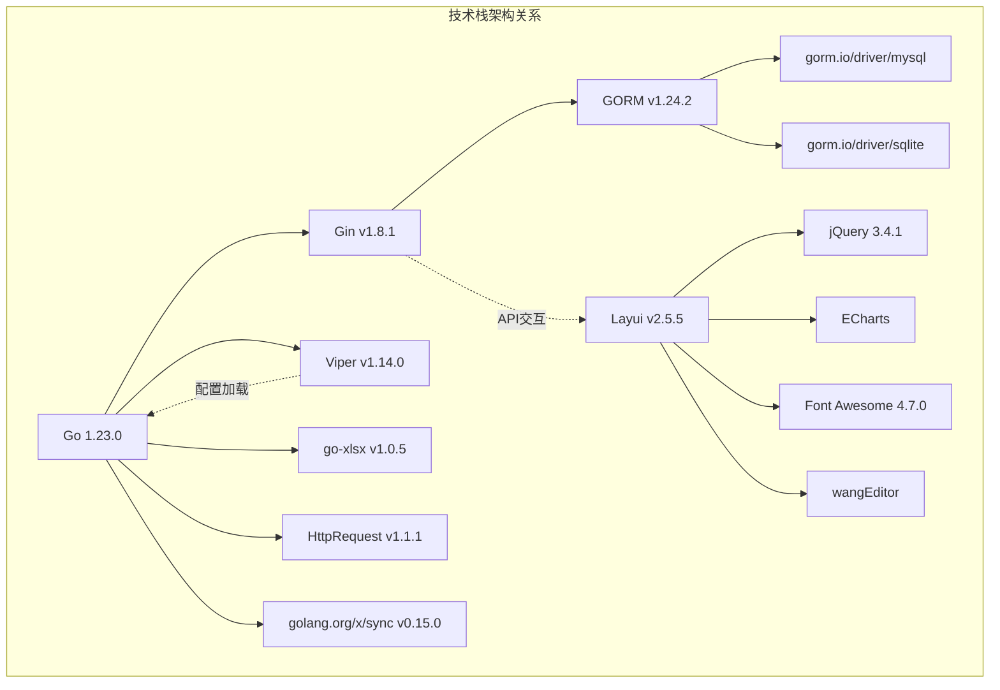
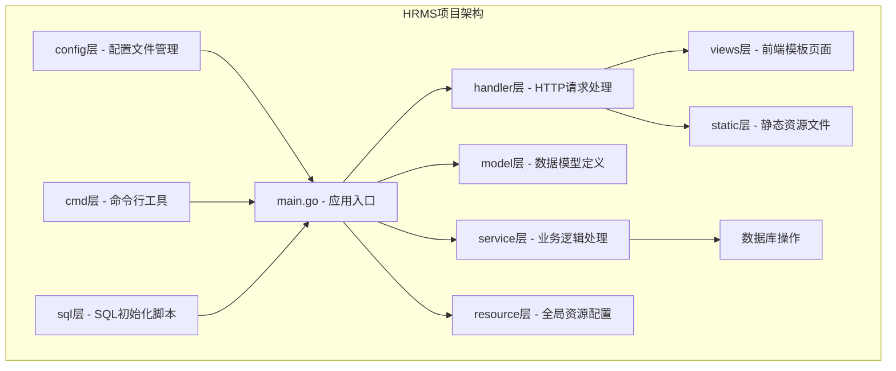
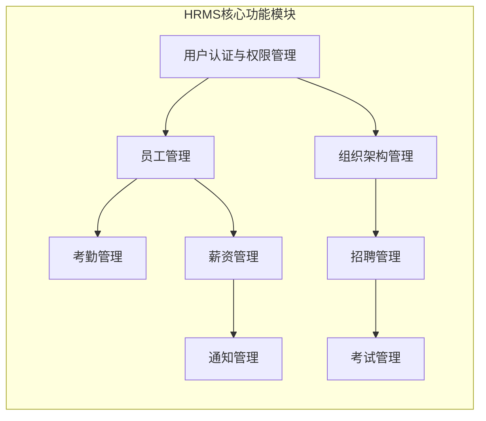
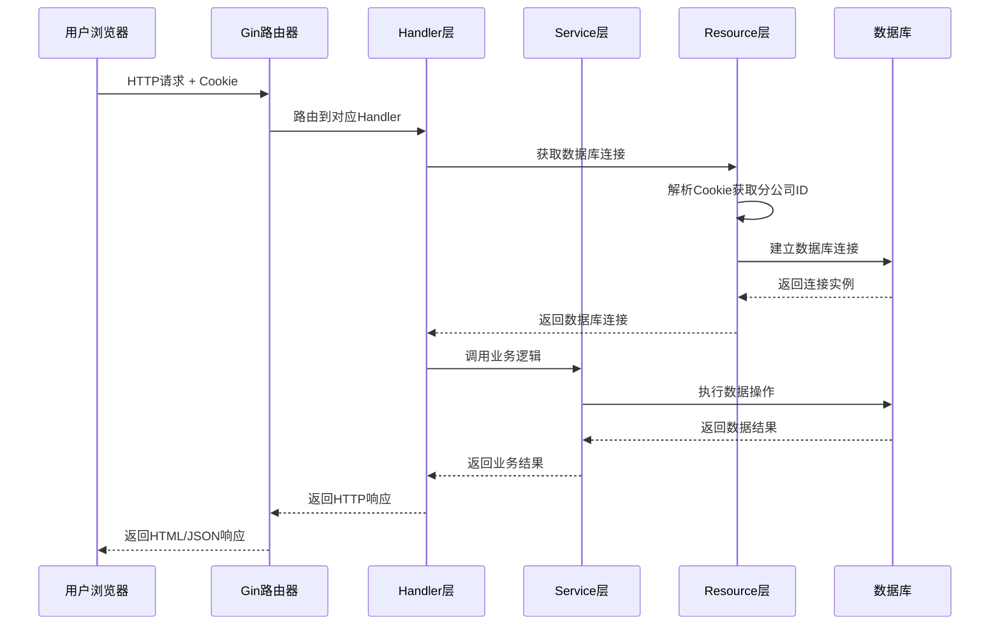

# 1、项目概述

<details>
<summary>相关源文件</summary>
main.go
go.mod
resource/resource.go
handler/account.go
model/authority.go
service/authority.go
config/config-dev.yaml
views/index.html
</details>

## 系统概述

HRMS（人力资源管理系统）是一个基于Go、Gin和GORM构建的完整企业级人力资源管理解决方案。系统采用MVC分层架构设计，提供员工管理、考勤管理、薪资管理、招聘管理等全流程人力资源服务，支持多分公司数据隔离和基于角色的权限控制机制，满足中大型企业多分支机构的人力资源管理需求。

系统的核心价值在于提供统一、高效、安全的人力资源管理平台，通过数字化手段优化企业人力资源管理流程，提升管理效率，降低运营成本。系统支持的典型业务场景包括：员工入职离职管理、部门组织架构管理、考勤数据采集与分析、薪资核算与发放、招聘流程管理与企业培训考试等。

### 核心特性

1. **多分公司数据隔离**：系统通过数据库层面的分离实现各分公司数据的物理隔离，每个分公司拥有独立的数据库实例，通过Cookie中的分公司ID进行识别，确保数据安全性和隐私性。此设计采用数据库命名规则`hrms_{分公司ID}`，在`resource.HrmsDB()`函数中实现动态数据库连接切换，通过`resource.DbMapper`映射表管理多个数据库连接实例。

2. **基于角色的权限控制**：实现三级角色体系（超级管理员supersys、系统管理员sys、普通员工normal），通过精细化权限控制，确保不同角色用户只能访问其权限范围内的功能和数据。权限控制采用Cookie会话管理机制，格式为`角色_工号_分公司ID_员工姓名(base64编码)`，通过`/authority_render/:modelName`路由进行动态权限验证，权限内容存储在AuthorityDetail表中，以"|"分隔权限字符串。

3. **灵活可配置的技术架构**：支持MySQL和SQLite双数据库后端，可根据企业规模和部署需求选择合适的数据存储方案，同时提供完整的环境配置支持。配置管理基于Viper库实现，通过`HRMS_ENV`环境变量自动加载对应配置文件（config-dev.yaml、config-test.yaml、config-prod.yaml），支持开发、测试、生产等多环境无缝切换。

## 技术栈组成

### 后端技术栈

- **Go 1.23.0**：系统后端开发语言，提供高性能、高并发的执行环境
- **Gin v1.8.1**：轻量级Web框架，提供高效的路由管理和中间件支持
- **GORM v1.24.2**：强大的ORM框架，简化数据库操作，支持模型自动迁移
- **Viper v1.14.0**：配置管理库，支持多环境配置文件切换
- **modernc.org/sqlite v1.39.0** & **gorm.io/driver/sqlite v1.4.4**：SQLite数据库驱动
- **gorm.io/driver/mysql v1.4.4**：MySQL数据库驱动

### 前端技术栈

- **Layui v2.5.5**：企业级UI组件库，提供丰富的前端界面组件
- **jQuery 3.4.1**：JavaScript库，简化DOM操作和AJAX交互
- **ECharts**：数据可视化库，提供图表展示功能
- **Font Awesome 4.7.0**：图标字体库，丰富UI图标展示
- **wangEditor**：富文本编辑器，支持内容编辑功能

### 开发工具与依赖

- **go-xlsx v1.0.5**：Excel文件处理库，支持员工信息批量导入
- **HttpRequest v1.1.1**：HTTP请求库，用于短信通知等外部服务调用
- **golang.org/x/sync v0.15.0**：并发控制库，提升批量操作性能



### 技术选型优势

1. **Go语言**：编译型语言，执行效率高，并发性能优秀，适合企业级应用开发。其垃圾回收机制降低了内存管理复杂度，静态类型系统保证了代码稳定性，简洁的语法使团队协作更加高效。

2. **Gin框架**：基于 httprouter 的高性能路由引擎，采用 Radix Tree 算法实现路由匹配，时间复杂度为 O(len(path))。中间件机制采用链式调用模式，支持横切关注点的统一处理，如认证、日志、CORS 等。

3. **GORM**：功能强大的ORM框架，采用回调(Callbacks)机制实现操作生命周期管理，支持预加载、关联查询等高级特性。自动迁移功能通过反射获取模型结构，动态生成DDL语句，大大简化了数据库维护工作。

4. **Layui**：专为后台管理系统设计，模块化架构支持按需加载，响应式布局适配多种屏幕尺寸。内建表单验证、数据表格等组件，通过 lay-filter 实现前端与后端的无缝对接。

5. **双数据库支持**：MySQL采用InnoDB引擎支持ACID事务，适合生产环境大规模部署；SQLite作为嵌入式数据库，无需独立服务器，适合开发测试和小型部署。系统通过 GORM 的 dialector 机制实现数据库驱动的动态切换。

## 项目结构

HRMS项目采用标准的MVC分层架构，各目录职责清晰，代码组织有序，便于团队协作开发和后期维护。



### 核心目录结构

```
hrms/
├── main.go                      # 应用程序入口文件，初始化配置、数据库和服务
├── go.mod & go.sum             # Go模块依赖管理文件
├── config/                     # 配置文件目录
│   ├── config-dev.yaml         # 开发环境配置
│   └── config-prod.yaml        # 生产环境配置
├── handler/                    # HTTP请求处理层（Controller）
│   ├── account.go              # 账户登录认证处理
│   ├── staff.go                # 员工管理相关处理
│   ├── authority.go            # 权限管理相关处理
│   ├── attend.go               # 考勤管理相关处理
│   ├── salary.go               # 薪资管理相关处理
│   ├── department.go           # 部门管理相关处理
│   ├── rank.go                 # 职级管理相关处理
│   ├── recruitment.go          # 招聘管理相关处理
│   ├── candidate.go            # 候选人管理相关处理
│   ├── notification.go         # 通知管理相关处理
│   └── example.go              # 考试管理相关处理
├── model/                      # 数据模型层（Model）
│   ├── staff.go                # 员工数据模型
│   ├── authority.go            # 权限数据模型
│   ├── department.go           # 部门数据模型
│   ├── rank.go                 # 职级数据模型
│   ├── attendance.go           # 考勤数据模型
│   ├── salary.go               # 薪资数据模型
│   └── ...                     # 其他数据模型
├── service/                    # 业务逻辑层（Service）
│   ├── biz.go                  # 通用业务逻辑
│   ├── authority.go            # 权限业务逻辑
│   ├── attend_record.go        # 考勤记录业务逻辑
│   ├── salary.go               # 薪资业务逻辑
│   └── ...                     # 其他业务逻辑
├── resource/                   # 资源配置层
│   └── resource.go             # 数据库连接、全局配置等
├── cmd/                        # 命令行工具
│   ├── migrate/                # 数据库迁移工具
│   ├── sqlexec/                # SQL执行工具
│   └── createdb/               # 数据库创建工具
├── views/                      # 前端HTML模板
│   ├── index.html              # 主页面模板
│   ├── login.html              # 登录页面模板
│   └── admin_*.html            # 管理员页面模板
├── static/                     # 静态资源
│   ├── css/                    # 样式文件
│   ├── js/                     # JavaScript文件
│   ├── lib/                    # 第三方库文件
│   └── images/                 # 图片资源
├── sql/                        # SQL初始化脚本
├── scripts/                    # 脚本文件
└── docs/                       # 项目文档目录
```

### 关键文件说明

1. **main.go** - 应用程序入口，采用分层初始化模式（配置→数据库→服务），通过`InitConfig()`实现环境感知配置加载，`InitGorm()`支持多数据库动态连接，`routerInit()`采用RESTful设计模式组织路由结构，每个业务模块使用独立的路由组，提高代码可维护性。

2. **handler/account.go** - 用户登录认证和权限验证的核心入口，实现基于Cookie的会话管理，通过`base64.StdEncoding.EncodeToString()`对敏感信息进行编码保护，采用MD5哈希算法存储用户密码，登录成功后设置包含角色、工号、分公司ID的复合Cookie。

3. **resource/resource.go** - 全局资源管理，采用单例模式管理数据库连接池，通过`DbMapper`映射表实现多分公司数据库实例管理，`HrmsDB()`函数作为中间件动态解析Cookie中的分公司ID，实现透明的数据库切换机制。

4. **service/biz.go** - 通用业务逻辑，包含`AcceptPage()`实现分页参数解析，`RandomStaffId()`生成唯一工号，`Str2Time()`和`Time2Str()`处理时间格式转换，`MD5()`函数提供密码加密，`Transfer()`函数利用反射实现DTO与Model的自动转换。

5. **MIGRATION_GUIDE.md** - 数据库迁移指南，提供基于GORM的自动化迁移工具，支持通过命令行参数指定目标数据库，采用`bash build.sh`脚本统一管理迁移操作，确保生产环境数据库结构升级的安全性。

## 功能特性概览

HRMS系统提供完整的人力资源管理功能集，覆盖企业人力资源管理的全生命周期，各功能模块既相互独立又紧密关联，形成完整的人力资源管理生态。





### 用户认证与权限管理

基于Cookie的会话管理机制，实现三级权限体系：
- **超级管理员（supersys）**：系统最高权限，可管理所有分公司和所有功能
- **系统管理员（sys）**：部门人力资源专员，负责本分公司员工管理和日常工作
- **普通员工（normal）**：一般员工，可查看个人信息，提交考勤、查看薪资等

权限控制通过`/authority_render/:modelName`路由实现动态检查，权限内容存储在AuthorityDetail表中，采用"|"分隔的权限字符串格式，支持create、query、update、delete、excel_add等多种操作权限。系统采用`resource.HrmsDB()`中间件在每次请求前进行数据库连接验证，通过`handler.RenderAuthority()`函数将权限映射转换为页面级别的元素显示控制，实现前后端一致的权限管理。

登录流程采用双重验证机制：首先验证用户凭证（工号+MD5加密密码），然后查询员工信息并设置复合Cookie（角色_工号_分公司ID_员工姓名base64编码）。系统在`handler.Login()`中实现分公司数据库的动态切换逻辑，确保多分公司环境下的数据隔离安全性。

### 员工管理

提供完整的员工信息管理功能，包括：
- 员工基本信息维护（姓名、性别、身份证号、联系方式等）
- 组织关系管理（所属部门、职级、直接上级）
- 入职离职管理（入职日期、离职流程）
- 批量导入导出（支持Excel格式批量导入员工信息）

**技术实现细节**：
- 采用`handler/excel_export.go`中的`ExcelExport()`函数实现批量导入，基于`errgroup`并发控制提升处理性能
- 员工数据模型在[`model/staff.go`](model/staff.go)中定义，包含28个字段覆盖完整员工信息
- 员工创建流程在`buildStaffInfoSaveDB()`函数中使用数据库事务确保数据一致性，同时创建员工基本信息和登录账号
- 系统自动生成唯一工号（H+6位随机数），初始密码为身份证后六位的MD5加密值

**实际使用场景**：
```bash
# 批量导入1000名员工信息
xlsx文件格式示例：
员工姓名 | 上级工号 | 员工性别 | 身份证号 | 出生日期 | 民族 | 毕业院校 | 最高学历 | 基本薪资 | 部门 | 职级
张三     | H000001 | 男      | 110101... | 1990-01-01 | 汉   | 北京大学 | 本科     | 8000    | 技术部 | 高级工程师
```

### 考勤管理

实现全流程考勤管理方案：
- 考勤记录登记（工作量、请假天数、加班天数）
- 考勤审批流程（上级审核、权限控制）
- 考勤历史查询（个人考勤记录、部门考勤统计）
- 考勤与薪资关联（考勤数据自动影响薪资计算）

### 薪资管理

提供灵活的薪资核算方案：
- 薪资标准设置（基本工资、补贴、奖金、提成等）
- 薪资明细管理（各项收入的详细配置）
- 薪资发放记录（薪资核算、发放状态跟踪）
- 薪资历史查询（个人薪资记录、统计报表）

### 组织架构管理

支持灵活的组织架构设计：
- 部门管理（部门创建、信息维护、层级关系）
- 职级管理（职级体系、薪资级别、晋升通道）
- 分公司管理（多分公司数据隔离、独立数据库）

### 招聘管理

完整的招聘流程管理：
- 招聘需求发布（岗位信息、招聘要求）
- 候选人管理（简历收集、筛选流程）
- 面试安排（面试记录、评价体系）
- 录用管理（offer发放、入职流程）

### 通知管理

企业内部通知系统：
- 通知发布（公告、政策、活动通知）
- 通知分类（按类型、部门、级别分类）
- 通知推送（短信提示、系统内消息）
- 通知状态跟踪（已读未读状态管理）

### 考试管理

企业培训与考试平台：
- 考试题库管理（题目创建、分类管理）
- 考试计划制定（考试安排、参考人员）
- 在线考试（答题界面、时间控制）
- 成绩管理（成绩记录、统计分析）

### 数据库迁移工具

提供专业级数据库管理工具：
- 自动模型迁移（支持所有模型结构的自动创建和更新）
- 多数据库支持（分公司数据库批量管理）
- 环境配置切换（dev/test/prod多环境配置）
- 重置功能（数据库清理和重建）

**技术实现细节**：
- 基于[`cmd/migrate/main.go`](cmd/migrate/main.go)实现命令行工具，通过`flag`包解析命令行参数
- 使用GORM的`AutoMigrate()`功能自动创建和更新数据库表结构，支持14个核心模型
- 通过`go run cmd/migrate/main.go -db hrms_C001`实现指定数据库迁移，支持多分公司独立管理
- 迁移工具遵循外键约束关系，采用逆序删除策略避免外键冲突

**实际使用场景**：
```bash
# 开发环境初始化数据库
HRMS_ENV=dev bash build.sh migrate

# 生产环境指定分公司数据库迁移
HRMS_ENV=prod go run cmd/migrate/main.go -db hrms_C001

# 重置测试环境数据库
HRMS_ENV=test go run cmd/migrate/main.go -reset -db hrms_C002
```

各功能模块通过统一的权限控制机制和数据库隔离设计，确保系统安全性、可扩展性和易维护性，为企业提供全面、高效、安全的人力资源管理解决方案。

---

## 关键技术实现深度分析

### 多分公司数据隔离机制

系统通过创新的数据库层面隔离方案，实现各分公司数据的完全物理隔离，这在传统多租户架构中较为罕见。具体实现包括：

1. **数据库命名规范**：采用`hrms_{分公司ID}`的命名规则，如`hrms_C001`、`hrms_C002`
2. **动态连接池管理**：在[`resource/resource.go`](resource/resource.go)的`DbMapper`中维护多个数据库连接实例
3. **会话级别切换**：通过Cookie中的分公司ID自动切换数据库连接，对业务层透明
4. **批量运维支持**：迁移工具支持一次性管理所有分公司数据库

### 分层权限控制系统

系统实现了独特的三层权限控制架构：

1. **应用层权限**：通过`/authority_render/:modelName`路由实现页面级权限控制
2. **数据层权限**：通过数据库隔离实现分公司级别的数据权限
3. **操作级权限**：通过AuthorityDetail表中的`create|query|update|delete|excel_add`权限字符串

这种设计确保了不同维度权限的完全隔离和灵活组合，为企业级应用提供了强大的安全保障。