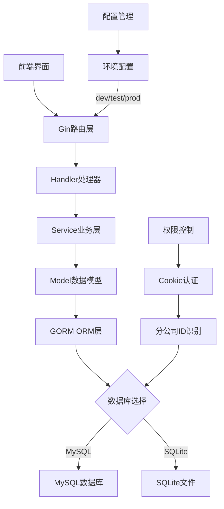

<details>
<summary>相关源文件</summary>
main.go
go.mod
config/config-dev.yaml
resource/resource.go
build.sh
cmd/migrate/main.go
scripts/init_database.sh
</details>

# 2、快速入门指南

## 概述

HRMS是基于Go语言开发的人力资源管理系统，采用Gin+GORM框架，支持MySQL/SQLite双数据库，提供员工管理、考试管理、通知管理、薪资考勤管理、招聘管理等完整功能。本指南将帮助您快速搭建并开始使用HRMS系统。

## 系统架构

HRMS系统采用分层架构设计，支持多分公司数据隔离，通过Cookie实现动态数据库切换。系统核心技术栈包括Go 1.23.0、Gin Web框架、GORM ORM层、MySQL/SQLite数据库，以及LayUI前端框架。



## 核心目录结构

```
hrms/
├─ cmd/                  # 命令行工具
│  ├─ createdb/         # 数据库创建工具
│  ├─ migrate/          # 数据库迁移工具
│  └─ sqlexec/          # SQL执行工具
├─ config/              # 配置文件目录
│  ├─ config-dev.yaml   # 开发环境配置
│  ├─ config-test.yaml  # 测试环境配置
│  └─ config-prod.yaml  # 生产环境配置
├─ data/                # SQLite数据库存储目录
├─ docs/                # 文档目录
├─ handler/             # 请求处理层
├─ model/               # 数据模型层
├─ resource/            # 资源和配置管理
├─ service/             # 业务逻辑层
├─ sql/                 # SQL脚本文件
├─ static/              # 静态资源
├─ views/               # 前端视图文件
├─ build.sh             # 构建脚本
├─ go.mod               # Go依赖管理
└─ main.go              # 应用入口
```

## 环境准备

### Go语言环境

HRMS系统需要Go 1.23.0或更高版本。请从[Go官方网站](https://golang.org/dl/)下载并安装Go。

**安装验证：**
```bash
go version
# 应显示：go version go1.23.0 xxx
```

**Go模块代理设置（推荐）：**
```bash
go env -w GOPROXY=https://goproxy.cn,direct
go env -w GOSUMDB=sum.golang.google.cn
```

### 数据库环境

HRMS支持MySQL和SQLite两种数据库，可根据需求选择：

#### MySQL环境（推荐用于生产环境）

1. **版本要求**：MySQL 5.7+或MariaDB 10.2+
2. **安装方式**：
   - Ubuntu/Debian：`sudo apt-get install mysql-server`
   - CentOS/RHEL：`sudo yum install mysql-server`
   - Windows：下载MySQL安装包
   - Docker：`docker run -d --name mysql -e MYSQL_ROOT_PASSWORD=123 -p 3306:3306 mysql:8.0`

3. **创建数据库**：
```sql
CREATE DATABASE hrms_C001 CHARACTER SET utf8mb4 COLLATE utf8mb4_unicode_ci;
CREATE DATABASE hrms_C002 CHARACTER SET utf8mb4 COLLATE utf8mb4_unicode_ci;
```

#### SQLite环境（推荐用于开发和测试）

SQLite是文件数据库，无需额外安装，HRMS会自动创建和管理数据库文件。

### 系统依赖

HRMS系统还需要以下依赖：

1. **Git**：用于版本控制和源码获取
2. **Make或Bash**：用于执行构建脚本
3. **文本编辑器**：用于配置文件修改

## 安装部署

### 1. 获取源码

```bash
git clone https://github.com/pbrong/hrms.git
cd hrms
```

### 2. 安装依赖

```bash
go mod tidy
```

### 3. 构建系统

HRMS提供了功能完整的构建脚本`build.sh`，支持多种操作：

```bash
# 查看所有可用命令
bash build.sh help

# 构建应用程序
bash build.sh build

# 运行开发服务器
bash build.sh run-dev

# 构建所有平台版本
bash build.sh build-all
```

### 4. 数据库初始化

HRMS提供两种数据库初始化方式：

#### 方式一：使用迁移工具（推荐）

```bash
# 构建迁移工具
bash build.sh build-migrate

# 执行数据库迁移
bash build.sh migrate

# 重置数据库（删除所有表）
bash build.sh migrate-reset
```

#### 方式二：使用初始化脚本

```bash
# 执行完整数据库初始化
bash scripts/init_database.sh
```

### 5. 启动应用

```bash
# 开发环境启动
HRMS_ENV=dev go run main.go

# 或使用构建脚本
bash build.sh run-dev
```

系统启动后，通过浏览器访问：http://localhost:8888

## 配置指南

### 配置文件结构

HRMS使用YAML格式的配置文件，根据运行环境自动选择：

- 开发环境：`config/config-dev.yaml`
- 测试环境：`config/config-test.yaml`
- 生产环境：`config/config-prod.yaml`
- 自定义环境：`config/config-self.yaml`

### 基础配置示例

```yaml
# config/config-dev.yaml
gin:
  port: 8888                    # 服务端口

db:
  type: sqlite                  # 数据库类型：mysql 或 sqlite
  path: ./data                  # SQLite数据库存储路径
  dbName: hrms_C001             # 数据库名称（多个用逗号分隔）
  
# MySQL配置示例
# db:
#   type: mysql
#   user: root
#   password: 123
#   host: 127.0.0.1
#   port: 3306
#   dbName: hrms_C001,hrms_C002
```

### 数据库配置详解

#### MySQL配置参数

| 参数 | 说明 | 示例值 |
|------|------|--------|
| type | 数据库类型 | mysql |
| user | 数据库用户名 | root |
| password | 数据库密码 | 123 |
| host | 数据库主机地址 | 127.0.0.1 |
| port | 数据库端口 | 3306 |
| dbName | 数据库名称，多个用逗号分隔 | hrms_C001,hrms_C002 |

#### SQLite配置参数

| 参数 | 说明 | 示例值 |
|------|------|--------|
| type | 数据库类型 | sqlite |
| path | 数据库文件存储路径 | ./data |
| dbName | 数据库文件名，多个用逗号分隔 | hrms_C001,hrms_C002 |

### 环境变量配置

通过环境变量`HRMS_ENV`控制运行环境：

```bash
# 开发环境（默认）
export HRMS_ENV=dev

# 测试环境
export HRMS_ENV=test

# 生产环境
export HRMS_ENV=prod

# 自定义环境
export HRMS_ENV=self
```

### 分公司数据库配置

HRMS支持多分公司数据隔离，每个分公司使用独立的数据库：

1. **数据库名称规范**：`hrms_{分公司ID}`，如`hrms_C001`、`hrms_C002`
2. **动态切换机制**：通过用户Cookie中的分公司ID自动选择对应数据库
3. **配置示例**：
```yaml
db:
  dbName: hrms_C001,hrms_C002    # 支持多分公司
```

## 快速上手

### 默认管理员账号

HRMS系统默认提供以下管理员账号：

| 角色 | 用户名 | 密码 | 说明 |
|------|--------|------|------|
| 超级管理员 | admin | admin1 | 拥有系统最高权限 |
| 系统管理员 | sys | sys1 | 各部门人力资源专员 |
| 普通员工 | normal | normal1 | 普通员工账号 |

### 首次登录流程

1. **访问系统**
   - 打开浏览器访问：http://localhost:8888
   - 使用默认超级管理员账号登录：`admin/admin1`

2. **初始化基础数据**
```bash
# 如果数据库为空，可执行数据初始化
go run cmd/sqlexec/main.go -db hrms_C001 -file ./sql/sqlite_init.sql
```

3. **创建分公司**
   - 登录后进入"分公司管理"模块
   - 创建新的分公司并记录分公司ID

4. **设置用户权限**
   - 进入"权限管理"模块
   - 为不同角色配置相应的操作权限（create、query、update、delete、excel_add）

### 权限管理配置

HRMS采用基于角色和资源的权限控制机制：

1. **用户角色说明**：
   - **supersys**：超级管理员，系统最高权限管理者
   - **sys**：系统管理员，一般为各部门人力资源专员
   - **normal**：普通员工，各部门普通员工

2. **权限配置格式**：
   - 权限内容以"|"分隔：`create|query|update|delete|excel_add`
   - 支持的行为动作：
     - `create`：创建资源权限
     - `query`：查询/查看资源权限
     - `update`：修改/编辑资源权限
     - `delete`：删除资源权限
     - `excel_add`：Excel导入权限

3. **权限设置流程**：
```bash
# 通过API设置用户角色
curl -X POST http://localhost:8888/authority/set_admin/{staff_id}    # 设置为管理员
curl -X POST http://localhost:8888/authority/set_normal/{staff_id}   # 设置为普通员工
```

### 基本操作指南

1. **员工管理**：
   - 添加新员工：进入"员工管理" → "添加员工"
   - 批量导入：使用Excel导入功能批量添加员工

2. **部门设置**：
   - 创建部门：进入"部门管理" → "添加部门"
   - 设置职级：进入"职级管理" → "添加职级"

3. **薪资考勤**：
   - 薪资设置：进入"薪酬管理" → "添加薪资"
   - 考勤记录：进入"考勤管理" → "考勤记录"

### 常见问题排查

1. **数据库连接失败**：
```bash
# 检查配置文件
cat config/config-dev.yaml

# 测试数据库连接
go run cmd/sqlexec/main.go -db hrms_C001 -sql "SELECT 1"
```

2. **权限访问问题**：
```bash
# 检查Cookie格式
# 期望格式：角色_工号_分公司ID_员工姓名(base64编码)

# 查看权限配置
go run cmd/sqlexec/main.go -db hrms_C001 -sql "SELECT * FROM authority_detail"
```

3. **端口冲突**：
```yaml
# 修改配置文件中的端口
gin:
  port: 8889  # 改为其他端口
```

## 开发工具使用

### SQL执行工具

HRMS提供了便捷的SQL执行工具：

```bash
# 构建工具
bash build.sh build-sqlexec

# 执行SQL查询
go run cmd/sqlexec/main.go -db hrms_C001 -sql "SELECT * FROM staff LIMIT 10"

# 执行SQL文件
go run cmd/sqlexec/main.go -db hrms_C001 -file ./data/test.sql
```

### 数据库管理

```bash
# 创建新数据库
bash build.sh createdb hrms_C003

# 迁移特定数据库
bash build.sh migrate-db hrms_C001

# 重置特定数据库
bash build.sh migrate-reset-db hrms_C001
```

## 部署建议

### 开发环境

- 使用SQLite数据库，便于快速搭建
- 启用调试模式和详细日志
- 使用热重载工具提高开发效率

### 生产环境

- 使用MySQL数据库，提高性能和可靠性
- 配置反向代理（如Nginx）
- 设置HTTPS加密传输
- 定期备份数据库

### Docker部署

```dockerfile
# 示例Dockerfile
FROM golang:1.23-alpine AS builder
WORKDIR /app
COPY . .
RUN go build -o hrms_app main.go

FROM alpine:latest
RUN apk --no-cache add ca-certificates
WORKDIR /root/
COPY --from=builder /app/hrms_app .
COPY --from=builder /app/config ./config
COPY --from=builder /app/static ./static
COPY --from=builder /app/views ./views
EXPOSE 8888
CMD ["./hrms_app"]
```

通过以上步骤，您已成功完成HRMS系统的部署配置。现在可以开始使用系统进行人力资源管理操作了。更多详细信息请参考项目文档和API文档。