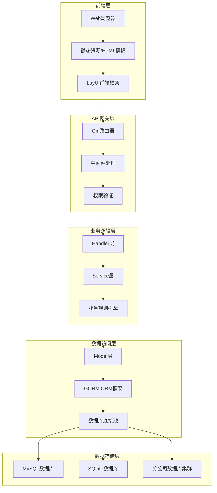
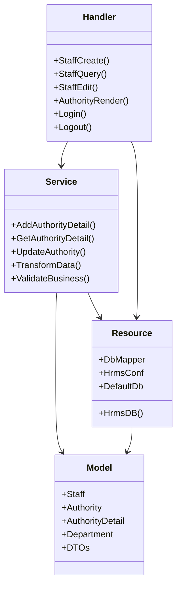
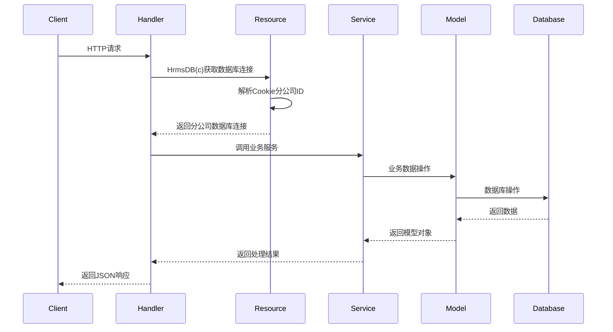
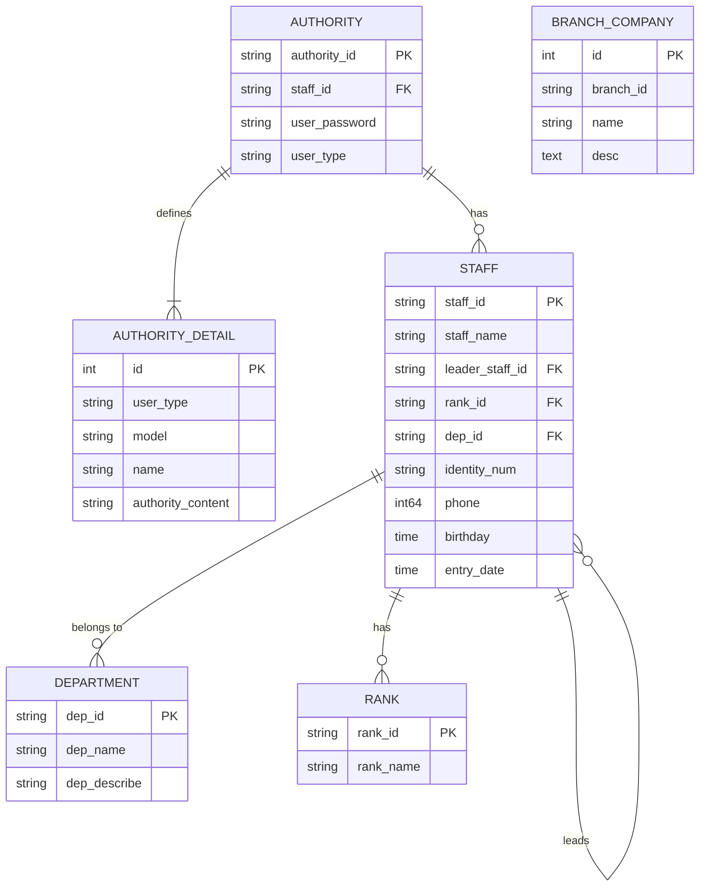
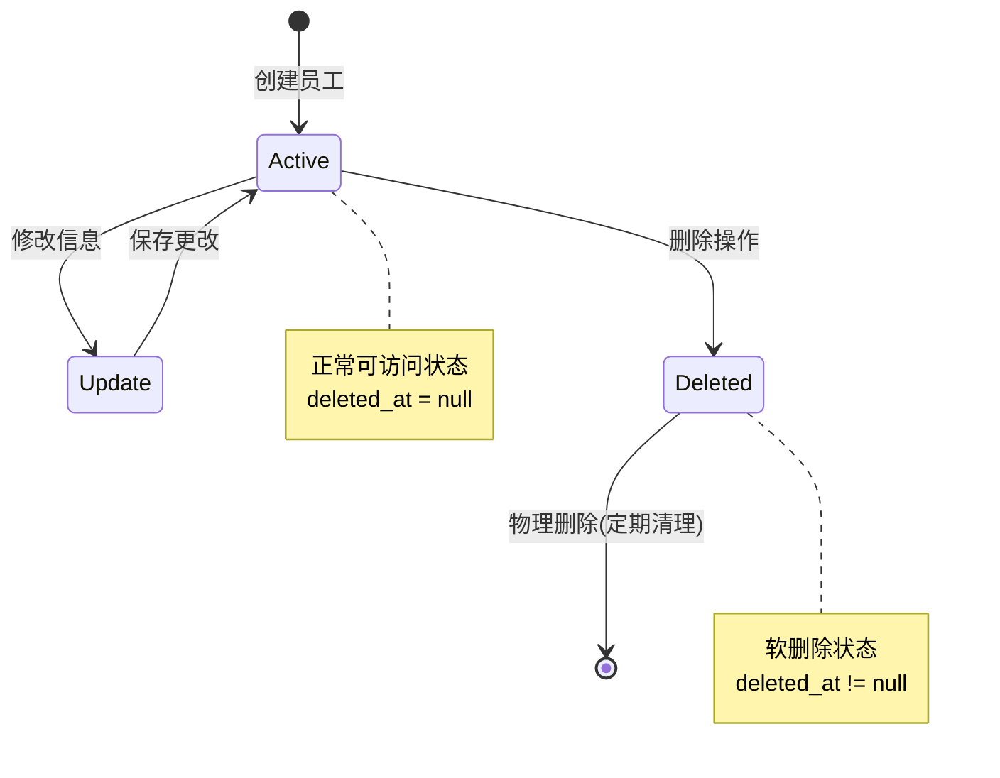
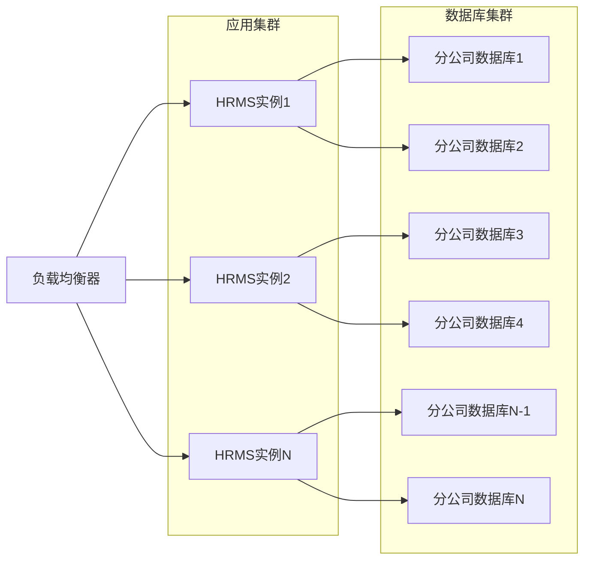

# 3、系统架构设计

<details>
<summary>相关源文件</summary>
main.go
resource/resource.go
handler/staff.go
model/staff.go
service/biz.go
handler/authority.go
model/authority.go
service/authority.go
handler/account.go
model/account.go
config/config-dev.yaml
config/config-prod.yaml
sql/sqlite_init.sql
</details>

## 概述

HRMS系统采用现代化的分层架构设计，基于Go语言开发，实现了前后端分离的Web应用模式。系统核心设计理念是通过模块化和分层实现高内聚、低耦合的软件架构，确保系统的可维护性、可扩展性和安全性。系统特别设计了多分公司数据隔离机制，通过动态数据库切换实现企业级多租户支持。

## 架构总览

### 系统整体架构

HRMS系统采用经典的三层架构模式，结合前后端分离设计，实现了业务逻辑与技术实现的清晰分离。系统通过Gin框架提供RESTful API服务，前端使用LayUI框架构建用户界面，数据持久化层支持MySQL和SQLite双数据库方案。



### 核心架构特点

1. **前后端分离**：前端使用LayUI框架，后端提供RESTful API，通过JSON格式进行数据交换
2. **分层架构**：严格遵循MVC模式，分为表示层(handler)、业务层(service)、数据层(model)
3. **多数据库支持**：同时支持MySQL和SQLite数据库，可根据部署环境灵活选择
4. **分公司数据隔离**：通过数据库映射表实现多分公司数据物理隔离
5. **权限控制系统**：基于角色的细粒度权限控制，支持动态权限验证
6. **配置环境化**：支持dev/test/prod等多环境配置，实现环境隔离

## 分层架构

### 表示层(Handler)

表示层负责处理HTTP请求和响应，是系统与外部交互的入口点。该层主要职责包括请求参数验证、权限检查、调用业务服务以及格式化响应数据。HRMS系统中，表示层通过Gin框架实现路由管理和中间件处理。

#### 核心组件
- **路由管理**：在[`main.go:74-193`](main.go:74)中定义了完整的路由结构，按功能模块组织路由组
- **请求处理**：如[`handler/staff.go:21-56`](handler/staff.go:21)中的员工创建处理函数
- **权限验证**：每个处理函数首先调用[`resource.HrmsDB(c)`](resource/resource.go:30)进行权限验证
- **响应格式化**：统一的JSON响应格式，包含状态码、消息和数据

#### 设计模式
表示层采用了**控制器模式**，每个功能模块对应一个控制器文件，如`staff.go`处理员工相关操作，`authority.go`处理权限相关操作。这种设计使得代码结构清晰，职责明确。

#### 技术实现深度剖析

**权限验证机制**：
表示层的每个处理函数都包含统一的权限验证逻辑。以员工创建为例，在[`handler/staff.go:23-27`](handler/staff.go:23中首先调用`resource.HrmsDB(c)`获取数据库连接，该函数不仅返回数据库连接，还隐含执行了权限验证：

```go
func StaffCreate(c *gin.Context) {
    // 先进行鉴权检查
    db := resource.HrmsDB(c)
    if db == nil {
        c.JSON(http.StatusUnauthorized, gin.H{"status": 401, "message": "Unauthorized"})
        return
    }
    // ... 业务逻辑处理
}
```

**事务处理**：
在需要数据一致性的操作中，表示层协调事务管理。如[`handler/staff.go:102-110`](handler/staff.go:102中使用数据库事务确保员工信息和登录信息的原子性创建：

```go
err := db.Transaction(func(tx *gorm.DB) error {
    if err := tx.Create(&staff).Error; err != nil {
        return err
    }
    if err := tx.Create(&login).Error; err != nil {
        return err
    }
    return nil
})
```

### 业务层(Service)

业务层封装了系统的核心业务逻辑，是系统的核心组件。该层负责处理复杂的业务规则、数据验证、事务管理等业务相关操作。业务层通过调用数据访问层完成数据持久化操作。

#### 核心组件
- **业务逻辑处理**：如[`service/authority.go:11-24`](service/authority.go:11)中的权限详情添加逻辑
- **数据转换**：在[`service/biz.go:120-132`](service/biz.go:120)中实现数据对象转换
- **工具函数**：提供日期转换、分页处理等通用工具函数

#### 设计模式
业务层采用了**服务模式**和**事务脚本模式**，将复杂的业务操作封装在服务方法中，确保业务逻辑的集中管理和维护。

#### 技术实现深度剖析

**权限控制模型**：
HRMS系统实现了基于角色的访问控制(RBAC)模型，每个权限条目以字符串格式存储，使用"|"分隔不同操作类型。例如，在[`service/authority.go:42-55`](service/authority.go:42)中实现了权限查询逻辑：

```go
func GetAuthorityDetailByUserTypeAndModel(c *gin.Context, detail *model.GetAuthorityDetailDTO) (string, error) {
    var authorityDetail model.AuthorityDetail
    db := resource.HrmsDB(c)
    if db == nil {
        log.Printf("GetAuthorityDetailByUserTypeAndModel: 数据库连接为空，鉴权失败")
        return "", resource.ErrUnauthorized
    }
    if err := db.Where("user_type = ? and model = ?", detail.UserType, detail.Model).
        Find(&authorityDetail).Error; err != nil {
        log.Printf("GetAuthorityDetailByUserTypeAndModel err = %v", err)
        return "", err
    }
    return authorityDetail.AuthorityContent, nil
}
```

**数据转换策略**：
系统使用反射和JSON序列化实现灵活的数据转换。在[`service/biz.go:120-132`](service/biz.go:120)中实现了通用的数据转换函数：

```go
func Transfer(from, to interface{}) error {
    bytes, err := json.Marshal(&from)
    if err != nil {
        log.Println("Transfer json err = %v", err)
        return err
    }
    err = json.Unmarshal(bytes, &to)
    if err != nil {
        log.Println("Transfer json err = %v", err)
        return err
    }
    return nil
}
```

### 数据层(Model)

数据层定义了系统的数据模型和数据库操作接口，是系统与数据库交互的桥梁。该层使用GORM框架提供ORM功能，实现对象-关系映射，简化数据库操作。

#### 核心组件
- **数据模型**：如[`model/staff.go:8-28`](model/staff.go:8)中的员工模型定义
- **数据传输对象**：如[`model/staff.go:37-55`](model/staff.go:37)中的DTO定义，用于前后端数据传输
- **数据验证**：通过GORM标签实现字段级验证规则

#### 设计模式
数据层采用了**活动记录模式**和**数据传输对象模式**，模型对象既包含数据也包含基本的数据库操作，DTO对象则专门用于数据传输。

#### 技术实现深度剖析

**模型设计原则**：
数据层模型设计遵循领域驱动设计原则，每个模型对应业务领域的一个核心概念。以员工模型为例，在[`model/staff.go:8-28`](model/staff.go:8中定义了完整的员工属性：

```go
type Staff struct {
    gorm.Model
    StaffId       string    `gorm:"column:staff_id" json:"staff_id"`
    StaffName     string    `gorm:"column:staff_name" json:"staff_name"`
    LeaderStaffId string    `gorm:"column:leader_staff_id" json:"leader_staff_id"`
    LeaderName    string    `gorm:"column:leader_name" json:"leader_name"`
    // ... 其他字段
}
```

**DTO设计模式**：
系统采用DTO模式实现前后端数据传输的解耦。在[`model/staff.go:37-55`](model/staff.go:37)中定义了创建员工的DTO：

```go
type StaffCreateDTO struct {
    StaffName     string `json:"staff_name" binding:"required"`
    LeaderStaffId string `gorm:"column:leader_staff_id" json:"leader_staff_id"`
    BirthdayStr   string `json:"birthday_str" binding:"required"`
    // ... 其他字段
}
```

DTO与实体模型的分离带来了以下优势：
- 前后端数据契约的稳定性
- 避免过度暴露内部模型
- 灵活的数据验证和转换
- 支持不同场景的数据表示

### 资源层(Resource)

资源层是HRMS系统的特色设计，负责管理全局资源和配置。该层提供了数据库连接管理、配置管理、权限验证等核心基础设施服务。

#### 核心组件
- **数据库连接管理**：在[`resource/resource.go:30-52`](resource/resource.go:30)中实现分公司数据库动态切换
- **配置管理**：在[`resource/resource.go:64-67`](resource/resource.go:64)中定义系统配置结构
- **全局资源池**：维护数据库连接映射表和默认数据库实例

#### 技术实现深度剖析

**多数据库连接池管理**：
资源层的核心创新在于实现了分公司级别的数据库隔离机制。在[`resource/resource.go:30-52`](resource/resource.go:30)中实现了动态数据库切换：

```go
func HrmsDB(c *gin.Context) *gorm.DB {
    cookie, err := c.Cookie("user_cookie")
    if err != nil || cookie == "" {
        c.Abort()
        return nil
    }

    // 安全检查：确保cookie格式正确
    parts := strings.Split(cookie, "_")
    if len(parts) < 3 {
        log.Printf("HrmsDB: cookie格式错误，期望格式为 'xxx_xxx_xxx'，实际为: %s", cookie)
        c.Abort()
        return nil
    }

    branchId := parts[2]
    dbName := fmt.Sprintf("hrms_%v", branchId)
    if db, ok := DbMapper[dbName]; ok {
        return db
    }
    c.Abort()
    return nil
}
```

这种设计实现了以下技术优势：
- **透明性**：业务代码无需关心数据库切换细节
- **安全性**：通过Cookie验证确保用户只能访问自己分公司的数据
- **性能**：避免每次请求都重新建立数据库连接
- **扩展性**：新增分公司只需在配置中添加数据库连接



### 数据流分析

HRMS系统的数据流设计遵循分层处理原则，确保数据在各层之间有序流动：



#### 数据转换流程

系统中的数据转换遵循明确的流程：
1. **请求阶段**：HTTP请求数据 → DTO对象
2. **处理阶段**：DTO对象 → 业务实体模型
3. **持久化阶段**：业务实体模型 → 数据库记录
4. **响应阶段**：数据库记录 → 业务实体模型 → VO对象 → JSON响应

这种分层的转换策略确保了数据的完整性和一致性，同时实现了各层之间的解耦。

## 数据库设计

### 数据库架构

HRMS系统采用多数据库架构设计，支持MySQL和SQLite两种数据库类型。每个分公司使用独立的数据库实例，实现数据的物理隔离。系统通过数据库映射表管理多个数据库连接，支持动态切换。

### 核心表结构

#### 权限表(authority)
权限表是系统的核心安全表，存储用户认证信息和角色类型。该表与员工表关联，确定用户的角色权限。

#### 权限详情表(authority_detail)
权限详情表定义了不同角色对不同功能模块的具体权限内容，是实现细粒度权限控制的核心表。权限内容以"|"分隔的字符串形式存储，如"create|query|update|delete"。

#### 员工表(staff)
员工表存储员工基本信息，包括个人资料、职位信息、联系方式等。该表与部门表、职级表关联，形成完整的员工档案体系。

#### 部门表(department)
部门表存储组织架构信息，支持树形结构的部门管理体系。

#### 职级表(rank)
职级表存储员工职级信息，与薪资体系关联。

### 数据库关系图



### 索引设计

系统在关键查询字段上建立了索引，如员工表的身份证号、工号等唯一索引，确保查询性能和数据完整性。权限表的复合索引用于快速验证用户身份和权限。

### 数据约束

通过数据库约束确保数据完整性，包括主键约束、外键约束、唯一性约束等。特别是在员工表中，身份证号和工号设置为唯一约束，防止重复录入。

## 多数据库架构

### 分公司数据隔离机制

HRMS系统的核心特色是实现了分公司级别的数据隔离，通过物理数据库分离确保数据安全和隐私。每个分公司拥有独立的数据库实例，数据完全隔离，互不干扰。

#### 数据库连接管理

系统在启动时根据配置文件连接多个分公司数据库，并将连接实例存储在数据库映射表中。在[`resource/resource.go:20`](resource/resource.go:20)中定义了数据库映射表：

```go
var DbMapper = make(map[string]*gorm.DB)
```

#### 动态数据库切换

用户登录时，系统根据Cookie中的分公司ID动态选择对应的数据库连接。在[`resource/resource.go:30-52`](resource/resource.go:30)中实现了动态数据库切换逻辑：

```go
func HrmsDB(c *gin.Context) *gorm.DB {
    cookie, err := c.Cookie("user_cookie")
    if err != nil || cookie == "" {
        c.Abort()
        return nil
    }
    
    parts := strings.Split(cookie, "_")
    if len(parts) < 3 {
        log.Printf("HrmsDB: cookie格式错误，期望格式为 'xxx_xxx_xxx'，实际为: %s", cookie)
        c.Abort()
        return nil
    }
    
    branchId := parts[2]
    dbName := fmt.Sprintf("hrms_%v", branchId)
    if db, ok := DbMapper[dbName]; ok {
        return db
    }
    c.Abort()
    return nil
}
```

### 数据库初始化过程

系统在启动时会遍历配置文件中的数据库配置，逐个建立数据库连接。在[`main.go:227-310`](main.go:227)中实现了数据库初始化逻辑：

```go
func InitGorm() error {
    dbType := strings.ToLower(resource.HrmsConf.Db.Type)
    if dbType == "" {
        dbType = "mysql" // 默认使用 MySQL
    }

    // 对每个分公司数据库进行连接
    dbNames := resource.HrmsConf.Db.DbName
    dbNameList := strings.Split(dbNames, ",")

    for index, dbName := range dbNameList {
        // 根据数据库类型选择不同的连接方式
        // ...
        
        // 添加到映射表中
        resource.DbMapper[dbName] = db
        // 第一个是默认DB，用以启动程序选择分公司
        if index == 0 {
            resource.DefaultDb = db
        }
    }
    return nil
}
```

### Cookie设计

系统使用Cookie存储用户身份和分公司信息，Cookie格式为：`角色_工号_分公司ID_员工姓名(base64编码)`。这种设计使得系统能够在一次会话中正确识别用户身份和所属分公司，实现数据隔离。

在[`handler/account.go:150-151`](handler/account.go:150)中设置了Cookie：

```go
c.SetCookie("user_cookie", fmt.Sprintf("%v_%v_%v_%v", loginDb.UserType, loginDb.StaffId, loginR.BranchId,
    base64.StdEncoding.EncodeToString([]byte(staff.StaffName))), 0, "/", "*", false, false)
```

### 多数据库优势

1. **数据安全**：物理隔离确保分公司数据不会混淆或泄露
2. **性能优化**：各分公司独立数据库，减少单表数据量，提高查询性能
3. **扩展性强**：新增分公司只需增加数据库连接，无需修改现有代码
4. **备份灵活**：可针对单个分公司进行数据备份和恢复
5. **维护便利**：分公司数据问题不会影响其他分公司的正常运行

### 配置示例

#### 开发环境配置
在[`config/config-dev.yaml`](config/config-dev.yaml:1-6)中配置了SQLite数据库：

```yaml
gin:
  port: 8888
db:
  type: sqlite
  path: ./data  # SQLite 数据库文件存储路径，相对于项目根目录
  dbName: hrms_C001
```

#### 生产环境配置
在[`config/config-prod.yaml`](config/config-prod.yaml:1-8)中配置了MySQL数据库：

```yaml
gin:
  port: 8888
db:
  user: root
  password: 123
  host: 127.0.0.1
  port: 3306
  dbName: hrms_C001,hrms_C002
```

### 数据库迁移支持

系统提供了完整的数据库迁移工具，支持多数据库环境的自动化迁移。根据[`MIGRATION_GUIDE.md`](MIGRATION_GUIDE.md:1)中的说明，迁移工具可以：

1. 自动迁移所有模型到多个分公司数据库
2. 支持重置和指定数据库操作
3. 提供命令行界面简化操作
4. 支持多环境配置

这种多数据库架构设计使HRMS系统能够支持企业级的多分公司部署场景，为大型人力资源管理系统提供了坚实的技术基础。

## 技术深度剖析

### 关键算法和逻辑

#### 权限验证算法

HRMS系统的权限验证采用了基于角色的访问控制(RBAC)模型，通过字符串分割和映射实现高效验证。在[`handler/account.go:53-77`](handler/account.go:53)中实现了权限动态渲染：

```go
func RenderAuthority(c *gin.Context) {
    cookie, err := c.Cookie("user_cookie")
    if err != nil || cookie == "" {
        HTMLWithNoCache(c, http.StatusOK, "login.html", nil)
        return
    }
    modelName := c.Param("modelName")
    userType := strings.Split(cookie, "_")[0]
    dto := &model.GetAuthorityDetailDTO{
        UserType: userType,
        Model:    modelName,
    }
    autoContent, err := service.GetAuthorityDetailByUserTypeAndModel(c, dto)
    if err != nil {
        HTMLWithNoCache(c, http.StatusOK, "login.html", nil)
        return
    }
    autoMap := make(map[string]bool)
    autoList := strings.Split(autoContent, "|")
    for _, autority := range autoList {
        autoMap[autority] = true
    }
    HTMLWithNoCache(c, http.StatusOK, modelName+".html", autoMap)
}
```

**算法复杂度分析**：
- 时间复杂度：O(n)，其中n为权限项数量
- 空间复杂度：O(n)，用于存储权限映射
- 优化策略：权限结果可通过缓存机制进一步提升性能

#### 数据库连接池管理算法

系统实现了高效的数据库连接池管理，通过映射表实现O(1)时间复杂度的数据库连接查找：

```go
var DbMapper = make(map[string]*gorm.DB)

func HrmsDB(c *gin.Context) *gorm.DB {
    // ... 权限验证逻辑
    branchId := parts[2]
    dbName := fmt.Sprintf("hrms_%v", branchId)
    if db, ok := DbMapper[dbName]; ok {
        return db  // O(1) 查找
    }
    c.Abort()
    return nil
}
```

**算法优势**：
- 查找效率：使用Go语言的map实现，平均时间复杂度为O(1)
- 内存效率：延迟加载，只维护活跃的数据库连接
- 并发安全：map的读写操作需要外部同步机制保护

### 数据管理和状态

#### 数据状态管理

HRMS系统采用GORM的软删除机制实现数据状态管理，通过`deleted_at`字段标记数据删除状态：

```go
type Staff struct {
    gorm.Model  // 包含ID, CreatedAt, UpdatedAt, DeletedAt
    // ... 其他字段
}
```

**状态转换图**：



#### 事务管理策略

系统在不同层级实现了事务管理策略：

1. **应用级事务**：在业务关键操作中使用数据库事务
2. **数据一致性**：通过外键约束和业务规则确保数据完整性
3. **异常处理**：完善的错误处理和回滚机制

### API设计和集成

#### RESTful API设计

系统遵循RESTful设计原则，采用统一的URL结构和HTTP方法：

- **GET**：用于查询操作，如`/staff/query/{staff_id}`
- **POST**：用于创建操作，如`/staff/create`
- **PUT/POST**：用于更新操作，如`/staff/edit`
- **DELETE**：用于删除操作，如`/staff/del/{staff_id}`

#### 响应格式标准化

系统采用统一的JSON响应格式，包含状态码、消息和数据：

```json
{
    "status": 2000,
    "msg": "success",
    "total": 100,
    "data": [...]
}
```

状态码定义：
- 2000：操作成功
- 2001：数据不存在
- 5000：系统错误
- 5001：参数错误
- 5002：业务逻辑错误

## 性能和可扩展性

### 性能特征

#### 数据库性能优化

系统通过多种策略优化数据库性能：

1. **连接池管理**：避免频繁建立和关闭数据库连接
2. **查询优化**：合理使用索引和查询条件
3. **分页查询**：大数据量查询采用分页机制
4. **缓存策略**：静态资源使用不缓存策略，确保更新及时性

在[`main.go:200-210`](main.go:200)中实现了静态资源的不缓存策略：

```go
server.Use(func(c *gin.Context) {
    if strings.HasPrefix(c.Request.URL.Path, "/static/") ||
       strings.HasPrefix(c.Request.URL.Path, "/views/") {
        c.Header("Cache-Control", "no-cache, no-store, must-revalidate")
        c.Header("Pragma", "no-cache")
        c.Header("Expires", "0")
    }
    c.Next()
})
```

#### 并发处理能力

系统采用Go语言的协程机制处理并发请求，通过Gin框架的高性能特性支持大量并发连接。

### 可扩展性分析

#### 水平扩展能力

系统的多数据库架构天然支持水平扩展：
- **数据库扩展**：可独立添加分公司数据库
- **应用扩展**：支持多实例部署，通过负载均衡分发请求
- **存储扩展**：支持分离存储和计算资源

#### 垂直扩展能力

系统架构支持垂直方向的扩展：
- **功能模块**：新功能模块可独立开发和集成
- **权限体系**：权限模型支持细粒度扩展
- **数据模型**：通过GORM的自动迁移支持数据结构演进

## 安全性和可靠性

### 安全实现

#### 身份认证机制

系统实现了多层次的认证机制：

1. **Cookie验证**：通过加密Cookie存储用户身份信息
2. **数据库隔离**：分公司级别的数据物理隔离
3. **权限控制**：基于角色的细粒度权限验证

在[`handler/account.go:149-151`](handler/account.go:149)中实现了Cookie设置：

```go
c.SetCookie("user_cookie", fmt.Sprintf("%v_%v_%v_%v", loginDb.UserType, loginDb.StaffId, loginR.BranchId,
    base64.StdEncoding.EncodeToString([]byte(staff.StaffName))), 0, "/", "*", false, false)
```

#### 数据加密

系统对敏感数据采用加密存储：
- **密码加密**：使用MD5哈希算法存储密码
- **个人信息编码**：用户姓名使用Base64编码存储

在[`handler/staff.go:98`](handler/staff.go:98)中实现了密码加密：

```go
UserPassword: service.MD5(staff.IdentityNum[identLen-6 : identLen]),
```

### 错误处理和恢复

#### 错误处理策略

系统采用分层错误处理机制：

1. **表示层错误**：HTTP状态码和错误消息
2. **业务层错误**：业务逻辑错误和验证失败
3. **数据层错误**：数据库连接和操作错误

#### 系统恢复机制

系统实现了多种恢复机制：

1. **事务回滚**：关键操作支持事务回滚
2. **数据库重连**：连接失败时的重试机制
3. **优雅降级**：部分功能故障时的降级策略

## 部署和运维

### 部署架构



### 配置和环境管理

系统支持多环境配置管理，通过环境变量`HRMS_ENV`控制配置文件选择：

- **开发环境**：`config-dev.yaml`，使用SQLite数据库
- **测试环境**：`config-test.yaml`，独立的测试数据库
- **生产环境**：`config-prod.yaml`，MySQL数据库集群
- **自定义环境**：`config-self.yaml`，特殊需求配置

### 监控和运维

#### 日志管理

系统实现了分层日志记录：
- **应用日志**：记录业务操作和系统状态
- **错误日志**：记录异常和错误信息
- **访问日志**：记录HTTP请求和响应

#### 健康检查

系统提供多种健康检查端点：
- **数据库连接检查**：验证各分公司数据库连接状态
- **服务状态检查**：验证系统核心功能运行状态
- **资源使用检查**：监控内存、CPU等系统资源使用情况

这种全面的架构设计使HRMS系统具备了企业级应用所需的稳定性、安全性和可扩展性，能够满足大规模人力资源管理的业务需求。