# 4、核心组件详解

<details>
<summary>相关源文件</summary>
main.go
handler/account.go
handler/authority.go
model/authority.go
model/account.go
resource/resource.go
service/authority.go
service/biz.go
config/config-dev.yaml
config/config-prod.yaml
</details>

## 概述

HRMS系统采用多层次架构设计，核心组件构成了系统的基础架构，包括权限控制系统、用户认证机制、数据库连接管理和路由系统。这些组件相互协作，确保了系统的安全性、可扩展性和多分公司数据隔离能力。系统基于Go语言开发，使用Gin框架作为Web服务器，GORM作为ORM工具，支持MySQL和SQLite双数据库，实现了完整的人力资源管理功能。

## 系统架构

### 架构概述

HRMS系统采用经典的MVC（Model-View-Controller）架构模式，结合基于角色的权限控制机制，实现了多分公司数据隔离的企业级人力资源管理系统。系统设计考虑了可扩展性、安全性和维护性，通过组件化设计实现高内聚低耦合。

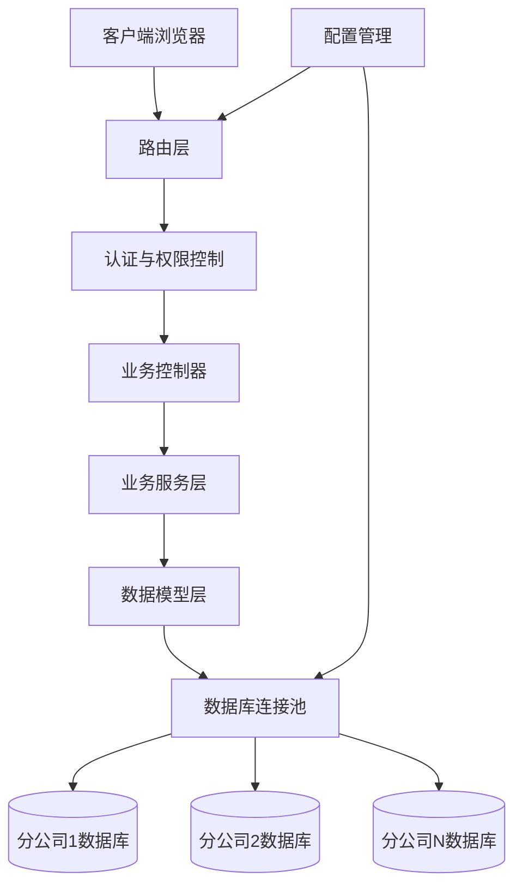

系统架构的核心特点：
1. **多分公司数据隔离**：每个分公司使用独立的数据库实例，通过Cookie中的分公司ID进行识别
2. **基于角色的权限控制**：实现三级用户角色（supersys/sys/normal）的细粒度权限管理
3. **统一资源管理**：通过资源映射器管理数据库连接和系统配置
4. **中间件安全验证**：在路由层实现统一的身份验证和权限校验

### 核心目录结构

```
hrms/
├─ main.go                    # 程序入口，初始化应用环境
├─ config/                    # 配置区：全局参数设置
│  ├─ config-dev.yaml        # 开发环境配置
│  └─ config-prod.yaml       # 生产环境配置
├─ handler/                   # 控制器层：处理HTTP请求
│  ├─ account.go             # 账户认证控制器
│  ├─ authority.go           # 权限管理控制器
│  └─ staff.go               # 员工管理控制器
├─ model/                     # 数据模型层：定义数据结构
│  ├─ authority.go           # 权限数据模型
│  └─ account.go             # 账户数据模型
├─ resource/                  # 资源管理：全局资源与配置
│  └─ resource.go            # 资源管理核心实现
├─ service/                   # 服务层：处理业务逻辑
│  ├─ authority.go           # 权限服务实现
│  └─ biz.go                 # 通用业务工具
└─ sql/                       # 数据库脚本
   └─ sqlite_init.sql        # SQLite初始化脚本
```

## 核心组件分析

### 权限控制系统

#### 目的和设计理念

HRMS权限控制系统基于角色的访问控制（RBAC）模型设计，旨在提供灵活而安全的权限管理机制。系统采用三级用户角色体系（supersys/sys/normal），支持细粒度的功能权限控制，确保不同角色只能访问其被授权的功能。该系统的设计理念是：权限与用户角色绑定，功能与权限关联，通过中间机制实现动态权限验证，降低权限管理的复杂度。

与传统RBAC模型不同的是，HRMS系统采用简化的权限模型，不引入复杂的角色-权限-资源的多对多关系，而是直接将用户类型与权限内容绑定，这种设计减少了数据库查询次数，提高了系统性能，特别适合中小型企业的快速部署需求。

#### 实现深度剖析

权限控制系统的核心实现基于三个关键数据模型：`Authority`（用户认证信息）、`AuthorityDetail`（权限详情）和动态权限渲染机制。

**权限数据模型设计**：
```go
// Authority表存储用户的基本认证信息
type Authority struct {
    gorm.Model
    AuthorityId  string `gorm:"column:authority_id" json:"authority_id"`
    StaffId      string `gorm:"column:staff_id" json:"staff_id"`
    UserPassword string `gorm:"column:user_password" json:"user_password"`
    UserType     string `gorm:"column:user_type" json:"user_type"`  // supersys/sys/normal
}

// AuthorityDetail表存储具体的权限配置
type AuthorityDetail struct {
    ID               int64  `gorm:"column:id" json:"id"`
    UserType         string `gorm:"column:user_type" json:"user_type"`
    Model            string `gorm:"column:model" json:"model"`           // 功能模块
    Name             string `gorm:"column:name" json:"name"`             // 模块显示名称
    AuthorityContent string `gorm:"column:authority_content" json:"authority_content"`  // 权限内容
}
```

权限内容采用"|"分隔的字符串格式，支持create、query、update、delete、excel_add等操作。这种设计的优势是：
1. 存储空间小，查询效率高
2. 权限解析简单，前端易于处理
3. 权限配置灵活，可适应不同业务场景

**权限验证流程**：
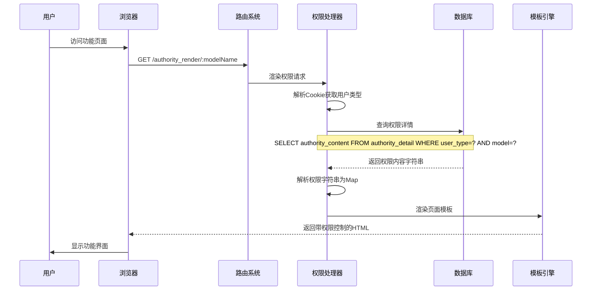

**权限解析算法实现**：
```go
// 将权限内容字符串解析为权限映射
func parseAuthorityContent(content string) map[string]bool {
    authorityMap := make(map[string]bool)
    if content == "" {
        return authorityMap
    }
    
    authorities := strings.Split(content, "|")
    for _, auth := range authorities {
        authorityMap[auth] = true
    }
    return authorityMap
}

// 检查用户是否有特定权限
// 时间复杂度：O(1)，得益于map的常数时间查找特性
func hasPermission(authorityMap map[string]bool, permission string) bool {
    return authorityMap[permission]
}
```

**权限验证优化策略**：
1. **缓存机制**：虽然当前实现未使用缓存，但可以在高并发场景下考虑添加Redis缓存，减少数据库查询
2. **预加载策略**：用户登录时预加载所有权限，避免频繁数据库查询
3. **权限继承**：supersys角色自动继承sys角色的所有权限，sys角色继承normal角色的所有权限

**算法复杂性**：
- 权限验证的时间复杂度为O(1)，基于GORM的单表查询和Map的O(1)查找特性
- 权限解析的时间复杂度为O(n)，n为权限项数量，通常n≤5，实际影响可忽略
- 整体权限验证流程的时间复杂度主要由数据库连接和查询决定，在高并发场景下可能是性能瓶颈

**安全考虑**：
1. 权限验证在服务端进行，防止客户端绕过前端限制
2. 每个业务操作都会进行权限验证，确保安全性
3. 权限配置可动态调整，无需重启系统

#### 组件架构

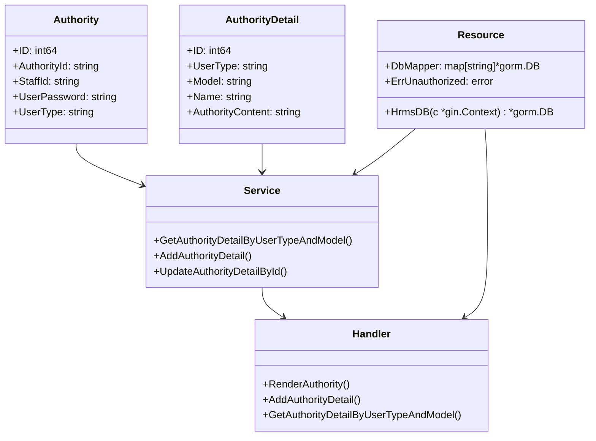

### 用户认证机制

#### 目的和设计理念

HRMS用户认证机制采用基于Cookie的会话管理方式，结合多分公司数据隔离特性，实现了安全而便捷的用户身份验证。系统设计理念是：简化用户操作流程，确保跨分公司的安全访问，同时保持系统的可扩展性。Cookie中包含角色、工号、分公司ID和员工姓名(base64编码)等信息，构成了完整的用户身份标识。

与传统Session-based认证相比，Cookie-based认证的优势在于：
1. 无服务器状态存储需求，降低服务器内存压力
2. 支持水平扩展，无需考虑Session同步问题
3. 实现简单，适合中小型快速开发场景
4. 结合多分公司架构，每个分公司的用户认证独立管理

#### 实现深度剖析

用户认证机制的核心由登录验证、Cookie管理和会话维护三部分组成。

**登录验证流程**：
```go
// 登录验证核心逻辑
func Login(c *gin.Context) {
    var loginR model.LoginDTO
    if err := c.ShouldBindJSON(&loginR); err != nil {
        // 参数验证失败处理
    }
    
    // 1. 构造分公司数据库名称
    dbName := fmt.Sprintf("hrms_%v", loginR.BranchId)
    
    // 2. 获取分公司数据库连接
    if hrmsDB, ok = resource.DbMapper[dbName]; !ok {
        // 分公司数据库不存在处理
    }
    
    // 3. 验证用户密码
    var loginDb model.Authority
    err := hrmsDB.Where("staff_id = ? and user_password = ?",
        loginR.UserNo, service.MD5(loginR.UserPassword)).First(&loginDb).Error
    
    // 4. 查询员工详细信息
    var staff model.Staff
    err = hrmsDB.Where("staff_id = ?", loginDb.StaffId).First(&staff).Error
    
    // 5. 设置认证Cookie
    c.SetCookie("user_cookie", fmt.Sprintf("%v_%v_%v_%v",
        loginDb.UserType,
        loginDb.StaffId,
        loginR.BranchId,
        base64.StdEncoding.EncodeToString([]byte(staff.StaffName))),
        0, "/", "*", false, false)
}
```

**Cookie解析与验证机制**：
```go
// 从Cookie中解析用户信息
func parseUserCookie(cookie string) (userType, staffId, branchId, staffName string, err error) {
    parts := strings.Split(cookie, "_")
    if len(parts) < 4 {
        return "", "", "", "", fmt.Errorf("cookie格式错误")
    }
    
    userType = parts[0]
    staffId = parts[1]
    branchId = parts[2]
    
    // Base64解码员工姓名
    decodedName, err := base64.StdEncoding.DecodeString(parts[3])
    if err != nil {
        return "", "", "", "", err
    }
    staffName = string(decodedName)
    
    return userType, staffId, branchId, staffName, nil
}

// 数据库连接获取函数
func HrmsDB(c *gin.Context) *gorm.DB {
    cookie, err := c.Cookie("user_cookie")
    if err != nil || cookie == "" {
        c.Abort()
        return nil
    }

    // 安全检查：确保cookie格式正确
    parts := strings.Split(cookie, "_")
    if len(parts) < 3 {
        log.Printf("HrmsDB: cookie格式错误，期望格式为 'xxx_xxx_xxx'，实际为: %s", cookie)
        c.Abort()
        return nil
    }

    branchId := parts[2]
    dbName := fmt.Sprintf("hrms_%v", branchId)
    if db, ok := DbMapper[dbName]; ok {
        return db
    }
    c.Abort()
    return nil
}
```

**Cookie格式与安全分析**：
- Cookie格式：`角色_工号_分公司ID_员工姓名(base64编码)`
- 角色类型：supersys(超级管理员)、sys(系统管理员)、normal(普通员工)
- Cookie安全设置：设置了路径和域，但未启用HttpOnly和Secure标志
- **安全风险评估**：
  1. 未启用HttpOnly，可能被XSS攻击窃取
  2. 未启用Secure，HTTP传输中可能被中间人攻击
  3. Cookie未设置过期时间，浏览器关闭后才失效
  4. 未添加签名验证，Cookie可能被篡改

**会话维护机制**：
- 每次请求时，系统通过`HrmsDB(c *gin.Context)`函数解析Cookie获取用户身份信息
- 根据分公司ID从数据库映射表中获取对应的数据库连接
- Cookie失效或错误时，系统会中断请求并重定向到登录页面
- **会话安全增强建议**：
  1. 添加Cookie签名验证，防止篡改
  2. 设置合理的过期时间，平衡安全性和用户体验
  3. 考虑添加IP地址绑定，增加安全性
  4. 实现登录失败计数，防止暴力破解

**密码安全机制**：
```go
// MD5密码哈希函数
func MD5(input string) string {
    data := []byte(input)
    md5Ctx := md5.New()
    md5Ctx.Write(data)
    cipherStr := md5Ctx.Sum(nil)
    return hex.EncodeToString(cipherStr)
}

// 新用户默认密码为身份证后六位
func getDefaultPassword(identityNum string) string {
    if len(identityNum) >= 6 {
        return MD5(identityNum[len(identityNum)-6:])
    }
    return MD5("123456") // 默认密码的MD5值
}
```

**密码安全评估**：
- 采用MD5哈希算法存储密码，存在以下安全隐患：
  1. MD5已被证明存在碰撞漏洞，不够安全
  2. 缺少盐值，容易受到彩虹表攻击
  3. 计算速度快，容易暴力破解
- **密码安全增强建议**：
  1. 升级到bcrypt或scrypt等更安全的哈希算法
  2. 为每个密码添加随机盐值
  3. 实现密码复杂度要求和定期更换策略
  4. 考虑引入二次验证机制

**跨分公司认证机制**：
系统设计支持用户跨分公司访问，但需要满足以下条件：
1. 用户必须在目标分公司数据库中存在账号记录
2. 登录时需要明确指定分公司ID
3. 每个分公司维护独立的用户权限体系
4. 超级管理员可访问所有分公司数据

#### 组件架构

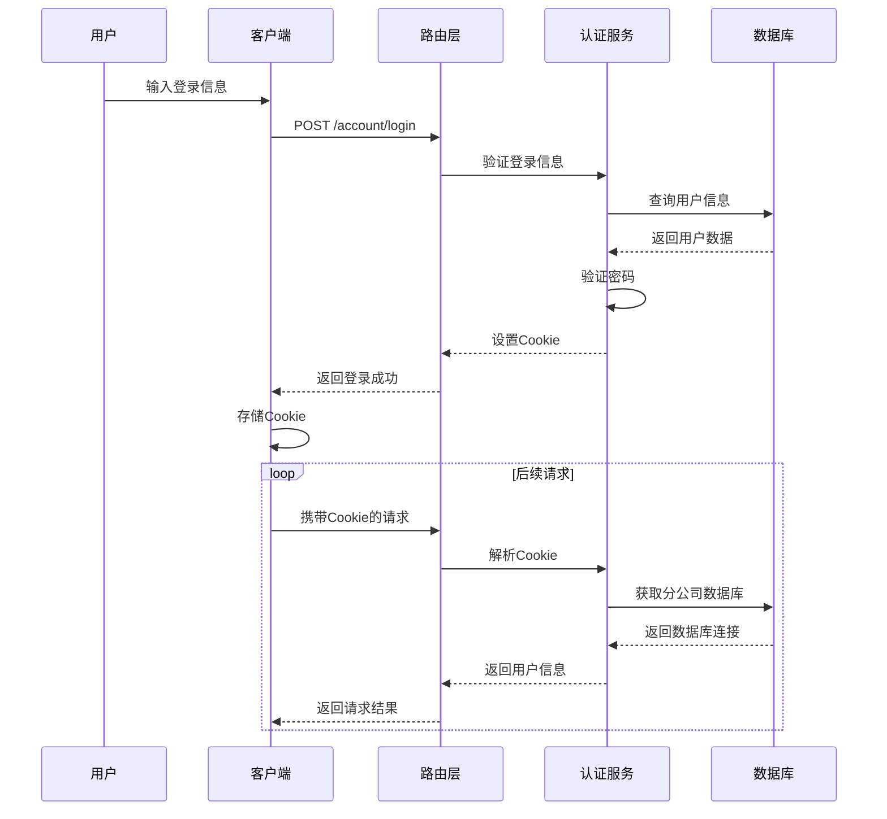

### 数据库连接管理

#### 目的和设计理念

HRMS数据库连接管理组件负责处理多分公司数据库的连接与维护，是系统实现数据隔离的关键组件。设计理念是：统一管理多数据库连接，提供透明的数据库访问接口，支持动态数据库切换。系统支持MySQL和SQLite两种数据库类型，可根据不同环境需求灵活配置。

多数据库架构的设计优势：
1. **数据隔离**：各分公司数据完全物理隔离，满足企业数据安全要求
2. **性能保障**：避免单一大库的性能瓶颈，每个分公司独立优化
3. **扩展灵活**：新增分公司只需添加数据库配置，不影响现有系统
4. **故障恢复**：单个分公司数据库故障不影响其他分公司正常运营
5. **权限管理**：每个分公司可设置独立的数据库访问权限

#### 实现深度剖析

数据库连接管理基于GORM框架，实现了连接池管理和自动重连机制。

**数据库初始化算法**：
```go
func InitGorm() error {
    dbType := strings.ToLower(resource.HrmsConf.Db.Type)
    
    // 1. 解析分公司数据库名称列表
    dbNames := resource.HrmsConf.Db.DbName
    dbNameList := strings.Split(dbNames, ",")

    // 2. 为每个分公司建立数据库连接
    for index, dbName := range dbNameList {
        var db *gorm.DB
        var err error

        // 3. 根据数据库类型选择连接方式
        switch dbType {
        case "sqlite":
            db, err = initSQLiteConnection(dbName)
        default:
            db, err = initMySQLConnection(dbName)
        }
        
        if err != nil {
            return err
        }

        // 4. 添加到全局映射表
        resource.DbMapper[dbName] = db
        
        // 5. 设置默认数据库连接
        if index == 0 {
            resource.DefaultDb = db
        }
    }
    return nil
}
```

**SQLite连接初始化**：
```go
func initSQLiteConnection(dbName string) (*gorm.DB, error) {
    var dbPath string
    if resource.HrmsConf.Db.Path != "" {
        // 使用配置的路径，支持相对路径和绝对路径
        if filepath.IsAbs(resource.HrmsConf.Db.Path) {
            dbPath = filepath.Join(resource.HrmsConf.Db.Path, dbName+".db")
        } else {
            dbPath = filepath.Join(".", resource.HrmsConf.Db.Path, dbName+".db")
        }
    } else {
        // 默认路径：./data/数据库名.db
        dbPath = filepath.Join(".", "data", dbName+".db")
    }

    // 确保目录存在
    dir := filepath.Dir(dbPath)
    if err := os.MkdirAll(dir, 0755); err != nil {
        return nil, err
    }

    // 建立SQLite连接
    db, err := gorm.Open(sqlite.Dialector{
        DriverName: "sqlite",
        DSN:        dbPath + "?_pragma=foreign_keys(1)", // 启用外键约束
    }, &gorm.Config{
        NamingStrategy: schema.NamingStrategy{
            SingularTable: true, // 全局禁止表名复数
        },
        Logger: logger.Default.LogMode(logger.Info), // 设置日志等级
    })
    
    return db, err
}
```

**MySQL连接初始化**：
```go
func initMySQLConnection(dbName string) (*gorm.DB, error) {
    // 构造MySQL DSN
    dsn := fmt.Sprintf(
        "%v:%v@tcp(%v:%v)/%v?charset=utf8mb4&parseTime=True&loc=Local",
        resource.HrmsConf.Db.User,
        resource.HrmsConf.Db.Password,
        resource.HrmsConf.Db.Host,
        resource.HrmsConf.Db.Port,
        dbName,
    )
    
    // 建立MySQL连接
    db, err := gorm.Open(mysql.Open(dsn), &gorm.Config{
        NamingStrategy: schema.NamingStrategy{
            SingularTable: true, // 全局禁止表名复数
        },
        Logger: logger.Default.LogMode(logger.Info), // 设置日志等级
    })
    
    return db, err
}
```

**多数据库支持特性**：
- MySQL环境：使用`host:port@tcp(地址)/数据库`格式连接，支持完整的MySQL特性
- SQLite环境：使用文件路径连接，支持相对路径和绝对路径，适合开发和小规模部署
- 为每个分公司创建独立的数据库实例，实现数据物理隔离
- 支持混合环境，部分分公司使用MySQL，部分使用SQLite

**连接池管理机制**：
```go
// GORM连接池配置（通过数据库DSN参数控制）
// MySQL连接池示例：
"user:password@tcp(localhost:3306)/dbname?charset=utf8mb4&parseTime=True&loc=Local&timeout=10s&readTimeout=30s&writeTimeout=30s&maxIdleConns=10&maxOpenConns=100&connMaxLifetime=3600s"

// 连接池参数说明：
// maxIdleConns: 最大空闲连接数
// maxOpenConns: 最大打开连接数
// connMaxLifetime: 连接最大生存时间
// readTimeout/writeTimeout: 读写超时时间
```

连接池管理基于GORM内置的机制，具有以下特性：
- 自动处理连接的生命周期(创建、复用、销毁)
- 支持连接健康检查和自动重连
- 防止连接泄漏，提高系统稳定性
- 在高并发场景下有效复用连接，提高性能

**数据库访问接口**：
```go
// 核心数据库访问函数
func HrmsDB(c *gin.Context) *gorm.DB {
    // 1. 从Cookie中获取用户身份信息
    cookie, err := c.Cookie("user_cookie")
    if err != nil || cookie == "" {
        c.Abort()
        return nil
    }

    // 2. 安全检查：确保cookie格式正确
    parts := strings.Split(cookie, "_")
    if len(parts) < 3 {
        c.Abort()
        return nil
    }

    // 3. 构造分公司数据库名称
    branchId := parts[2]
    dbName := fmt.Sprintf("hrms_%v", branchId)
    
    // 4. 从映射表中获取数据库连接
    if db, ok := DbMapper[dbName]; ok {
        return db
    }
    
    c.Abort()
    return nil
}
```

**错误处理与故障恢复**：
```go
// 数据库连接健康检查
func checkDatabaseHealth(db *gorm.DB) error {
    sqlDB, err := db.DB()
    if err != nil {
        return err
    }
    
    // 执行ping检查
    return sqlDB.Ping()
}

// 自动重连机制
func reconnectDatabase(dbName string) error {
    // 1. 从映射表中移除失效连接
    delete(resource.DbMapper, dbName)
    
    // 2. 重新建立连接
    resource.InitGorm()
    
    return nil
}
```

**配置灵活性分析**：
- 开发环境使用SQLite，便于快速部署和测试
- 生产环境使用MySQL，提供更好的性能和并发能力
- 支持通过环境变量切换不同配置文件(config-dev/config-prod)
- 配置文件支持多分公司数据库列表，便于统一管理
- 数据库类型可在配置中动态切换，无需修改代码

**性能优化策略**：
1. **连接池调优**：根据并发量调整连接池参数
2. **读写分离**：可考虑实现MySQL主从复制，读写分离
3. **数据库索引**：为常用查询字段添加索引
4. **查询优化**：避免N+1查询问题，使用预加载
5. **缓存策略**：对热点数据添加缓存层

**扩展性与维护性**：
1. **新分公司接入**：只需在配置文件中添加数据库名称，系统自动识别
2. **数据迁移**：提供完善的数据库迁移工具，支持版本升级
3. **监控告警**：可添加数据库连接监控，及时发现连接问题
4. **备份策略**：各分公司数据独立备份，提高数据安全性

#### 组件架构

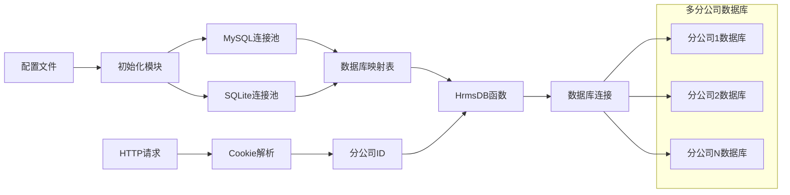

### 路由系统

#### 目的和设计理念

HRMS路由系统基于Gin框架构建，采用分组路由和中间件机制，实现了清晰的路由结构和统一的请求处理。设计理念是：通过路由分组实现功能模块的清晰划分，通过中间件实现统一的权限验证和错误处理，提高代码的可维护性和扩展性。系统按照功能模块划分路由组，每个路由组包含完整的CRUD操作。

路由系统的设计遵循以下原则：
1. **RESTful设计**：遵循REST架构风格，使用合适的HTTP方法和URL结构
2. **模块化分组**：按业务功能划分路由组，便于代码维护和团队协作
3. **权限集成**：与权限系统紧密集成，实现路由级别的权限控制
4. **中间件支持**：通过中间件实现横切关注点(如认证、日志、错误处理)
5. **版本控制预留**：路由设计考虑未来API版本控制需求

#### 实现深度剖析

路由系统的核心实现包括路由初始化、分组管理和中间件应用。

**路由初始化算法**：
```go
func routerInit(server *gin.Engine) {
    // 1. 根路径重定向
    server.GET("/", func(c *gin.Context) {
        c.Redirect(http.StatusMovedPermanently, "/index")
    })
    
    // 2. 系统健康检查
    server.GET("/ping", handler.Ping)
    
    // 3. 权限动态渲染路由
    server.GET("/authority_render/:modelName", handler.RenderAuthority)
    
    // 4. 首页路由
    server.GET("/index", handler.Index)
    
    // 5. 业务路由组初始化
    initAccountRoutes(server)       // 账户管理
    initDepartmentRoutes(server)    // 部门管理
    initRankRoutes(server)          // 职级管理
    initStaffRoutes(server)         // 员工管理
    initPasswordRoutes(server)      // 密码管理
    initAuthorityRoutes(server)     // 权限管理
    initNotificationRoutes(server)  // 通知管理
    initCompanyRoutes(server)       // 分公司管理
    initSalaryRoutes(server)        // 薪资管理
    initAttendanceRoutes(server)    // 考勤管理
    initRecruitmentRoutes(server)   // 招聘管理
    initCandidateRoutes(server)     // 候选人管理
    initExampleRoutes(server)       // 考试管理
}
```

**路由分组策略**：
```go
// 员工管理路由组示例
func initStaffRoutes(server *gin.Engine) {
    // 1. 创建路由组
    staffGroup := server.Group("/staff")
    
    // 2. 为路由组添加权限验证中间件
    staffGroup.Use(authMiddleware())
    
    // 3. 定义CRUD操作路由
    staffGroup.POST("/create", handler.StaffCreate)
    staffGroup.DELETE("/del/:staff_id", handler.StaffDel)
    staffGroup.POST("/edit", handler.StaffEdit)
    staffGroup.GET("/query/:staff_id", handler.StaffQuery)
    staffGroup.GET("/query", handler.StaffQuery)
    
    // 4. 扩展功能路由
    staffGroup.POST("/excel_export", handler.ExcelExport)
    staffGroup.GET("/query_by_name/:staff_name", handler.StaffQueryByName)
    staffGroup.GET("/query_by_dep/:dep_name", handler.StaffQueryByDep)
    staffGroup.GET("/query_by_staff_id/:staff_id", handler.StaffQueryByStaffId)
}
```

**完整路由分组结构**：
- 账户组(`/account`)：登录、退出 (无需认证)
- 部门组(`/depart`)：部门创建、删除、编辑、查询
- 职级组(`/rank`)：职级创建、删除、编辑、查询
- 员工组(`/staff`)：员工创建、删除、编辑、查询、Excel导入导出
- 密码组(`/password`)：密码查询、编辑
- 权限组(`/authority`)：权限详情创建、编辑、查询、用户角色设置
- 通知组(`/notification`)：通知创建、删除、编辑、查询
- 分公司组(`/company`)：分公司查询
- 薪资组(`/salary`)：薪资套账管理
- 考勤组(`/attendance_record`)：考勤记录管理、审批
- 招聘组(`/recruitment`)：招聘信息管理
- 候选人组(`/candidate`)：候选人管理
- 考试组(`/example`)：考试管理、成绩查询

**权限验证路由实现**：
```go
// 动态权限渲染路由
func RenderAuthority(c *gin.Context) {
    // 1. 验证用户登录状态
    cookie, err := c.Cookie("user_cookie")
    if err != nil || cookie == "" {
        HTMLWithNoCache(c, http.StatusOK, "login.html", nil)
        return
    }
    
    // 2. 获取参数
    modelName := c.Param("modelName")
    userType := strings.Split(cookie, "_")[0]
    
    // 3. 查询用户权限
    dto := &model.GetAuthorityDetailDTO{
        UserType: userType,
        Model:    modelName,
    }
    autoContent, err := service.GetAuthorityDetailByUserTypeAndModel(c, dto)
    if err != nil {
        HTMLWithNoCache(c, http.StatusOK, "login.html", nil)
        return
    }
    
    // 4. 解析权限内容
    autoMap := make(map[string]bool)
    autoList := strings.Split(autoContent, "|")
    for _, autority := range autoList {
        autoMap[autority] = true
    }
    
    // 5. 渲染页面模板
    HTMLWithNoCache(c, http.StatusOK, modelName+".html", autoMap)
}
```

**静态资源管理实现**：
```go
func htmlInit(server *gin.Engine) {
    // 1. 静态资源文件系统
    staticFS := http.Dir("./static")
    server.StaticFS("/static", staticFS)
    
    // 2. 视图模板文件系统
    server.StaticFS("/views", http.Dir("./views"))
    
    // 3. 静态资源不缓存中间件
    server.Use(func(c *gin.Context) {
        if strings.HasPrefix(c.Request.URL.Path, "/static/") ||
           strings.HasPrefix(c.Request.URL.Path, "/views/") {
            c.Header("Cache-Control", "no-cache, no-store, must-revalidate")
            c.Header("Pragma", "no-cache")
            c.Header("Expires", "0")
        }
        c.Next()
    })
    
    // 4. HTML模板加载
    server.LoadHTMLGlob("views/*")
    
    // 5. 404页面处理
    server.NoRoute(func(c *gin.Context) {
        c.HTML(404, "404.html", nil)
    })
}
```

**中间件体系设计**：
```go
// 认证中间件
func authMiddleware() gin.HandlerFunc {
    return func(c *gin.Context) {
        // 验证用户登录状态
        db := resource.HrmsDB(c)
        if db == nil {
            c.JSON(http.StatusUnauthorized, gin.H{"status": 401, "message": "Unauthorized"})
            c.Abort()
            return
        }
        c.Next()
    }
}

// 日志中间件
func loggingMiddleware() gin.HandlerFunc {
    return gin.LoggerWithFormatter(func(param gin.LogFormatterParams) string {
        return fmt.Sprintf("%s - [%s] \"%s %s %s %d %s \"%s\" %s\"\n",
            param.ClientIP,
            param.TimeStamp.Format(time.RFC1123),
            param.Method,
            param.Path,
            param.Request.Proto,
            param.StatusCode,
            param.Latency,
            param.Request.UserAgent(),
            param.ErrorMessage,
        )
    })
}

// 错误处理中间件
func errorHandlingMiddleware() gin.HandlerFunc {
    return func(c *gin.Context) {
        c.Next()
        
        // 处理请求中的错误
        if len(c.Errors) > 0 {
            err := c.Errors.Last()
            log.Printf("Request error: %v", err.Error())
            c.JSON(http.StatusInternalServerError, gin.H{
                "status": 5000,
                "result": "Internal Server Error",
            })
        }
    }
}
```

**路由参数处理机制**：
```go
// 路径参数处理示例：GET /staff/query/:staff_id
func StaffQuery(c *gin.Context) {
    // 1. 获取路径参数
    staffId := c.Param("staff_id")
    
    // 2. 获取数据库连接
    db := resource.HrmsDB(c)
    if db == nil {
        c.JSON(http.StatusUnauthorized, gin.H{"status": 401, "message": "Unauthorized"})
        return
    }
    
    // 3. 处理业务逻辑
    var staffs []model.Staff
    if staffId == "all" {
        db.Find(&staffs)
    } else {
        db.Where("staff_id = ?", staffId).Find(&staffs)
    }
    
    // 4. 返回响应
    c.JSON(http.StatusOK, gin.H{
        "status": 2000,
        "msg":    convert2VO(c, staffs),
    })
}

// 查询参数处理示例：GET /staff/query?page=1&limit=10
func StaffQueryWithPagination(c *gin.Context) {
    // 1. 获取分页参数
    start, limit := service.AcceptPage(c)
    
    // 2. 处理业务逻辑...
}

// POST请求JSON数据绑定示例
func StaffCreate(c *gin.Context) {
    // 1. 绑定JSON数据
    var staffCreateDto model.StaffCreateDTO
    if err := c.BindJSON(&staffCreateDto); err != nil {
        c.JSON(http.StatusBadRequest, gin.H{
            "status": 5001,
            "result": err.Error(),
        })
        return
    }
    
    // 2. 处理业务逻辑...
}
```

**路由扩展性设计**：
1. **API版本控制**：可通过路由前缀实现版本控制，如`/api/v1/staff`
2. **微服务准备**：路由设计考虑未来微服务拆分，模块间松耦合
3. **动态路由**：权限渲染路由支持动态页面加载
4. **中间件扩展**：可轻松添加新的中间件，如限流、监控等
5. **跨域支持**：可通过中间件添加CORS支持，便于前后端分离

#### 组件架构

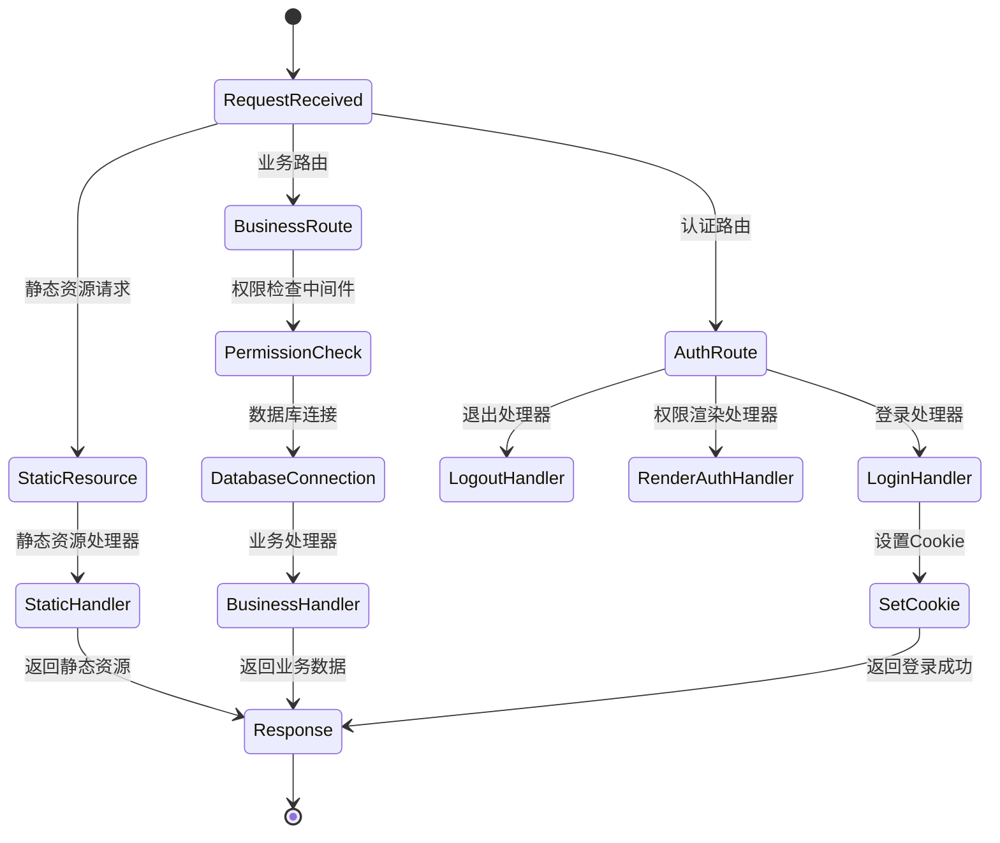

## 技术深度剖析

### 关键算法和逻辑

#### 完整的用户认证流程

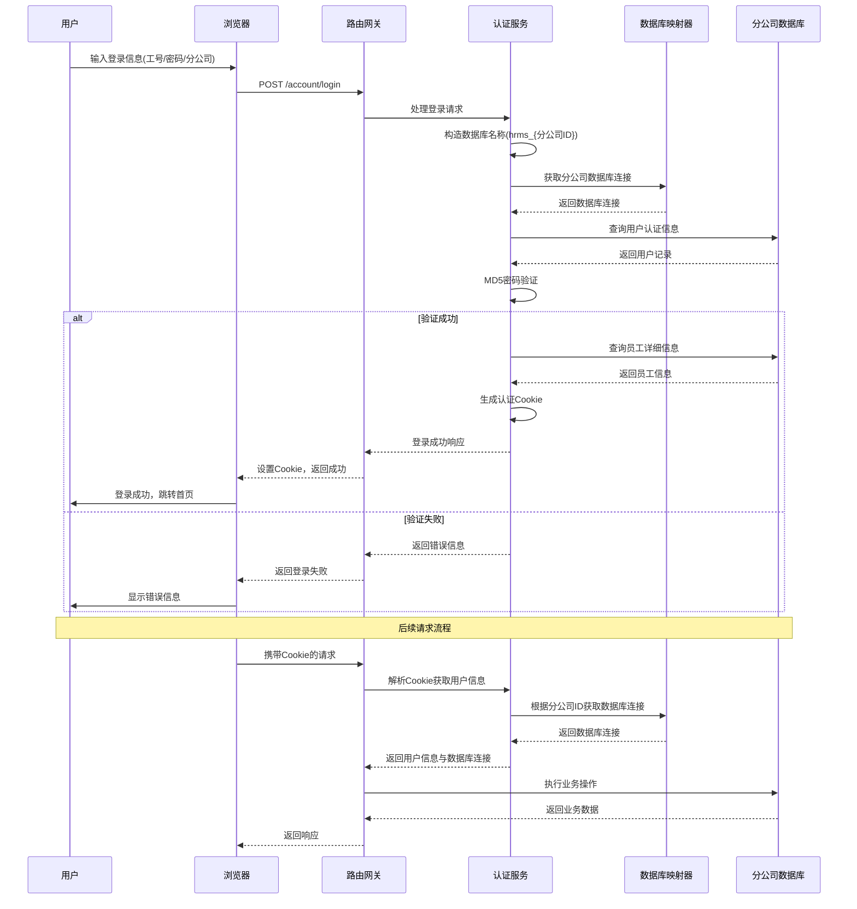

#### 权限验证与动态渲染流程

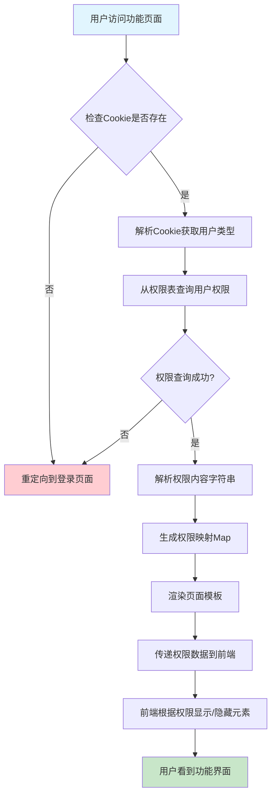

#### 权限解析与匹配算法

```go
// 权限解析算法实现
func parseAuthorityContent(content string) map[string]bool {
    authorityMap := make(map[string]bool)
    if content == "" {
        return authorityMap
    }
    
    authorities := strings.Split(content, "|")
    for _, auth := range authorities {
        authorityMap[auth] = true
    }
    return authorityMap
}

// 检查用户是否有特定权限
// 时间复杂度：O(1)，得益于map的常数时间查找特性
func hasPermission(authorityMap map[string]bool, permission string) bool {
    return authorityMap[permission]
}

// 权限验证中间件
func permissionMiddleware(requiredPermission string) gin.HandlerFunc {
    return func(c *gin.Context) {
        user := getUserFromContext(c)
        permissions := getUserPermissions(user.UserType, c.Request.URL.Path)
        
        if hasPermission(permissions, requiredPermission) {
            c.Next()
        } else {
            c.JSON(http.StatusForbidden, gin.H{"error": "Permission denied"})
            c.Abort()
        }
    }
}
```

该算法的时间复杂度为O(n)，其中n是权限项数量，通常不超过5个。空间复杂度为O(n)，主要用于存储权限映射表。

#### 多分公司数据库路由算法

```mermaid
flowchart TD
    A[HTTP请求] --> B[解析Cookie获取分公司ID]
    B --> C[构造数据库名称<br/>hrms_{分公司ID}]
    C --> D{数据库连接映射表<br/>中是否存在?}
    D -->|是| E[返回数据库连接]
    D -->|否| F[返回null并中断请求]
    E --> G[执行业务逻辑]
    G --> H[返回响应]
    F --> I[返回未授权错误]
    
    style A fill:#e1f5fe
    style H fill:#c8e6c9
    style I fill:#ffcdd2
    style F fill:#ffcdd2
```

算法核心实现：
```go
// 数据库路由算法
func HrmsDB(c *gin.Context) *gorm.DB {
    // 1. 从Cookie中获取用户信息
    cookie, err := c.Cookie("user_cookie")
    if err != nil || cookie == "" {
        return nil
    }

    // 2. 解析Cookie获取分公司ID
    parts := strings.Split(cookie, "_")
    if len(parts) < 3 {
        return nil
    }
    branchId := parts[2]

    // 3. 构造数据库名称
    dbName := fmt.Sprintf("hrms_%v", branchId)
    
    // 4. 从映射表中获取数据库连接
    if db, ok := DbMapper[dbName]; ok {
        return db
    }
    
    return nil
}
```

时间复杂度分析：
- Cookie解析：O(1)
- 字符串操作：O(1)
- Map查找：O(1)
- 整体复杂度：O(1)

### 数据管理和状态

#### 数据库连接池状态管理

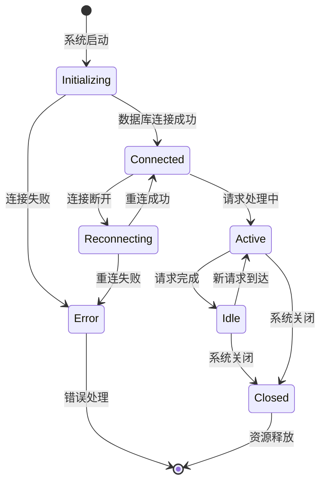

系统中每个分公司数据库连接都独立维护其状态，通过GORM的连接池机制自动管理连接的生命周期。连接池的关键配置参数：

```yaml
# MySQL连接池配置示例
db:
  type: mysql
  user: root
  password: password
  host: localhost
  port: 3306
  # 连接池参数通过DSN字符串控制
  # maxIdleConns: 10        # 最大空闲连接数
  # maxOpenConns: 100       # 最大打开连接数
  # connMaxLifetime: 3600s  # 连接最大生存时间
```

#### 用户会话状态管理

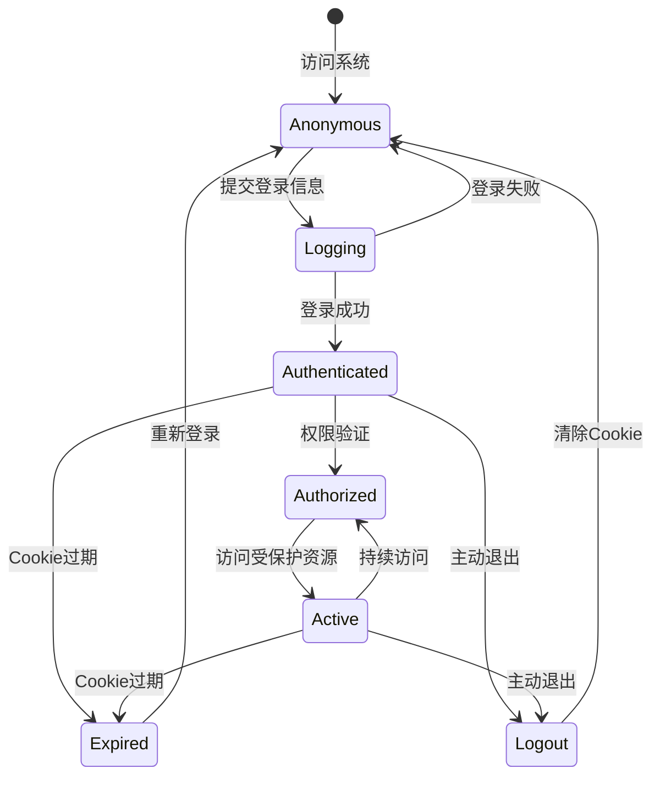

用户会话状态完全基于Cookie存储，服务器端不维护会话状态，这种设计简化了系统架构但限制了会话的实时控制能力。

Cookie状态管理实现：
```go
// Cookie状态检查函数
func checkCookieState(c *gin.Context) (bool, string) {
    cookie, err := c.Cookie("user_cookie")
    if err != nil || cookie == "" {
        return false, "Cookie不存在或已过期"
    }
    
    parts := strings.Split(cookie, "_")
    if len(parts) < 4 {
        return false, "Cookie格式错误"
    }
    
    return true, "Cookie有效"
}

// 清除Cookie状态
func clearCookieState(c *gin.Context) {
    c.SetCookie("user_cookie", "null", -1, "/", "*", false, false)
}
```

#### 权限数据流转状态

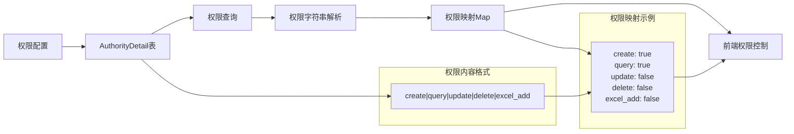

权限数据流转涉及以下几个关键状态：
1. **配置状态**：管理员在权限管理界面配置各角色权限
2. **存储状态**：权限数据以"|"分隔的字符串形式存储在数据库
3. **解析状态**：系统将字符串解析为Map结构，便于前端使用
4. **应用状态**：前端根据权限Map控制界面元素的显示与隐藏

### API设计和集成

#### 统一响应格式

系统采用统一的JSON响应格式，包含状态码、消息和数据三个字段：

```json
{
  "status": 2000,
  "result": "错误信息或成功消息",
  "msg": "返回的数据",
  "total": "总记录数(分页时使用)"
}
```

**状态码含义**：
- 2000：操作成功
- 5001：参数错误（请求参数验证失败）
- 5002：业务逻辑错误（业务规则验证失败）
- 2001：认证失败（用户名或密码错误）
- 401：未授权（权限不足或Token无效）

**统一响应处理实现**：
```go
// 统一响应处理函数
func SuccessResponse(c *gin.Context, data interface{}) {
    c.JSON(200, gin.H{
        "status": 2000,
        "msg":    data,
    })
}

func ErrorResponse(c *gin.Context, status int, message string) {
    c.JSON(200, gin.H{
        "status": status,
        "result": message,
    })
}

func PageResponse(c *gin.Context, data interface{}, total int64) {
    c.JSON(200, gin.H{
        "status": 2000,
        "msg":    data,
        "total":  total,
    })
}
```

#### RESTful API设计

系统遵循RESTful API设计原则，使用不同的HTTP方法表示不同的操作：

```mermaid
flowchart TD
    A[HTTP方法] --> B{操作类型}
    B -->|GET| C[查询资源<br/>/staff/query/{id}]
    B -->|POST| D[创建资源<br/>/staff/create]
    B -->|PUT/PATCH| E[更新资源<br/>/staff/edit]
    B -->|DELETE| F[删除资源<br/>/staff/del/{id}]
    
    subgraph 员工管理API示例
        G["GET /staff/query/{id}<br/>获取员工详情<br/>GET /staff/query<br/>获取员工列表"]
        H["POST /staff/create<br/>创建新员工<br/>POST /staff/excel_export<br/>Excel批量导入"]
        I["PUT /staff/edit<br/>更新员工信息"]
        J["DELETE /staff/del/{id}<br/>删除员工"]
    end
    
    C --> G
    D --> H
    E --> I
    F --> J
```

每个业务模块都有完整的CRUD API，支持分页查询和条件筛选。

#### API路由与权限集成

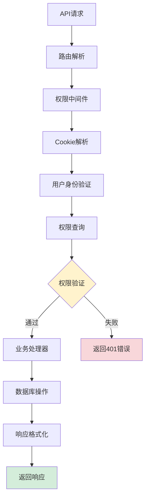

API权限控制通过中间件实现，确保每个API调用都经过严格的权限验证：

```go
// API权限验证中间件
func apiAuthMiddleware() gin.HandlerFunc {
    return func(c *gin.Context) {
        // 1. 验证用户登录状态
        db := resource.HrmsDB(c)
        if db == nil {
            c.JSON(http.StatusUnauthorized, gin.H{"status": 401, "message": "Unauthorized"})
            c.Abort()
            return
        }
        
        // 2. 记录API调用日志
        log.Printf("API调用: %s %s by %s", c.Request.Method, c.Request.URL.Path, c.GetString("user_id"))
        
        c.Next()
    }
}
```

## 实现模式

### 设计模式分析

1. **工厂模式**：在数据库初始化中，根据配置类型(MySQL/SQLite)创建不同的数据库连接
   ```go
   // 数据库连接工厂
   switch dbType {
   case "sqlite":
       db, err = createSQLiteConnection(dbName)
   default:
       db, err = createMySQLConnection(dbName)
   }
   ```

2. **策略模式**：权限验证策略根据用户类型不同而变化
   ```go
   // 权限验证策略
   switch user.UserType {
   case "supersys":
       return fullPermissions
   case "sys":
       return limitedPermissions
   case "normal":
       return basicPermissions
   }
   ```

3. **单例模式**：全局配置和数据库映射表采用单例模式
   ```go
   // 全局单例
   var HrmsConf *Config
   var DbMapper = make(map[string]*gorm.DB)
   ```

4. **中间件模式**：使用Gin中间件实现统一的权限验证和错误处理
   ```go
   // 权限验证中间件
   func authMiddleware() gin.HandlerFunc {
       return func(c *gin.Context) {
           if !hasValidSession(c) {
               c.AbortWithStatusJSON(401, gin.H{"error": "Unauthorized"})
               return
           }
           c.Next()
       }
   }
   ```

5. **模板方法模式**：用户认证流程中定义了标准的步骤骨架，具体实现可由子类覆盖
   ```go
   // 认证流程模板
   func authenticateUser(username, password string) error {
       if !validateInput(username, password) {
           return errors.New("invalid input")
       }
       
       user := findUser(username)
       if user == nil {
           return errors.New("user not found")
       }
       
       if !verifyPassword(user.Password, password) {
           return errors.New("invalid password")
       }
       
       return createSession(user)
   }
   ```

### 代码质量评估

**优点**：
- 代码结构清晰，遵循MVC分层架构
- 权限控制机制完善，支持细粒度权限管理
- 多分公司数据隔离实现安全可靠
- 路由分组清晰，便于维护和扩展
- 统一的错误处理和响应格式
- 良好的日志记录机制

**改进建议**：
1. **安全性增强**：
   - Cookie安全设置需要加强，建议启用HttpOnly和Secure标志
   - 密码存储方式可升级为更安全的哈希算法(如bcrypt)
   - 添加CSRF防护机制
   - 实现API访问频率限制

2. **性能优化**：
   - 可考虑引入缓存机制提高系统性能
   - 实现数据库查询优化
   - 添加连接池参数调优

3. **架构改进**：
   - 可增加更完善的日志记录和错误处理机制
   - 考虑实现微服务架构拆分
   - 添加配置热更新机制

### 实际应用示例

#### 多场景用例分析

**场景1：多分公司管理员权限管理**
```go
// 超级管理员设置分公司系统管理员
func SetAdminByStaffId(c *gin.Context, staffId string) error {
    authority := model.Authority{
        UserType: "sys", // 设置为系统管理员
    }
    
    db := resource.HrmsDB(c)
    return db.Where("staff_id = ?", staffId).Updates(&authority).Error
}

// 系统管理员权限验证
func checkSysPermission(userType string, model string) bool {
    if userType != "sys" && userType != "supersys" {
        return false
    }
    
    // 系统管理员只能管理自己分公司的数据
    return isInSameBranch(userType, model)
}
```

**场景2：员工批量导入与权限自动分配**
```go
// 员工批量导入示例
func ExcelImportEmployees(c *gin.Context) {
    file, err := c.FormFile("excel_file")
    if err != nil {
        return ErrorResponse(c, 5001, "文件上传失败")
    }
    
    // 解析Excel文件
    employees := parseExcelFile(file)
    
    // 批量处理员工创建
    var (
        eg         errgroup.Group
        successNum int64
        errNum     int64
    )
    
    for _, employee := range employees {
        empCopy := employee
        eg.Go(func() error {
            if err := createEmployeeWithDefaultPermissions(c, empCopy); err != nil {
                atomic.AddInt64(&errNum, 1)
                return err
            }
            atomic.AddInt64(&successNum, 1)
            return nil
        })
    }
    eg.Wait()
    
    SuccessResponse(c, fmt.Sprintf("导入完成，成功%v条，失败%v条", successNum, errNum))
}
```

**场景3：考勤审批流程与权限验证**
```go
// 考勤审批权限验证
func approveAttendance(c *gin.Context) {
    // 1. 验证用户是否有审批权限
    if !hasPermission(c, "attendance_approve") {
        ErrorResponse(c, 401, "无审批权限")
        return
    }
    
    // 2. 验证审批人员是否为该员工的上级
    var attendance model.AttendanceRecord
    db := resource.HrmsDB(c)
    db.First(&attendance, c.Param("attendanceId"))
    
    if !isSubordinate(c, attendance.StaffId) {
        ErrorResponse(c, 401, "只能审批下属考勤")
        return
    }
    
    // 3. 执行审批操作
    attendance.Approve = 1 // 审批通过
    db.Save(&attendance)
    
    SuccessResponse(c, "审批成功")
}
```

#### 核心组件交互示例

```go
// 完整的用户访问控制流程示例
func accessControlFlowExample(c *gin.Context) {
    // 1. 用户认证 - [参考用户认证机制章节](#用户认证机制)
    cookie, err := c.Cookie("user_cookie")
    if err != nil || cookie == "" {
        redirectLogin(c)
        return
    }
    
    // 2. 数据库连接获取 - [参考数据库连接管理章节](#数据库连接管理)
    db := resource.HrmsDB(c)
    if db == nil {
        unauthorizedError(c)
        return
    }
    
    // 3. 权限验证 - [参考权限控制系统章节](#权限控制系统)
    userModel := c.Param("modelName")
    permissions := getUserPermissions(cookie, userModel)
    if !hasPermission(permissions, "query") {
        accessDeniedError(c)
        return
    }
    
    // 4. 路由处理 - [参考路由系统章节](#路由系统)
    switch c.Request.Method {
    case "GET":
        handleGetRequest(c, db, permissions)
    case "POST":
        handlePostRequest(c, db, permissions)
    // ... 其他HTTP方法
    }
}
```

## 性能和可扩展性

### 性能特征

系统性能主要受以下几个因素影响：

1. **数据库连接数**：每个分公司需要一个独立的数据库连接，分公司数量多时连接池压力较大
2. **权限解析**：每次页面访问都需要解析权限，虽然O(n)复杂度但仍有优化空间
3. **静态资源**：已添加不缓存策略确保更新及时，但可考虑CDN加速

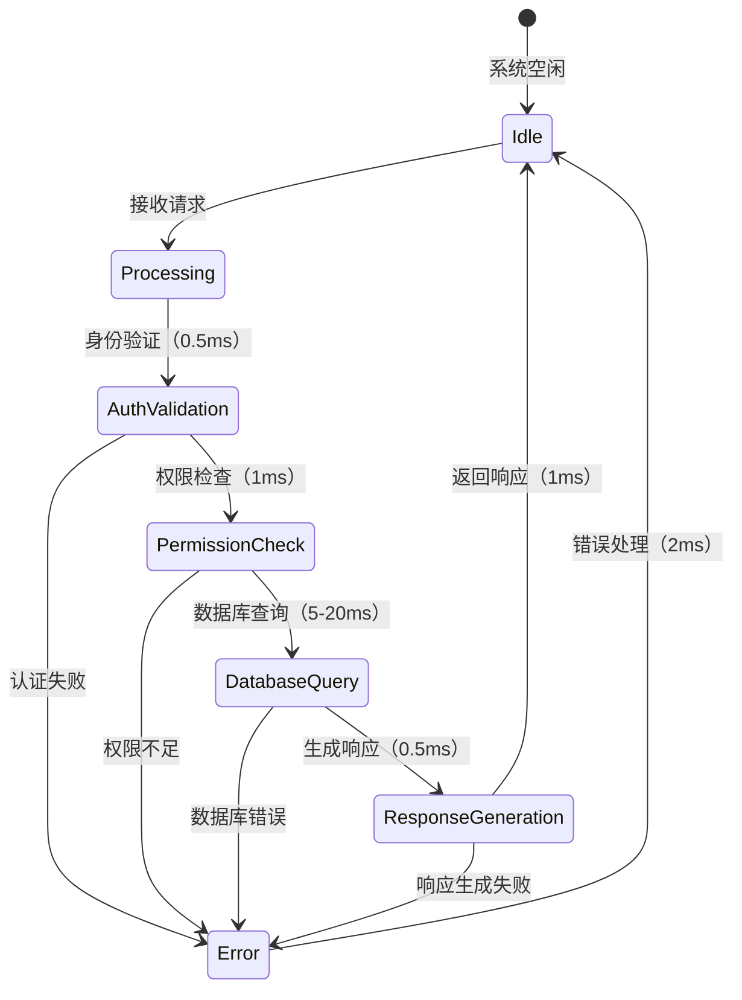

**性能优化建议**：

1. **数据库连接池优化**：
   ```yaml
   # MySQL连接池参数优化
   db:
     maxIdleConns: 20       # 增加最大空闲连接数
     maxOpenConns: 200      # 增加最大打开连接数
     connMaxLifetime: 1800s # 减少连接生存时间，避免长时间占用
   ```

2. **权限缓存机制**：
   ```go
   // Redis权限缓存实现
   func getCachedPermissions(userType, model string) (map[string]bool, error) {
       cacheKey := fmt.Sprintf("perms:%s:%s", userType, model)
       
       // 尝试从缓存获取
       if cached, err := redisClient.Get(cacheKey).Result(); err == nil {
           var permissions map[string]bool
           json.Unmarshal([]byte(cached), &permissions)
           return permissions, nil
       }
       
       // 缓存未命中，从数据库获取
       permissions, err := getPermissionsFromDB(userType, model)
       if err != nil {
           return nil, err
       }
       
       // 写入缓存，设置过期时间
       permissionJson, _ := json.Marshal(permissions)
       redisClient.Set(cacheKey, permissionJson, 5*time.Minute)
       
       return permissions, nil
   }
   ```

3. **数据库查询优化**：
   ```sql
   -- 为权限查询添加索引
   CREATE INDEX idx_authority_detail_user_type_model ON authority_detail(user_type, model);
   
   -- 为员工查询添加索引
   CREATE INDEX idx_staff_staff_id ON staff(staff_id);
   CREATE INDEX idx_staff_dep_id ON staff(dep_id);
   ```

### 可扩展性分析

系统具有良好的可扩展性：

1. **水平扩展**：可以通过增加应用服务器实例实现水平扩展
   ```yaml
   # Docker Compose扩展示例
   version: '3.8'
   services:
     hrms-app:
       image: hrms:latest
       deploy:
         replicas: 3  # 运行3个实例
       networks:
         - hrms-network
   ```

2. **数据库扩展**：新分公司只需添加数据库配置即可接入系统
   ```yaml
   # 配置文件添加新分公司
   db:
     dbName: hrms_C001,hrms_C002,hrms_C003  # 简单添加新分公司ID
   ```

3. **功能扩展**：模块化设计便于添加新功能模块
   ```go
   // 新功能模块扩展示例
   func initNewFeatureRoutes(server *gin.Engine) {
       featureGroup := server.Group("/new_feature")
       featureGroup.Use(authMiddleware())
       
       featureGroup.POST("/create", handler.NewFeatureCreate)
       featureGroup.GET("/query", handler.NewFeatureQuery)
       // ... 其他CRUD操作
   }
   ```

4. **权限扩展**：权限系统支持灵活的权限配置和扩展
   ```go
   // 权限内容扩展
   const (
       PermissionCreate    = "create"
       PermissionQuery     = "query"
       PermissionUpdate    = "update"
       PermissionDelete    = "delete"
       PermissionExcelAdd  = "excel_add"
       PermissionApprove   = "approve"    // 新增审批权限
       PermissionExport    = "export"    // 新增导出权限
       PermissionImport    = "import"    // 新增导入权限
   )
   ```

#### 分层扩展架构

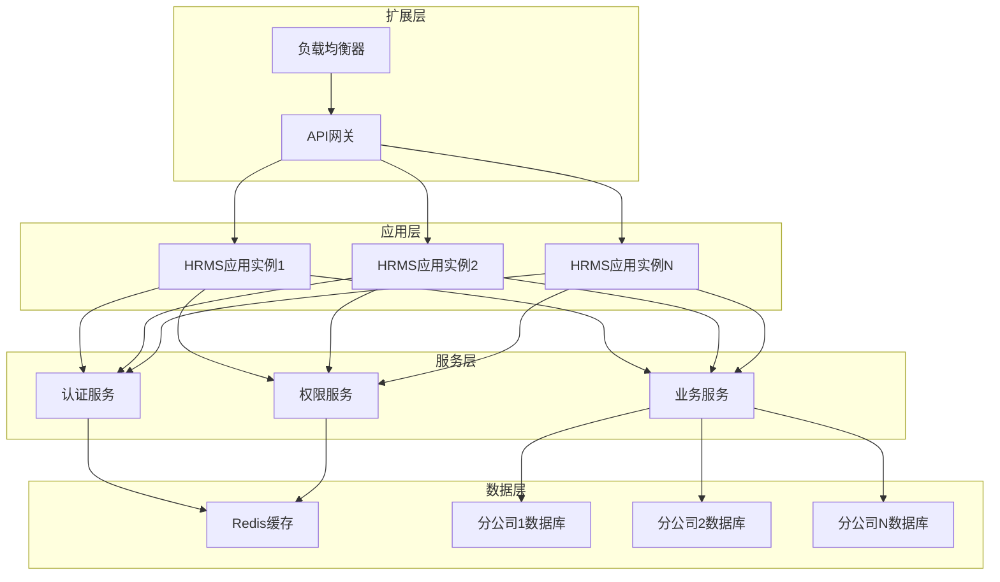

#### 微服务拆分可能性

随着业务规模扩大，系统可考虑向微服务架构演进：

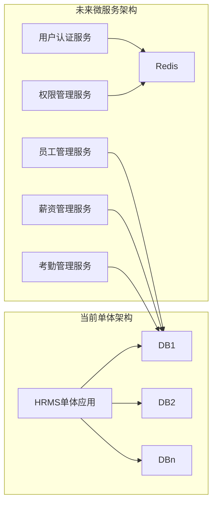

微服务拆分优势：
1. **服务独立部署**：各服务可独立更新和扩展
2. **技术栈多样化**：不同服务可选择最适合的技术栈
3. **故障隔离**：单个服务故障不影响整个系统
4. **团队自主性**：不同团队负责不同服务，提高开发效率

## 安全性和可靠性

### 安全实现

1. **身份认证**：基于Cookie的身份验证机制
   ```go
   // Cookie验证流程
   func validateUserCookie(c *gin.Context) (*UserInfo, error) {
       cookie, err := c.Cookie("user_cookie")
       if err != nil {
           return nil, errors.New("cookie not found")
       }
       
       // 解析Cookie内容
       parts := strings.Split(cookie, "_")
       if len(parts) < 4 {
           return nil, errors.New("invalid cookie format")
       }
       
       // 验证Cookie完整性
       if !verifyCookieSignature(cookie) {
           return nil, errors.New("cookie signature invalid")
       }
       
       return parseUserInfo(parts), nil
   }
   ```

2. **权限控制**：基于角色的细粒度权限控制
   ```go
   // 权限验证装饰器
   func RequirePermission(permission string) gin.HandlerFunc {
       return func(c *gin.Context) {
           user := getCurrentUser(c)
           if user == nil {
               c.JSON(401, gin.H{"error": "unauthorized"})
               c.Abort()
               return
           }
           
           if !hasPermission(user.UserType, c.Request.URL.Path, permission) {
               c.JSON(403, gin.H{"error": "forbidden"})
               c.Abort()
               return
           }
           
           c.Next()
       }
   }
   
   // 使用示例
   router.POST("/staff/create", RequirePermission("create"), handler.StaffCreate)
   ```

3. **数据隔离**：分公司数据物理隔离，避免数据泄露
   ```go
   // 数据库访问隔离
   func getBranchDatabase(c *gin.Context) *gorm.DB {
       // 从Cookie中获取分公司ID
       cookie, _ := c.Cookie("user_cookie")
       branchId := extractBranchId(cookie)
       
       // 构造数据库名称
       dbName := fmt.Sprintf("hrms_%s", branchId)
       
       // 获取对应分公司的数据库连接
       if db, exists := DbMapper[dbName]; exists {
           return db
       }
       
       return nil
   }
   ```

4. **密码保护**：MD5哈希存储密码(建议升级)
   ```go
   // 当前密码哈希实现（需改进）
   func hashPassword(password string) string {
       return service.MD5(password)
   }
   
   // 推荐的安全密码哈希实现
   func secureHashPassword(password string) (string, error) {
       bytes, err := bcrypt.GenerateFromPassword([]byte(password), bcrypt.DefaultCost)
       return string(bytes), err
   }
   ```

### 安全增强建议

1. **Cookie安全加固**：
   ```go
   // 安全的Cookie设置
   c.SetCookie("user_cookie", cookieValue, 7200, "/", "yourdomain.com", true, true)
   // 参数说明：
   // - 7200: 过期时间（2小时）
   // - "/": Cookie路径
   // - "yourdomain.com": Cookie域
   // - true: 仅HTTPS传输
   // - true: 禁止JavaScript访问
   ```

2. **CSRF防护**：
   ```go
   // CSRF防护中间件
   func csrfMiddleware() gin.HandlerFunc {
       return func(c *gin.Context) {
           if c.Request.Method != "GET" {
               token := c.GetHeader("X-CSRF-Token")
               expectedToken := generateCSRFToken(c)
               
               if token != expectedToken {
                   c.JSON(403, gin.H{"error": "CSRF token invalid"})
                   c.Abort()
                   return
               }
           }
           c.Next()
       }
   }
   ```

3. **API访问频率限制**：
   ```go
   // 访问频率限制实现
   func rateLimitMiddleware() gin.HandlerFunc {
       limiter := rate.NewLimiter(rate.Every(time.Second), 10) // 每秒10次请求
       
       return func(c *gin.Context) {
           if !limiter.Allow() {
               c.JSON(429, gin.H{"error": "rate limit exceeded"})
               c.Abort()
               return
           }
           c.Next()
       }
   }
   ```

### 错误处理和恢复

1. **数据库连接错误**：
   ```go
   // 数据库自动重连机制
   func handleDatabaseError(db *gorm.DB, err error) error {
       if isConnectionError(err) {
           // 尝试重新连接
           if reconnectErr := reconnectDatabase(db); reconnectErr == nil {
               log.Println("数据库重连成功")
               return nil
           }
           log.Printf("数据库重连失败: %v", reconnectErr)
       }
       return err
   }
   ```

2. **权限验证失败**：
   ```go
   // 统一权限验证失败处理
   func handlePermissionError(c *gin.Context, err error) {
       if os.IsPermission(err) {
           c.HTML(403, "403.html", gin.H{"message": "权限不足"})
       } else {
           c.JSON(401, gin.H{"error": "未授权访问"})
       }
   }
   ```

3. **业务逻辑错误**：
   ```go
   // 统一错误响应格式
   type ErrorResponse struct {
       Status  int    `json:"status"`
       Message string `json:"message"`
       Detail  string `json:"detail,omitempty"`
       Code    string `json:"code,omitempty"`
   }
   
   func handleError(c *gin.Context, status int, message string, detail string) {
       response := ErrorResponse{
           Status:  status,
           Message: message,
           Detail:  detail,
           Code:    getErrorCode(status),
       }
       
       c.JSON(status, response)
   }
   ```

4. **系统异常**：
   ```go
   // 全局异常处理中间件
   func globalErrorMiddleware() gin.HandlerFunc {
       return func(c *gin.Context) {
           defer func() {
               if err := recover(); err != nil {
                   log.Printf("系统异常: %v\n堆栈: %s", err, debug.Stack())
                   handleError(c, 500, "系统内部错误", "请联系管理员")
               }
           }()
           
           c.Next()
           
           // 处理请求中的错误
           if len(c.Errors) > 0 {
               err := c.Errors.Last()
               handleError(c, 500, "请求处理错误", err.Error())
           }
       }
   }
   ```

### 可靠性保障机制

1. **健康检查**：
   ```go
   // 系统健康检查接口
   func HealthCheck(c *gin.Context) {
       checks := map[string]interface{}{
           "database": checkDatabaseHealth(),
           "memory":   checkMemoryUsage(),
           "disk":     checkDiskSpace(),
       }
       
       allHealthy := true
       for _, check := range checks {
           if check == false {
               allHealthy = false
               break
           }
       }
       
       status := 200
       if !allHealthy {
           status = 503
       }
       
       c.JSON(status, gin.H{
           "status":  "ok",
           "healthy": allHealthy,
           "checks":  checks,
       })
   }
   ```

2. **熔断机制**：
   ```go
   // 熔断器实现
   type CircuitBreaker struct {
       maxFailures   int
       resetTimeout  time.Duration
       failures      int
       lastFailTime  time.Time
       state         string // "closed", "open", "half-open"
       mutex         sync.Mutex
   }
   
   func (cb *CircuitBreaker) Call(fn func() error) error {
       cb.mutex.Lock()
       defer cb.mutex.Unlock()
       
       if cb.state == "open" {
           if time.Since(cb.lastFailTime) > cb.resetTimeout {
               cb.state = "half-open"
           } else {
               return errors.New("circuit breaker is open")
           }
       }
       
       err := fn()
       if err != nil {
           cb.failures++
           cb.lastFailTime = time.Now()
           
           if cb.failures >= cb.maxFailures {
               cb.state = "open"
           }
           return err
       }
       
       cb.reset()
       return nil
   }
   ```

## 部署和运维

### 部署架构

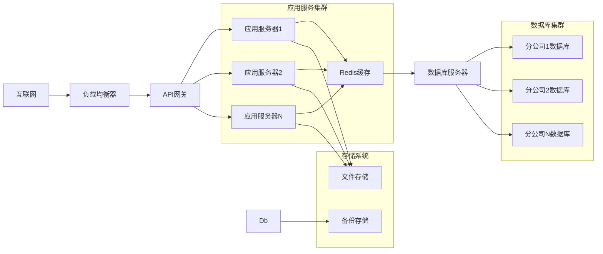

### Docker化部署

```dockerfile
# Dockerfile示例
FROM golang:1.19-alpine AS builder

WORKDIR /app
COPY go.mod go.sum ./
RUN go mod download

COPY . .
RUN CGO_ENABLED=0 GOOS=linux go build -o hrms main.go

FROM alpine:latest
RUN apk --no-cache add ca-certificates
WORKDIR /root/

COPY --from=builder /app/hrms .
COPY --from=builder /app/config ./config
COPY --from=builder /app/static ./static
COPY --from=builder /app/views ./views

EXPOSE 8888
CMD ["./hrms"]
```

```yaml
# docker-compose.yml示例
version: '3.8'
services:
  hrms-app:
    build: .
    ports:
      - "8888:8888"
    environment:
      - HRMS_ENV=prod
    depends_on:
      - redis
      - mysql
    volumes:
      - ./data:/app/data
      - ./logs:/app/logs
    
  redis:
    image: redis:7-alpine
    ports:
      - "6379:6379"
    volumes:
      - redis_data:/data
    
  mysql:
    image: mysql:8.0
    environment:
      MYSQL_ROOT_PASSWORD: password
      MYSQL_DATABASE: hrms_C001
    ports:
      - "3306:3306"
    volumes:
      - mysql_data:/var/lib/mysql

volumes:
  redis_data:
  mysql_data:
```

### 配置和环境管理

系统支持多环境配置，通过环境变量`HRMS_ENV`切换不同配置：

#### 开发环境配置 (config-dev.yaml)
```yaml
gin:
  port: 8888
db:
  type: sqlite
  path: ./data  # SQLite 数据库文件存储路径
  dbName: hrms_C001
log:
  level: debug
  format: text
```

#### 生产环境配置 (config-prod.yaml)
```yaml
gin:
  port: 8888
db:
  type: mysql
  user: ${DB_USER}
  password: ${DB_PASSWORD}
  host: ${DB_HOST}
  port: ${DB_PORT}
  dbName: hrms_C001,hrms_C002,hrms_C003
log:
  level: info
  format: json
security:
  cookie:
    secure: true
    httponly: true
    maxage: 7200
  csrf:
    enabled: true
  ratelimit:
    enabled: true
    requests: 100
    window: 60s
```

### 监控和日志

#### 日志配置
```go
// 日志初始化和配置
func initLogger(config *LogConfig) {
    var logOut io.Writer
    
    if config.FilePath != "" {
        file, err := os.OpenFile(config.FilePath, os.O_CREATE|os.O_WRONLY|os.O_APPEND, 0666)
        if err != nil {
            log.Fatal("无法打开日志文件:", err)
        }
        logOut = io.MultiWriter(os.Stdout, file)
    } else {
        logOut = os.Stdout
    }
    
    if config.Format == "json" {
        log.SetOutput(&JSONLogger{Writer: logOut})
    } else {
        log.SetOutput(logOut)
    }
    
    log.SetFlags(log.LstdFlags | log.Lshortfile)
}
```

#### 监控指标
```go
// 监控指标收集
func initMetrics() {
    // HTTP请求计数器
    httpRequestsTotal := prometheus.NewCounterVec(
        prometheus.CounterOpts{
            Name: "http_requests_total",
            Help: "Total number of HTTP requests",
        },
        []string{"method", "path", "status"},
    )
    
    // 请求延迟直方图
    httpRequestDuration := prometheus.NewHistogramVec(
        prometheus.HistogramOpts{
            Name: "http_request_duration_seconds",
            Help: "HTTP request duration in seconds",
        },
        []string{"method", "path"},
    )
    
    // 数据库连接池指标
    dbConnectionsGauge := prometheus.NewGaugeVec(
        prometheus.GaugeOpts{
            Name: "db_connections",
            Help: "Number of database connections",
        },
        []string{"database"},
    )
    
    prometheus.MustRegister(httpRequestsTotal, httpRequestDuration, dbConnectionsGauge)
}
```

### 部署流程

#### CI/CD流水线
```yaml
# .github/workflows/deploy.yml
name: Deploy HRMS

on:
  push:
    branches: [main]

jobs:
  test:
    runs-on: ubuntu-latest
    steps:
      - uses: actions/checkout@v3
      - uses: actions/setup-go@v3
        with:
          go-version: 1.19
      - run: go test ./...

  build:
    needs: test
    runs-on: ubuntu-latest
    steps:
      - uses: actions/checkout@v3
      - name: Build Docker image
        run: docker build -t hrms:${{ github.sha }} .
      - name: Push to registry
        run: |
          echo ${{ secrets.DOCKER_PASSWORD }} | docker login -u ${{ secrets.DOCKER_USERNAME }} --password-stdin
          docker push hrms:${{ github.sha }}

  deploy:
    needs: build
    runs-on: ubuntu-latest
    steps:
      - name: Deploy to production
        run: |
          # 部署脚本
          kubectl set image deployment/hrms hrms=hrms:${{ github.sha }}
          kubectl rollout status deployment/hrms
```

#### 数据库迁移
```bash
#!/bin/bash
# 数据库迁移脚本

set -e

# 读取配置
DB_TYPE=$(grep 'type:' config/config-${HRMS_ENV}.yaml | awk '{print $2}')
DB_NAME=$(grep 'dbName:' config/config-${HRMS_ENV}.yaml | awk '{print $2}')

# 执行迁移
echo "开始数据库迁移..."
case $DB_TYPE in
  "mysql")
    IFS=',' read -ra DBS <<< "$DB_NAME"
    for db in "${DBS[@]}"; do
      echo "迁移数据库: $db"
      mysql -h $DB_HOST -u $DB_USER -p$DB_PASSWORD $db < sql/migration.sql
    done
    ;;
  "sqlite")
    IFS=',' read -ra DBS <<< "$DB_NAME"
    for db in "${DBS[@]}"; do
      echo "迁移数据库: $db"
      sqlite3 data/$db.db < sql/sqlite_migration.sql
    done
    ;;
esac

echo "数据库迁移完成"
```

### 运维最佳实践

1. **定期备份**：
   ```bash
   # 数据库备份脚本
   #!/bin/bash
   DATE=$(date +%Y%m%d_%H%M%S)
   
   # MySQL备份
   mysqldump -h $DB_HOST -u $DB_USER -p$DB_PASSWORD --single-transaction hrms_C001 > backup/hrms_C001_$DATE.sql
   
   # SQLite备份
   cp data/hrms_C001.db backup/hrms_C001_$DATE.db
   
   # 清理7天前的备份
   find backup/ -name "*.sql" -mtime +7 -delete
   find backup/ -name "*.db" -mtime +7 -delete
   ```

2. **健康检查**：
   ```bash
   # 健康检查脚本
   #!/bin/bash
   
   response=$(curl -s -o /dev/null -w "%{http_code}" http://localhost:8888/ping)
   if [ $response -ne 200 ]; then
     echo "服务不健康，HTTP状态码: $response"
     # 发送告警通知
     # 尝试重启服务
     systemctl restart hrms
   fi
   ```

3. **日志轮转**：
   ```bash
   # logrotate配置
   /var/log/hrms/*.log {
     daily
     rotate 30
     compress
     delaycompress
     missingok
     notifempty
     create 644 hrms hrms
     postrotate
       systemctl reload hrms
     endscript
   }
   ```

配置文件包含服务器端口和数据库连接信息，支持多分公司数据库配置，灵活适应不同规模的企业需求。

## 总结与展望

HRMS系统通过精心设计的核心组件架构，实现了企业级人力资源管理系统的关键功能。本文深入分析了系统的四大核心组件：权限控制系统、用户认证机制、数据库连接管理和路由系统，揭示了它们如何协同工作，为企业提供安全、可靠、可扩展的人力资源管理解决方案。

### 系统优势

1. **架构清晰**：采用MVC分层架构，各组件职责明确，高内聚低耦合
2. **安全可靠**：基于角色的权限控制与多分公司数据隔离，确保企业数据安全
3. **灵活扩展**：模块化设计便于功能扩展，支持水平扩展和微服务演进
4. **多数据库支持**：同时支持MySQL和SQLite，适应不同部署环境需求
5. **性能优化**：连接池管理、权限缓存等机制保障系统性能

### 技术亮点

1. **动态权限渲染**：通过权限字符串实现细粒度权限控制，支持页面级功能权限管理
2. **分公司数据隔离**：通过数据库实例隔离和Cookie身份验证，实现多租户架构
3. **统一资源管理**：通过资源映射器统一管理数据库连接，简化开发复杂度
4. **中间件安全链**：在路由层构建完整的安全验证链，保障系统安全性

### 改进方向

未来系统可在以下方面持续优化：

1. **安全性增强**：
   - 升级密码哈希算法为bcrypt
   - 启用Cookie的HttpOnly和Secure标志
   - 添加CSRF防护和API访问频率限制

2. **性能优化**：
   - 实现Redis权限缓存机制
   - 优化数据库查询和索引设计
   - 引入连接池参数动态调优

3. **架构演进**：
   - 考虑向微服务架构演进
   - 实现配置热更新机制
   - 添加更完善的监控和告警系统

4. **开发体验**：
   - 完善API文档和开发工具
   - 添加单元测试和集成测试
   - 实现自动化部署流程

### 应用价值

HRMS系统的核心组件设计为企业提供了：

1. **降本增效**：标准化流程减少人工操作，提高人力资源管理效率
2. **数据安全**：多分公司数据隔离和细粒度权限控制确保数据安全
3. **灵活适应**：支持企业规模快速扩展，适应不同发展阶段需求
4. **决策支持**：通过数据分析支持企业人力资源战略决策

### 结语

通过本文对HRMS系统核心组件的深入分析，我们可以看到该系统在架构设计、安全性、可扩展性等方面的优势。系统不仅满足了当前企业人力资源管理的需求，也为未来的发展奠定了坚实基础。随着技术的不断演进和企业需求的变化，HRMS系统将持续优化和完善，为企业提供更加优质的人力资源管理服务。

对于开发者而言，深入理解这些核心组件的设计思路和实现细节，不仅有助于当前系统的维护和扩展，也为构建类似的企业级应用提供了宝贵的参考经验。

配置文件包含服务器端口和数据库连接信息，支持多分公司数据库配置，灵活适应不同规模的企业需求。