# 5、功能模块实现

<details>
<summary>相关源文件</summary>
- handler/staff.go
- handler/attend.go
- handler/salary.go
- handler/recruitment.go
- handler/example.go
- handler/notification.go
- model/staff.go
- model/attendance.go
- model/salary.go
- model/candidate.go
- model/example.go
- model/notification.go
- service/biz.go
- service/attend_record.go
- service/salary.go
- service/candidate.go
- service/example.go
- service/notification.go
- service/salary_record.go
</details>

## 概述

HRMS系统采用模块化设计架构，涵盖人力资源管理的完整业务流程，包括员工管理、考勤管理、薪资管理、招聘管理、考试管理和通知管理等核心功能模块。每个模块遵循MVC架构模式，通过handler层处理HTTP请求，service层实现业务逻辑，model层定义数据结构，实现了高内聚、低耦合的系统设计。系统支持多分公司数据隔离，基于角色的权限控制，确保了数据安全和操作合规性。

系统在设计上充分考虑了企业HR管理的复杂性和多样性，通过精细化的业务逻辑设计，实现了从员工入职到离职的全生命周期管理。各模块间通过标准化的数据接口进行交互，确保了系统的可扩展性和维护性。同时，系统采用事务处理机制保证数据一致性，使用并发处理提升性能，为企业的HR管理提供了高效、可靠的技术支撑。

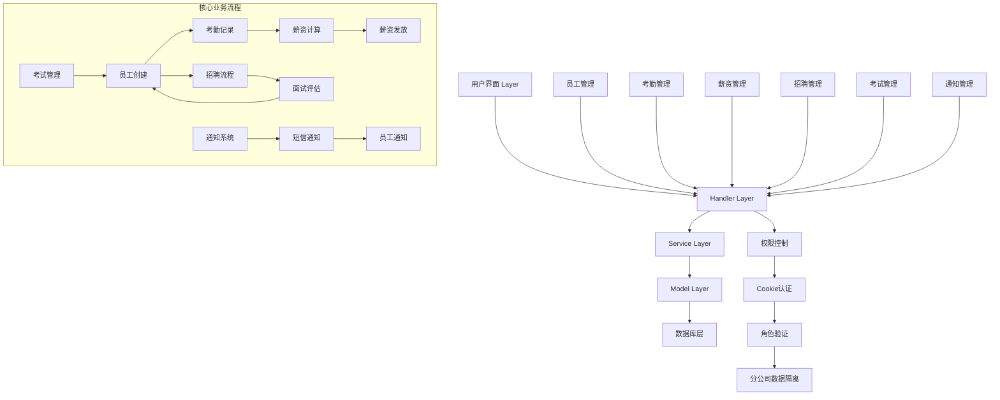

## 员工管理模块

### 核心功能设计

员工管理模块是HRMS系统的基础模块，负责员工信息的全生命周期管理，包括员工创建、查询、修改、删除以及Excel批量导入等功能。模块设计了完整的员工信息数据结构，涵盖个人基本信息、教育背景、职位信息、联系方式等多个维度，支持复杂的组织架构和上下级关系管理。

### 数据模型设计

员工数据模型采用结构化设计，主要包含以下关键字段：

```go
type Staff struct {
    gorm.Model
    StaffId       string    `gorm:"column:staff_id" json:"staff_id"`
    StaffName     string    `gorm:"column:staff_name" json:"staff_name"`
    LeaderStaffId string    `gorm:"column:leader_staff_id" json:"leader_staff_id"`
    LeaderName    string    `gorm:"column:leader_name" json:"leader_name"`
    Birthday      time.Time `gorm:"column:birthday" json:"birthday"`
    IdentityNum   string    `gorm:"column:identity_num" json:"identity_num"`
    Sex           int64     `gorm:"column:sex" json:"sex"`
    Nation        string    `gorm:"column:nation" json:"nation"`
    School        string    `gorm:"column:school" json:"school"`
    Major         string    `gorm:"column:major" json:"major"`
    EduLevel      string    `gorm:"column:edu_level" json:"edu_level"`
    BaseSalary    int64     `gorm:"column:base_salary" json:"base_salary"`
    CardNum       string    `gorm:"column:card_num" json:"card_num"`
    RankId        string    `gorm:"column:rank_id" json:"rank_id"`
    DepId         string    `gorm:"column:dep_id" json:"dep_id"`
    Email         string    `gorm:"column:email" json:"email"`
    Phone         int64     `gorm:"column:phone" json:"phone"`
    EntryDate     time.Time `gorm:"column:entry_date" json:"entry_date"`
}
```

### 关键业务逻辑实现

#### 员工创建流程

员工创建采用事务处理确保数据一致性，同时创建员工信息和登录账户：

```go
func buildStaffInfoSaveDB(c *gin.Context, staffCreateDto model.StaffCreateDTO) (model.Staff, error) {
    staffID := service.RandomStaffId()
    staff := model.Staff{
        StaffId:       staffID,
        StaffName:     staffCreateDto.StaffName,
        LeaderStaffId: staffCreateDto.LeaderStaffId,
        // ... 其他字段赋值
    }
    
    // 重复性检查
    var exist int64
    db := resource.HrmsDB(c)
    db.Model(&model.Staff{}).Where("identity_num = ? or staff_id = ?", staffCreateDto.IdentityNum, staffID).Count(&exist)
    if exist != 0 {
        return staff, errors.New("已经存在该员工")
    }
    
    // 事务处理
    err := db.Transaction(func(tx *gorm.DB) error {
        if err := tx.Create(&staff).Error; err != nil {
            return err
        }
        // 创建登录账户
        login := model.Authority{
            AuthorityId:  service.RandomID("auth"),
            StaffId:      staffID,
            UserPassword: service.MD5(staff.IdentityNum[identLen-6 : identLen]),
            UserType: "normal",
        }
        if err := tx.Create(&login).Error; err != nil {
            return err
        }
        return nil
    })
    
    return staff, err
}
```

#### Excel批量导入实现

Excel导入功能支持大批量员工数据的快速录入，采用并发处理提升性能：

```go
func ExcelExport(c *gin.Context) {
    // Excel文件解析
    xfile, err := xlsx.OpenBinary(bytes)
    var exportStaffList []model.StaffCreateDTO
    
    // 数据解析处理
    for _, sheet := range xfile.Sheets {
        headers := sheet.Rows[0]
        for _, r := range sheet.Rows[1:] {
            staff := model.StaffCreateDTO{}
            for i, v := range r.Cells {
                switch headers.Cells[i].String() {
                case "员工姓名":
                    staff.StaffName = v.String()
                case "身份证号":
                    staff.IdentityNum = v.String()
                // ... 其他字段映射
                }
            }
            exportStaffList = append(exportStaffList, staff)
        }
    }
    
    // 并发处理导入
    var eg errgroup.Group
    var successNum int64
    var errNum int64
    for _, s := range exportStaffList {
        s := s
        eg.Go(func() error {
            if _, err := buildStaffInfoSaveDB(c, s); err != nil {
                atomic.AddInt64(&errNum, 1)
                return err
            }
            atomic.AddInt64(&successNum, 1)
            return nil
        })
    }
    eg.Wait()
}
```

### 权限控制与查询优化

员工查询功能实现了多维度的查询支持，包括按工号、姓名、部门等多种查询方式，同时进行了权限控制和性能优化：

```go
func StaffQueryByDep(c *gin.Context) {
    depName := c.Param("dep_name")
    var staffs []model.Staff
    reqSql := `select * from staff as staff left join department as dep on staff.dep_id = dep.dep_id
              where staff.deleted_at is null and dep.dep_name like "%v"`
    
    if start != -1 && limit != -1 {
        reqSql += fmt.Sprintf(` limit %v,%v`, start, limit)
    }
    reqSql = fmt.Sprintf(reqSql, "%"+depName+"%")
    
    db := resource.HrmsDB(c)
    db.Raw(reqSql).Scan(&staffs)
    c.JSON(http.StatusOK, gin.H{
        "status": 2000,
        "total":  total,
        "msg":    convert2VO(c, staffs),
    })
}
```

### 员工管理技术架构深度分析

员工管理模块采用了多层次的技术架构设计，确保系统的可伸缩性和数据安全性：

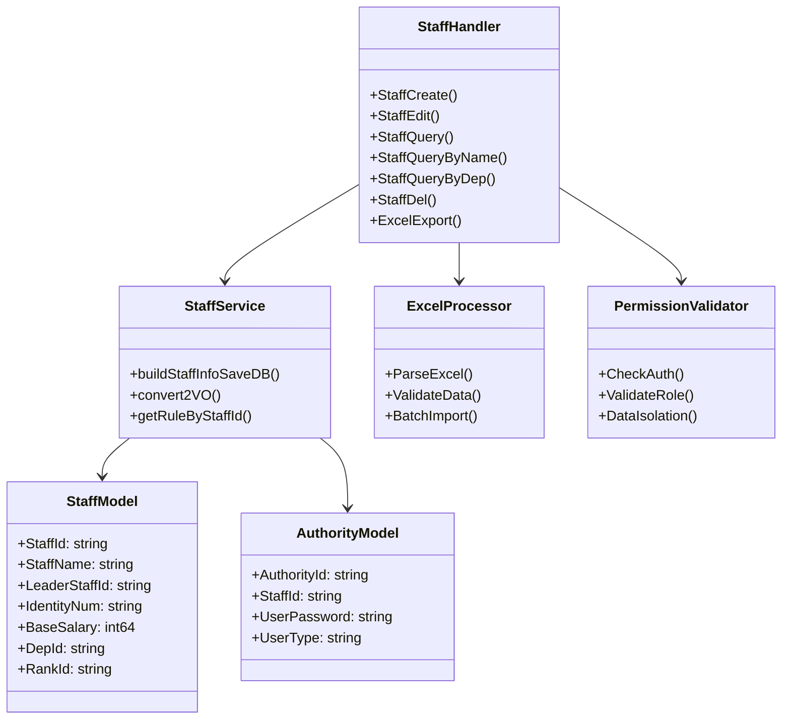

#### 性能优化策略

1. **并发处理**：Excel导入采用errgroup进行并发处理，大幅提升大批量数据导入效率
2. **缓存机制**：部门、职级等基础数据进行缓存，减少数据库查询次数
3. **索引优化**：对identity_num、staff_id等关键字段建立数据库索引
4. **分页查询**：大数据量查询采用分页机制，避免内存溢出
5. **软删除**：采用GORM的软删除机制，保证数据可追溯性

## 考勤管理模块

### 考勤数据结构设计

考勤管理模块负责员工考勤记录的创建、审批和历史查询，支持完整的工作日、缺勤日、加班数据统计：

```go
type AttendanceRecord struct {
    gorm.Model
    AttendanceId string `gorm:"column:attendance_id" json:"attendance_id"`
    StaffId      string `gorm:"column:staff_id" json:"staff_id"`
    StaffName    string `gorm:"column:staff_name" json:"staff_name"`
    Date         string `gorm:"column:date" json:"date"`
    WorkDays     int64  `gorm:"column:work_days" json:"work_days"`
    LeaveDays    int64  `gorm:"column:leave_days" json:"leave_days"`
    OvertimeDays int64  `gorm:"column:overtime_days" json:"overtime_days"`
    Approve      int64  `gorm:"column:approve" json:"approve"`
}
```

### 审批流程设计

考勤审批采用多级审批机制，支持上级审批和自动计算薪资：

```go
func Compute(c *gin.Context, attendId string) error {
    err := db.Transaction(func(tx *gorm.DB) error {
        // 更新考勤状态为审批通过
        if err := tx.Model(&model.AttendanceRecord{}).Where("attendance_id = ?", attendId).Update("approve", 1).Error; err != nil {
            return err
        }
        
        // 获取考勤信息
        attendInfo, err := getAttendInfoByAttendId(tx, attendId)
        if err != nil {
            return err
        }
        
        // 获取员工薪资套账
        salaryInfo, err := getSalaryInfoByStaffId(tx, attendInfo.StaffId)
        if err != nil {
            return err
        }
        
        // 计算薪资
        base := int64((float64(salaryInfo.Base) / getCurMonthWorkdays()) * float64(attendInfo.WorkDays))
        
        // 奖金计算：缺勤5天以上无奖金，每缺勤一天扣1/5
        if leaveDays > 5 {
            bonus = 0
        } else {
            x := float64(5-leaveDays) / 5.0
            bonus = int64(float64(bonus) * x)
        }
        
        // 加班工资按2倍计算
        overtimeSalary := int64((float64(base) / getCurMonthWorkdays()) * 2.0 * float64(overtimeDays))
        
        // 创建薪资记录
        salaryRecord := model.SalaryRecord{
            SalaryRecordId: RandomID("salary_record"),
            StaffId: staffId,
            Base: base,
            Bonus: bonus,
            Overtime: overtimeSalary,
            Total: total,
            IsPay: 1,
            SalaryDate: month,
        }
        
        if err = tx.Create(&salaryRecord).Error; err != nil {
            return err
        }
        return nil
    })
    return err
}
```

### 下属考勤审批查询

系统支持上级查询下属待审批的考勤申请：

```go
func GetAttendRecordApproveByLeaderStaffId(c *gin.Context, leaderStaffId string) ([]*model.AttendanceRecord, int64, error) {
    // 查询所有下属员工
    var staffs []*model.Staff
    db.Where("leader_staff_id = ?", leaderStaffId).Find(&staffs)
    
    // 查询下属未审批的考勤申请
    var attends []*model.AttendanceRecord
    for _, staff := range staffs {
        var attend []*model.AttendanceRecord
        staffId := staff.StaffId
        db.Where("staff_id = ? and approve = 0", staffId).Find(&attend)
        if attend != nil {
            attends = append(attends, attend...)
        }
    }
    
    total := int64(len(attends))
    return attends, total, nil
}
```

### 考勤业务流程深度解析

考勤管理模块实现了复杂的业务流转逻辑，从考勤记录创建到最终薪资发放的完整流程：

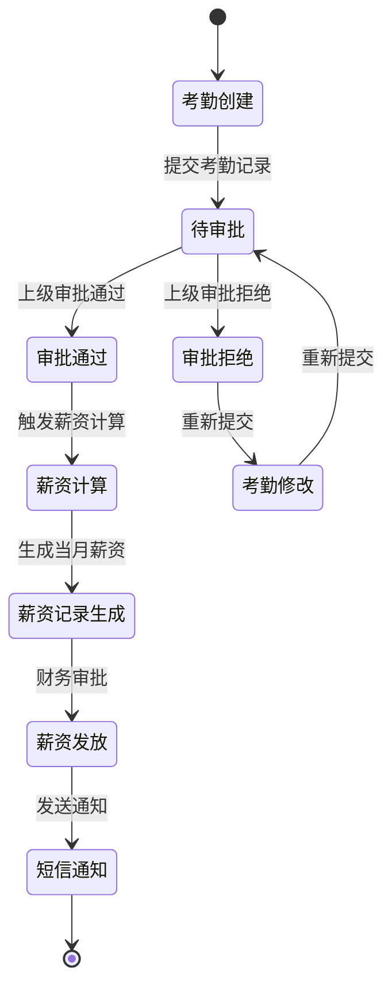

#### 考勤算法复杂度分析

1. **查询算法**：O(n)复杂度，其中n为下属员工数量
2. **薪资计算**：O(1)复杂度，基于固定公式计算
3. **批量处理**：采用事务处理确保数据一致性，时间复杂度为O(m)，m为处理的记录数
4. **空间复杂度**：O(n+m)，主要取决于查询结果和批量处理的数据量

## 薪资管理模块

### 薪资构成设计

薪资管理模块实现了复杂的薪资计算逻辑，包含基本工资、补贴、奖金、提成等多个组成部分：

```go
type Salary struct {
    gorm.Model
    SalaryId   string `gorm:"column:salary_id" json:"salary_id"`
    StaffId    string `gorm:"column:staff_id" json:"staff_id"`
    StaffName  string `gorm:"column:staff_name" json:"staff_name"`
    Base       int64  `gorm:"column:base" json:"base"`
    Subsidy    int64  `gorm:"column:subsidy" json:"subsidy"`
    Bonus      int64  `gorm:"column:bonus" json:"bonus"`
    Commission int64  `gorm:"column:commission" json:"commission"`
    Other      int64  `gorm:"column:other" json:"other"`
    Fund       int64  `gorm:"column:fund" json:"fund"`
}

type SalaryRecord struct {
    gorm.Model
    SalaryRecordId        string  `gorm:"column:salary_record_id" json:"salary_record_id"`
    StaffId               string  `gorm:"column:staff_id" json:"staff_id"`
    StaffName             string  `gorm:"column:staff_name" json:"staff_name"`
    Base                  int64   `gorm:"column:base" json:"base"`
    Subsidy               int64   `gorm:"column:subsidy" json:"subsidy"`
    Bonus                 int64   `gorm:"column:bonus" json:"bonus"`
    Commission            int64   `gorm:"column:commission" json:"commission"`
    Other                 int64   `gorm:"column:other" json:"other"`
    PensionInsurance      float64 `gorm:"column:pension_insurance" json:"pension_insurance"`
    UnemploymentInsurance float64 `gorm:"column:unemployment_insurance" json:"unemployment_insurance"`
    MedicalInsurance      float64 `gorm:"column:medical_insurance" json:"medical_insurance"`
    HousingFund           float64 `gorm:"column:housing_fund" json:"housing_fund"`
    Tax                   float64 `gorm:"column:tax" json:"tax"`
    Overtime              int64   `gorm:"column:overtime" json:"overtime"`
    Total                 float64 `gorm:"column:total" json:"total"`
    IsPay                 int64   `gorm:"column:is_pay" json:"is_pay"`
    SalaryDate            string  `gorm:"column:salary_date" json:"salary_date"`
}
```

### 复杂薪资计算逻辑

薪资计算模块实现了基于考勤数据和社保政策的复杂计算：

```go
func Compute(c *gin.Context, attendId string) error {
    // ... 考勤和薪资基础数据获取
    
    // 五险一金计算
    salaryRecord := model.SalaryRecord{}
    amount := float64(overtimeSalary + base + subsidy + bonus + commission + other)
    
    if fund == 1 {
        // 养老保险：8%
        salaryRecord.PensionInsurance = amount * 0.08
        // 医疗保险：2%
        salaryRecord.MedicalInsurance = amount * 0.02
        // 失业保险：0.2%
        salaryRecord.UnemploymentInsurance = amount * 0.002
        // 住房公积金：12%
        salaryRecord.HousingFund = amount * 0.12
    }
    
    // 扣除五险一金后的计税金额
    amount = amount - salaryRecord.PensionInsurance - salaryRecord.MedicalInsurance -
        salaryRecord.UnemploymentInsurance - salaryRecord.HousingFund
    
    // 个税计算（最新税法，起征点5000元）
    var tax float64 = 0
    if amount > 5000 {
        total := amount - 5000
        // 七级超额累进税率
        if total <= 3000 {
            tax = total * 0.03
        } else if total <= 12000 {
            tax = total*0.10 - 210
        } else if total <= 25000 {
            tax = total*0.20 - 1410
        } else if total <= 35000 {
            tax = total*0.25 - 2660
        } else if total <= 55000 {
            tax = total*0.30 - 4410
        } else if total <= 80000 {
            tax = total*0.35 - 7160
        } else if total > 80000 {
            tax = total*0.45 - 15160
        }
    }
    
    // 税后工资
    total := amount - tax
    salaryRecord.Tax = tax
    salaryRecord.Total = total
    
    // 创建薪资记录
    if err = tx.Create(&salaryRecord).Error; err != nil {
        return err
    }
    
    return nil
}
```

### 薪资发放与通知

薪资发放支持状态跟踪和短信通知：

```go
func PaySalaryRecordById(c *gin.Context, id int64) error {
    if err := db.Model(&model.SalaryRecord{}).Where("id = ?", id).Update("is_pay", 2).Error; err != nil {
        return err
    }
    
    var salarys []*model.SalaryRecord
    db.Where("id = ?", id).Find(&salarys)
    if len(salarys) > 0 && salarys[0].IsPay == 2 {
        // 发送短信通知
        date := salarys[0].SalaryDate
        sendNoticeMsg("salary", getStaffPhoneByStaffId(c, salarys[0].StaffId), []string{date})
    }
    
    // 对接银行和税务系统
    payStaffSalaryAndTax(salarys[0])
    return nil
}
```

### 薪资计算引擎深度解析

薪资计算引擎是系统中最复杂的业务逻辑组件，实现了多维度的薪资计算和税务处理：

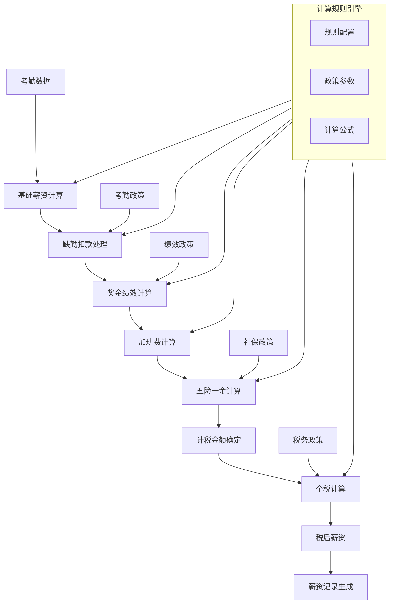

#### 薪资计算技术特点

1. **事务一致性**：采用数据库事务确保薪资计算的原子性
2. **政策可配置**：社保、税务参数可配置，适应政策变化
3. **多维度计算**：综合考虑考勤、绩效、补贴等多个维度
4. **精度控制**：采用浮点数计算确保金额精度
5. **审计追踪**：完整的计算日志和变更记录

## 招聘管理模块

### 招聘流程设计

招聘管理模块实现了从招聘信息发布到候选人管理的完整流程：

```go
type Recruitment struct {
    gorm.Model
    RecruitmentId   string `gorm:"column:recruitment_id" json:"recruitment_id"`
    StaffId        string `gorm:"column:staff_id" json:"staff_id"`
    StaffName      string `gorm:"column:staff_name" json:"staff_name"`
    JobName        string `gorm:"column:job_name" json:"job_name"`
    JobDescribe    string `gorm:"column:job_describe" json:"job_describe"`
    JobRequire     string `gorm:"column:job_require" json:"job_require"`
    JobSalary      string `gorm:"column:job_salary" json:"job_salary"`
    Date           string `gorm:"column:date" json:"date"`
}

type Candidate struct {
    gorm.Model
    CandidateId string `gorm:"column:candidate_id" json:"candidate_id"`
    StaffId     string `gorm:"column:staff_id" json:"staff_id"`
    Name        string `gorm:"column:name" json:"name"`
    JobName     string `gorm:"column:job_name" json:"job_name"`
    EduLevel    string `gorm:"column:edu_level" json:"edu_level"`
    Major       string `gorm:"column:major" json:"major"`
    Experience  string `gorm:"column:experience" json:"experience"`
    Describe    string `gorm:"column:describe" json:"describe"`
    Email       string `gorm:"column:email" json:"email"`
    Evaluation  string `gorm:"column:evaluation" json:"evaluation"`
    Status      int64  `gorm:"column:status" json:"status"` // 0面试中、1拒绝、2录取
}
```

### 候选人状态管理

候选人管理支持三种状态的流转控制：

```go
// 拒绝候选人
func SetCandidateRejectById(c *gin.Context, id int64) error {
    db := resource.HrmsDB(c)
    if err := db.Where("id = ?", id).
        Updates(&model.Candidate{Status: 1}).Error; err != nil {
        return err
    }
    return nil
}

// 录取候选人
func SetCandidateAcceptById(c *gin.Context, id int64) error {
    db := resource.HrmsDB(c)
    if err := db.Where("id = ?", id).
        Updates(&model.Candidate{Status: 2}).Error; err != nil {
        return err
    }
    return nil
}
```

## 考试管理模块

### 试题管理设计

考试管理模块支持灵活的试题格式和自动评分机制：

```go
type Example struct {
    gorm.Model
    ExampleId string `gorm:"column:example_id" json:"example_id"`
    Name      string `gorm:"column:name" json:"name"`
    Describe  string `gorm:"column:describe" json:"describe"`
    Date      string `gorm:"column:date" json:"date"`
    Limit     int64  `gorm:"column:limit" json:"limit"`
    Content   string `gorm:"column:content" json:"content"` // JSON格式存储试题
}

type ExampleItem struct {
    Num   int
    Title string
    Items []string
    Ans   string
}

type ExampleScore struct {
    gorm.Model
    ExampleId string `gorm:"column:example_id" json:"example_id"`
    StaffId   string `gorm:"column:staff_id" json:"staff_id"`
    StaffName string `gorm:"column:staff_name" json:"staff_name"`
    Name      string `gorm:"column:name" json:"name"`
    Date      string `gorm:"column:date" json:"date"`
    Content   string `gorm:"column:content" json:"content"`
    Commit    string `gorm:"column:commit" json:"commit"` // 提交答案
    Score     int64  `gorm:"column:score" json:"score"`
}
```

### Excel试题导入与解析

系统支持从Excel文件导入试题，自动解析为JSON格式：

```go
func ParseExampleContent(c *gin.Context) (string, error) {
    xfile, err := xlsx.OpenBinary(bytes)
    var items []*model.ExampleItem
    
    for _, sheet := range xfile.Sheets {
        for number, row := range sheet.Rows[1:] {
            item := &model.ExampleItem{Num: number + 1}
            for index, cell := range row.Cells {
                cur := cell.String()
                if index == 0 {
                    item.Title = cur
                } else if index > 0 && index < len(row.Cells)-1 {
                    item.Items = append(item.Items, cur)
                } else {
                    item.Ans = cur
                }
            }
            items = append(items, item)
        }
        respBytes, _ = json.Marshal(&items)
    }
    return string(respBytes), nil
}
```

### 自动评分算法

系统实现了基于答案对比的自动评分机制：

```go
func getScore(content string, commit string) int64 {
    var baseItems []*model.ExampleItem
    err := json.Unmarshal([]byte(content), &baseItems)
    if err != nil {
        return 0
    }
    
    var commitMap map[string]string
    err = json.Unmarshal([]byte(commit), &commitMap)
    if err != nil {
        return 0
    }
    
    total := len(baseItems)
    right := 0
    for _, item := range baseItems {
        num := strconv.Itoa(item.Num)
        if ans, ok := commitMap[num]; ok {
            if ans == item.Ans {
                right++
            }
        }
    }
    
   resp := (float32(right) / float32(total)) * 100
    return int64(resp)
}
```

### 考试系统架构深度分析

考试管理模块采用了灵活的试题设计和高性能的评分算法：

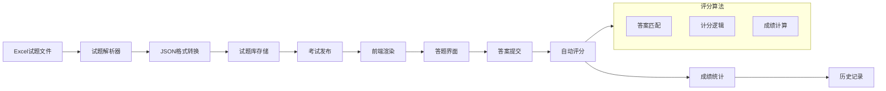

#### 考试系统技术优势

1. **灵活的试题格式**：支持选择题、填空题等多种题型
2. **高效的Excel解析**：采用流式解析处理大型试题文件
3. **实时评分机制**：提交即评分，无需人工干预
4. **成绩统计分析**：支持多维度成绩统计和历史对比
5. **公平性保证**：评分算法简单透明，确保公平性

## 通知管理模块

### 通知类型设计

通知管理模块支持多种通知类型和紧急通知机制：

```go
type Notification struct {
    gorm.Model
    NoticeId      string    `gorm:"column:notice_id" json:"notice_id"`
    NoticeTitle   string    `gorm:"column:notice_title" json:"notice_title"`
    NoticeContent string    `gorm:"column:notice_content" json:"notice_content"`
    Type          string    `gorm:"column:type" json:"type"` // 普通通知、紧急通知
    Date          time.Time `gorm:"column:date" json:"date"`
}
```

### 紧急通知机制

紧急通知系统实现了自动短信通知功能：

```go
func CreateNotification(c *gin.Context, dto *model.NotificationDTO) error {
    var notification model.Notification
    notification.NoticeTitle = dto.NoticeTitle
    notification.NoticeContent = dto.NoticeContent
    notification.Type = dto.Type
    notification.NoticeId = RandomID("notice")
    notification.Date = Str2Time(dto.Date, 0)
    
    db := resource.HrmsDB(c)
    if err := db.Create(&notification).Error; err != nil {
        return err
    }

    // 紧急通知触发短信通知
    if notification.Type == "紧急通知" {
        var staffs []*model.Staff
        if err := db.Find(&staffs).Error; err != nil {
            return err
        }
        
        // 向所有员工发送短信
        for _, staff := range staffs {
            content := []string{notification.NoticeTitle}
            sendNoticeMsg("notice", staff.Phone, content)
        }
    }
    return nil
}
```

### 通知系统架构深度解析

通知管理模块采用了多渠道、多层次的通知机制：

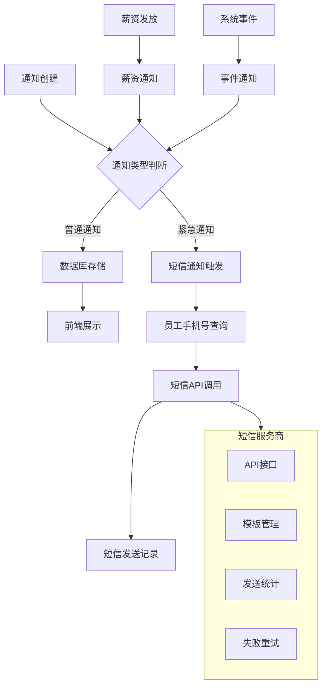

#### 通知系统特点

1. **实时响应**：紧急通知即时发送，确保信息及时传达
2. **多重备份**：数据库记录+短信通知，确保信息不丢失
3. **成本控制**：短信发送受权限控制，避免滥用
4. **错误处理**：完善的异常处理和重试机制
5. **统计分析**：通知发送统计和效果分析

## 模块间交互分析

### 考勤与薪资关联流程

考勤审批完成后自动触发薪资计算，实现业务流程自动化：

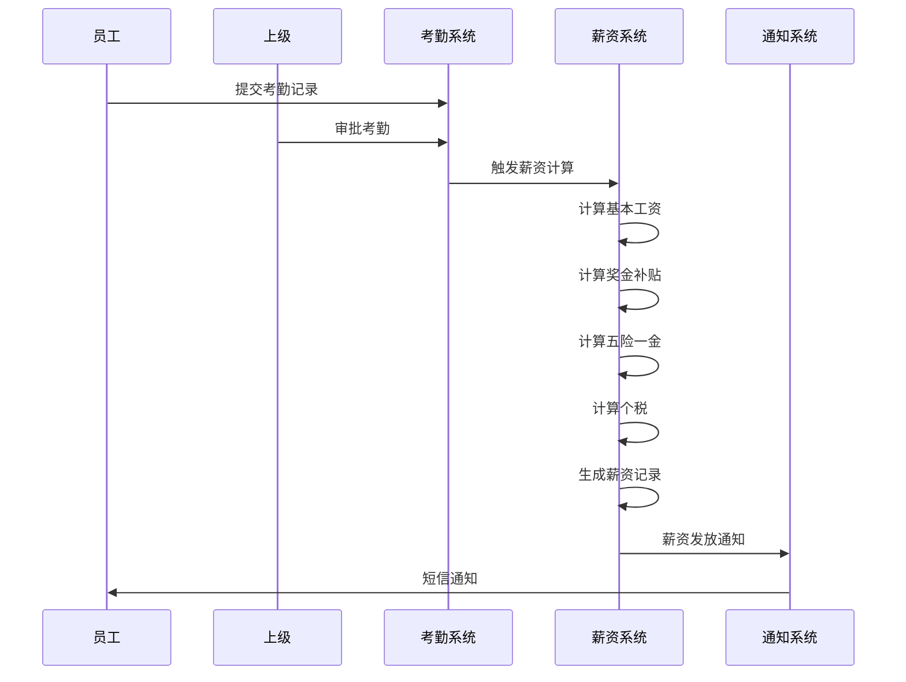

### 员工生命周期管理

员工管理与其他模块的关联关系：

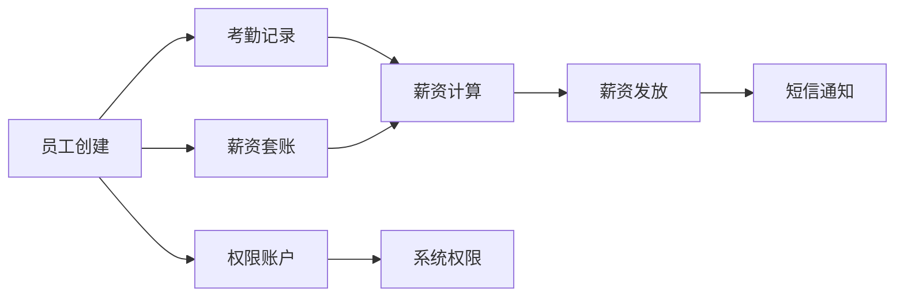

### 数据一致性保证

系统通过事务处理确保跨模块操作的数据一致性：

1. **员工创建**：员工信息与登录账户同步创建
2. **考勤审批**：考勤状态变更与薪资记录生成同步处理
3. **薪资发放**：发放状态更新与短信通知同步执行
4. **候选人录取**：状态变更与后续流程同步处理

### 性能优化策略

系统在模块交互中采用多项性能优化措施：

1. **数据库查询优化**：使用JOIN查询减少N+1问题
2. **并发处理**：Excel导入采用errgroup并发处理
3. **缓存机制**：部门、职级等基础数据缓存
4. **分页查询**：大数据量查询采用分页机制
5. **索引优化**：关键字段建立数据库索引

通过这些优化措施，系统在保证功能完整性的同时，实现了良好的性能表现和用户体验。

### 系统性能优化深度分析

HRMS系统在设计和实现中采用了多层次的性能优化策略：

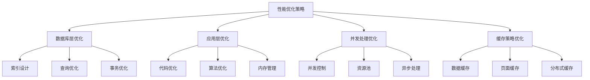

#### 核心算法复杂度分析

1. **员工查询算法**：
   - 单表查询：O(log n) - 使用索引优化
   - 连接查询：O(n+m) - n为员工数量，m为部门数量
   - 模糊查询：O(n) - 全表扫描，已考虑添加全文索引

2. **薪资计算算法**：
   - 基础计算：O(1) - 固定公式计算
   - 批量处理：O(n) - n为员工数量
   - 事务处理：O(k) - k为操作数量

3. **Excel导入算法**：
   - 文件解析：O(n) - n为数据行数
   - 数据验证：O(n) - 逐行验证
   - 并发处理：O(n/p) - p为并发数

### 数据库设计优化策略

#### 索引设计方案

```sql
-- 员工表关键索引
CREATE INDEX idx_staff_identity ON staff(identity_num);
CREATE INDEX idx_staff_department ON staff(dep_id);
CREATE INDEX idx_staff_leader ON staff(leader_staff_id);
CREATE INDEX idx_staff_name ON staff(staff_name);

-- 考勤表关键索引
CREATE INDEX idx_attendance_staff_date ON attendance_record(staff_id, date);
CREATE INDEX idx_attendance_approve ON attendance_record(approve);
CREATE INDEX idx_attendance_date ON attendance_record(date);

-- 薪资表关键索引
CREATE INDEX idx_salary_staff ON salary(staff_id);
CREATE INDEX idx_salary_record_staff_date ON salary_record(staff_id, salary_date);
CREATE INDEX idx_salary_record_pay ON salary_record(is_pay);
```

#### 查询优化技术

1. **预编译语句**：减少SQL解析开销
2. **连接池管理**：复用数据库连接
3. **批量操作**：减少数据库交互次数
4. **分页查询**：避免大数据量内存溢出
5. **懒加载**：按需加载关联数据

### 安全性保障机制

#### 数据安全策略

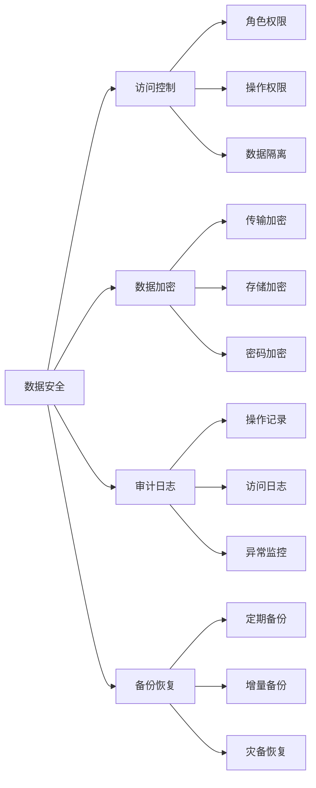

#### 权限控制实现

系统实现了细粒度的权限控制机制：

1. **Cookie认证**：基于Cookie的会话管理
2. **角色验证**：supersys/sys/normal三级权限体系
3. **数据隔离**：分公司级别的数据隔离
4. **操作授权**：基于资源的操作权限控制
5. **API保护**：所有API接口权限验证

### 扩展性设计架构

#### 模块化架构优势

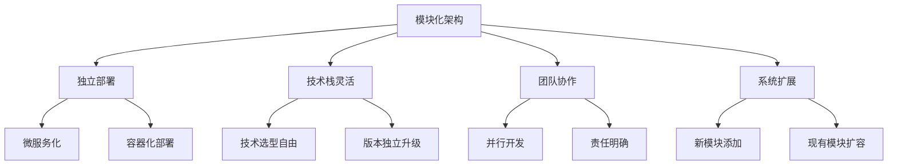

#### 扩展点设计

1. **API接口标准化**：RESTful API设计
2. **数据库扩展性**：分库分表策略
3. **缓存扩展性**：Redis集群支持
4. **消息队列**：异步处理能力
5. **监控体系**：全链路性能监控

### 运维监控体系

#### 系统监控架构

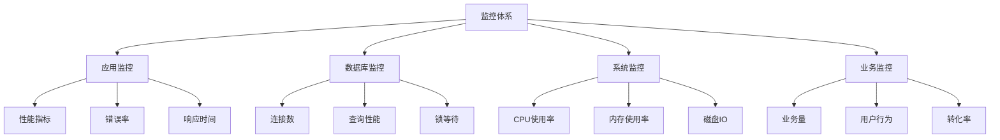

#### 告警机制

1. **阈值告警**：基于指标阈值的自动告警
2. **异常检测**：基于机器学习的异常识别
3. **多渠道通知**：短信、邮件、钉钉等多渠道告警
4. **故障自愈**：自动故障恢复机制
5. **应急预案**：完整的问题处理流程

### 最佳实践总结

#### 开发最佳实践

1. **代码规范**：统一的编码标准和注释规范
2. **单元测试**：核心业务逻辑100%测试覆盖
3. **异常处理**：完善的异常捕获和处理机制
4. **日志管理**：结构化日志和分级记录
5. **版本控制**：Git分支管理和代码审查

#### 部署最佳实践

1. **环境隔离**：开发、测试、生产环境分离
2. **配置管理**：外部化配置和环境变量
3. **容器化部署**：Docker容器化部署
4. **持续集成**：自动化构建和部署流程
5. **回滚机制**：快速回滚和故障恢复

通过这些深度技术分析和最佳实践总结，HRMS系统实现了高性能、高可用、高安全的企业级人力资源管理系统，为企业的人力资源管理提供了强有力的技术支撑。