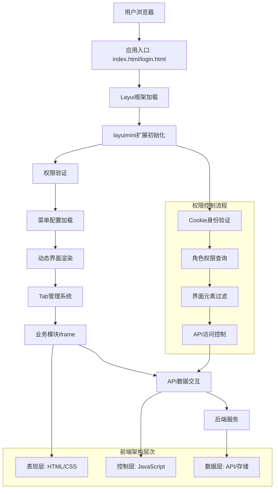
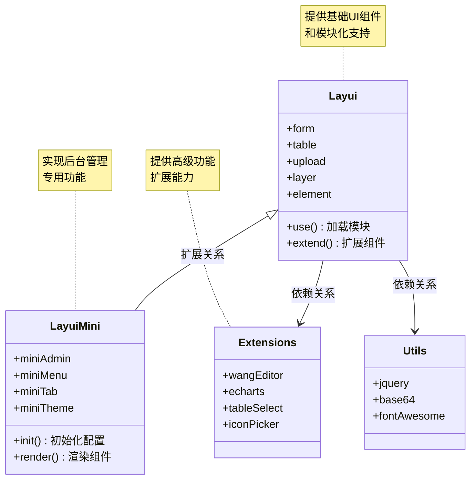
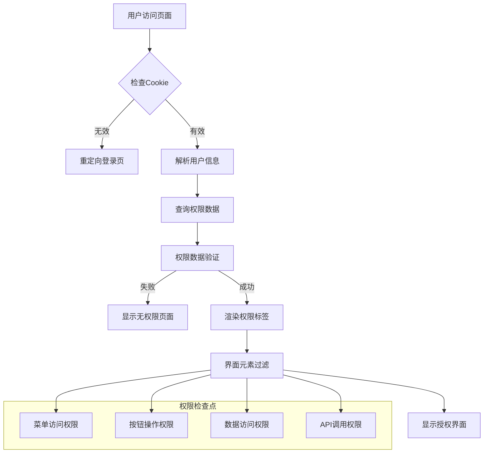
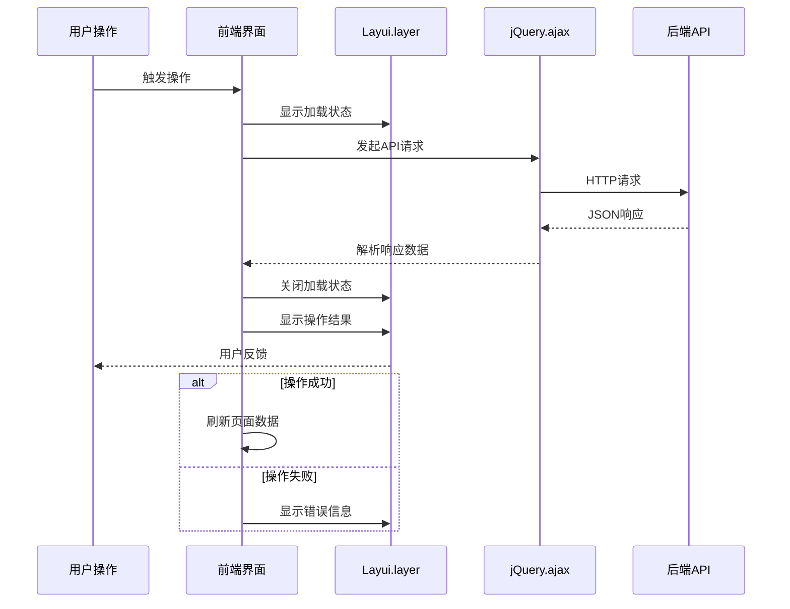

<details>
<summary>相关源文件</summary>
views/index.html
views/login.html
static/js/lay-config.js
static/css/layuimini.css
static/css/public.css
static/js/lay-module/layuimini/miniAdmin.js
static/js/lay-module/layuimini/miniMenu.js
static/js/lay-module/layuimini/miniTab.js
views/admin_staff_manage.html
views/normal_staff_manage.html
static/api/init_supersys.json
static/api/init_sys.json
static/api/init_normal.json
static/js/base64.js
main.go
handler/authority.go
handler/template.go
model/authority.go
</details>

# 6、前端界面设计

<details>
<summary>目录</summary>
- [概述](#概述)
- [前端架构](#前端架构)
  - [架构概述](#架构概述)
  - [核心目录结构](#核心目录结构)
  - [技术栈分析](#技术栈分析)
- [页面设计规范](#页面设计规范)
  - [布局设计原则](#布局设计原则)
  - [统一的样式体系](#统一的样式体系)
  - [组件使用规范](#组件使用规范)
  - [响应式设计](#响应式设计)
- [权限界面控制](#权限界面控制)
  - [基于角色的菜单动态生成](#基于角色的菜单动态生成)
  - [功能按钮权限控制](#功能按钮权限控制)
  - [数据访问权限](#数据访问权限)
- [数据交互设计](#数据交互设计)
  - [API调用模式](#api调用模式)
  - [错误处理机制](#错误处理机制)
  - [加载状态管理](#加载状态管理)
  - [数据格式处理](#数据格式处理)
</details>

## 概述

HRMS系统前端采用Layui框架构建的现代化企业级管理界面，通过模块化设计和权限控制实现了高度可定制的人力资源管理系统。系统采用iframe+Tab页面架构，支持多角色视角的差异化界面展示，通过配置化的菜单系统和权限控制实现了灵活的用户体验。前端架构充分体现了组件化、响应式和安全性的设计理念，为企业提供了高效、直观的人力资源管理解决方案。

该系统前端架构的核心特点包括：
- **模块化设计**：基于Layui的模块化机制，实现功能的松耦合和高内聚
- **权限精细化控制**：从前端菜单到功能按钮，实现多维度的权限管理
- **配置驱动**：通过JSON配置实现不同角色的界面差异化
- **组件复用**：建立统一的组件标准，提高开发效率和界面一致性

## 前端架构

### 架构概述

HRMS系统前端采用基于Layui框架的经典后台管理系统架构，结合layuimini扩展实现现代化的界面体验。整体架构遵循分层设计原则，将视图层、控制层和数据层清晰分离，通过模块化的JavaScript框架实现组件复用和功能扩展。

系统采用iframe+Tab的多页面架构，通过动态加载不同模块实现功能的隔离与协作。这种架构设计既保证了各功能模块的独立性，又提供了统一用户体验。基于配置的菜单系统能够根据用户角色动态生成不同的导航结构，实现了高度灵活的权限控制。



### 核心目录结构

```
hrms/
├─ views/                    # 视图层：HTML模板
│  ├─ index.html            # 主框架页面
│  ├─ login.html            # 登录页面
│  ├─ admin_*.html          # 管理员专用页面
│  └─ normal_*.html         # 普通员工页面
├─ static/                   # 静态资源
│  ├─ css/                  # 样式文件
│  │  ├─ layuimini.css      # 主题样式
│  │  └─ public.css         # 公共样式
│  ├─ js/                   # JavaScript脚本
│  │  ├─ lay-config.js      # Layui配置
│  │  └─ lay-module/        # 扩展模块
│  │     └─ layuimini/      # 后台管理扩展
│  ├─ lib/                  # 第三方库
│  │  ├─ layui-v2.5.5/     # Layui框架
│  │  ├─ jquery-3.4.1/     # jQuery库
│  │  └─ font-awesome-4.7.0/ # 图标库
│  └─ api/                  # 配置接口
│     ├─ init_supersys.json # 超级管理员菜单
│     ├─ init_sys.json      # 系统管理员菜单
│     └─ init_normal.json   # 普通员工菜单
```

### 技术栈分析

HRMS系统前端技术栈以Layui为核心，结合多种扩展组件构建完整的企业级管理界面：

1. **核心框架**：Layui 2.5.5作为UI基础框架，提供丰富的组件和模块化支持
2. **后台扩展**：layuimini 2.0.4提供现代化的后台管理界面体验
3. **辅助库**：jQuery 3.4.1处理DOM操作和Ajax请求
4. **图标系统**：Font Awesome 4.7.0提供统一的图标体系
5. **富文本**：wangEditor支持富文本编辑功能
6. **图表组件**：ECharts提供数据可视化能力

**技术选型优势分析**：
- **Layui框架**：轻量级、模块化设计，适合快速开发企业级管理系统
- **layuimini扩展**：提供标准的后台管理模板，减少重复开发
- **jQuery库**：简化DOM操作和Ajax请求，提高开发效率
- **组件化架构**：各功能模块独立，便于维护和扩展



## 页面设计规范

### 布局设计原则

HRMS系统采用经典的左侧导航+顶部工具栏+内容区域的布局模式，遵循F型浏览习惯和现代后台管理系统的设计惯例。

**1. 头部区域设计**
- 顶部固定高度60px，包含Logo、系统信息和用户操作区
- 左侧为Logo和系统名称展示，中间为功能导航（移动端显示）
- 右侧为用户信息、刷新、设置等操作按钮
- 响应式设计支持移动端菜单折叠和适配

**2. 左侧导航设计**
- 导航宽度默认240px，支持折叠至60px的图标模式
- 多级菜单支持无限级嵌套，通过缩进和图标区分层级
- 当前激活菜单和路径高亮显示，提供清晰的导航反馈
- 菜单项支持图标配置，增强视觉识别度

**3. 内容区域设计**
- 采用Tab页面管理，支持多页面同时打开
- 每个Tab对应一个iframe，实现功能页面隔离
- Tab页面支持关闭、刷新等操作，最大打开数量可配置
- 内置滚动条优化，提供流畅的浏览体验

### 统一的样式体系

系统建立了完整的样式规范体系，确保界面的一致性和专业感：

**1. 色彩系统**
- 主色调：#1aa094（青绿色）应用于导航栏、选中状态等关键元素
- 背景色：#2f4056（深灰蓝色）作为侧边栏背景
- 交互色：#197971（深青色）用于hover和active状态
- 中性色：#f2f2f2（浅灰）作为页面背景色

**2. 字体规范**
- 主字体：Avenir, Helvetica Neue, Arial, Helvetica, sans-serif
- 标题字号：20px（系统标题）、16px（模块标题）、14px（普通标题）
- 正文字号：12px（表格内容）、14px（普通文本）
- 行高：1.5倍，确保良好的可读性

**3. 间距规范**
- 基础间距：10px的倍数系统（10px, 20px, 30px等）
- 容器边距：15px统一边距
- 组件间距：10px标准间距
- 表单间距：20px表单组间距

### 组件使用规范

系统基于Layui框架提供了一套完整的前端组件标准：

**1. 表格组件标准**
- 统一使用layui.table组件，配置一致的样式和交互
- 表头固定，支持排序、筛选和搜索功能
- 操作列统一位于右侧，包含编辑、删除、查看等操作
- 分页组件统一配置，支持每页显示数量调整

**2. 表单组件标准**
- 表单布局采用inline-block模式，标签宽度120px
- 表单验证 Layui 自带验证规则，必填项显示红色星号
- 表单提交统一使用Ajax方式，避免页面刷新
- 表单弹窗统一配置 area 属性为['80%', '80%']

**3. 按钮组件标准**
- 主要操作：layui-btn-normal（青色）
- 次要操作：layui-btn-warm（橙色）
- 危险操作：layui-btn-danger（红色）
- 按钮大小统一为 layui-btn-sm，保持界面协调

**4. 表格组件实现细节**

系统表格组件采用统一的数据处理和渲染模式，以下是从[`admin_staff_manage.html`](views/admin_staff_manage.html:84-149)中提取的核心实现：

```javascript
table.render({
    elem: '#currentTableId',
    url: '/staff/query/all',                    // 数据接口
    toolbar: '#toolbarDemo',                   // 工具栏模板
    defaultToolbar: ['filter', 'exports', 'print'],
    cols: [[                                   // 列定义
        {field: 'staff_id', width: 100, title: '员工工号'},
        {field: 'staff_name', width: 100, title: '员工姓名'},
        // 更多列定义...
        {title: '操作', toolbar: '#currentTableBar', align: "center", fixed: 'right'}
    ]],
    limits: [10, 15, 20, 25, 50, 100],         // 分页选项
    limit: 10,                                 // 默认每页数量
    page: true,                                // 开启分页
    skin: 'line',                              // 表格样式
    parseData: function(res){                  // 数据格式化
        return {
            "code": res.status == 2000 ? 0 : -1,
            "msg": res.status == 2000 ? "获取数据成功" : "数据不存在",
            "count": res.total,
            "data": res.msg
        };
    }
});
```

**表格组件的优势**：
- **统一数据格式**：通过parseData函数标准化后端数据格式
- **响应式列配置**：支持列宽固定和自适应，确保在不同屏幕下的显示效果
- **操作按钮权限控制**：通过工具栏模板实现基于权限的按钮显示
- **性能优化**：支持分页加载和本地缓存，提高大数据量表格的性能

### 响应式设计

系统采用多层次的响应式设计策略，确保在不同设备上的良好体验：

**1. 布局适配**
- 桌面端（>1024px）：完整显示左侧导航和内容区域
- 平板端（768-1024px）：支持侧边栏折叠，优化内容展示
- 移动端（<768px）：隐藏侧边栏，通过按钮触发菜单

**2. 组件适配**
- 表格组件：在移动端隐藏部分次要列，保留核心信息
- 表单组件：移动端采用垂直布局，确保足够的输入空间
- 按钮组件：移动端增大点击区域，提高操作便利性

**3. 交互适配**
- 移动端禁用部分hover效果，优化触摸交互
- 弹窗组件在移动端自动调整为全屏显示
- Tab页面在移动端仅保留当前页面，避免宽度不足

## 权限界面控制

### 基于角色的菜单动态生成

HRMS系统通过配置化的菜单系统实现了基于角色的动态界面生成，不同用户登录后会看到完全不同的导航结构。

**1. 角色分类机制**
系统将用户分为三种角色类型，每种角色对应不同的菜单配置文件：
- **supersys**（超级管理员）：使用init_supersys.json配置，拥有系统全部功能权限
- **sys**（系统管理员）：使用init_sys.json配置，拥有各业务模块管理权限
- **normal**（普通员工）：使用init_normal.json配置，仅能查看和编辑自身相关信息

**2. 菜单动态加载实现**
在[`index.html`](views/index.html:138-155)中，系统根据用户类型动态选择对应的配置文件：
```javascript
var userType = $("#user_type").val();
if (userType == "supersys") {
    initUrl = "/static/api/init_supersys.json"
}
if (userType == "sys") {
    initUrl = "/static/api/init_sys.json"
}
if (userType == "normal") {
    initUrl = "/static/api/init_normal.json"
}
```

**3. 菜单配置结构**
菜单配置采用JSON格式，支持多级嵌套和丰富的属性配置：

```json
{
  "homeInfo": {
    "title": "首页",
    "href": "/authority_render/staff_manage"
  },
  "logoInfo": {
    "title": "欢迎超级管理员",
    "image": "/static/images/logo.png"
  },
  "menuInfo": [
    {
      "title": "常用功能",
      "icon": "fa fa-address-book",
      "child": [
        {
          "title": "部门管理",
          "href": "/authority_render/dep_manage",
          "icon": "fa fa-home"
        }
      ]
    }
  ]
}
```

### 功能按钮权限控制

系统不仅控制菜单的显示，还实现了页面内功能按钮的精细化权限控制。

**1. 模板级权限控制**
在每个业务页面中，通过Go模板语法根据用户权限动态渲染按钮：
```html
<script type="text/html" id="toolbarDemo">
    <div class="layui-btn-container">
        {{ if .create }}
        <button id="add_button" class="layui-btn layui-btn-normal layui-btn-sm" lay-event="add"> 录入信息 </button>
        {{ else }}
        {{ end }}
    </div>
</script>
```

**2. 操作按钮权限管理**
表格行的操作按钮同样基于权限动态显示：
```html
<script type="text/html" id="currentTableBar">
    {{ if .query }}
    <a class="layui-btn layui-btn-warm layui-btn-xs" lay-event="query">查看</a>
    {{ end }}
    
    {{ if .update }}
    <a class="layui-btn layui-btn-normal layui-btn-xs" lay-event="edit">编辑</a>
    {{ end }}
    
    {{ if .delete }}
    <a class="layui-btn layui-btn-xs layui-btn-danger" lay-event="delete">删除</a>
    {{ end }}
</script>
```

**3. 数据访问权限**
不同角色对数据的访问范围也不同，如[`normal_staff_manage.html`](views/normal_staff_manage.html:95)中只能查看自身信息：
```javascript
var staffId = getCookie("user_cookie").split("_")[1];
table.render({
    elem: '#currentTableId',
    url: '/staff/query/' + staffId,  // 只查询当前员工信息
    // ...
});
```

### 权限验证机制

系统在前端和后端都实现了权限验证，确保安全性：

**1. Cookie身份验证**
系统通过Cookie验证用户身份，Cookie格式为：`角色_工号_分公司ID_员工姓名(base64编码)`

**2. 权限映射渲染**
页面访问权限通过 `/authority_render/:modelName` 路由进行动态检查，后端根据用户角色返回相应的权限内容

**3. 权限数据存储**
权限内容存储在AuthorityDetail表中，格式为以"|"分隔的权限字符串，如：`create|query|update|delete|excel_add`

**4. 权限验证完整流程**



**5. 权限验证的技术实现**

权限验证依赖于后端的[`authority.go`](handler/authority.go)和[`template.go`](handler/template.go)实现，通过Go模板引擎在前端页面中注入权限变量：

```go
// 在template.go中，系统将权限数据传递给模板
func renderTemplate(w http.ResponseWriter, r *http.Request, templateName string, data map[string]interface{}) {
    // 获取用户权限信息
    authority := getAuthorityByUser(userInfo)
    data["create"] = strings.Contains(authority, "create")
    data["query"] = strings.Contains(authority, "query")
    data["update"] = strings.Contains(authority, "update")
    data["delete"] = strings.Contains(authority, "delete")
    // 渲染模板
    temple.ExecuteTemplate(w, templateName+".html", data)
}
```

这种双重验证机制（前端界面过滤+后端API权限控制）确保了系统的安全性，即使绕过前端验证，后端仍会进行检查。

## 数据交互设计

### API调用模式

HRMS系统前端采用标准化的API调用模式，确保数据交互的一致性和可维护性。

**1. 统一的请求格式**
所有API请求都采用统一的格式和配置：
```javascript
$.ajax({
    type: "POST",  // 或GET, DELETE等
    url: "/api/endpoint",
    contentType: "application/json;charset=utf-8",
    data: JSON.stringify(requestData),
    dataType: "json",
    async: false,  // 同步请求，确保操作顺序
    success: successCallback,
    error: errorCallback
});
```

**2. 标准响应格式**
后端API返回统一的响应格式，前端通过parseData函数处理：
```javascript
parseData: function(res){
    var code = 0, msg = "获取数据成功"
    if (res.status != 2000) {
        code = -1
        msg = "数据不存在"
    }
    return {
        "code": code,      // 解析接口状态
        "msg": msg,        // 解析提示文本
        "count": res.total,// 解析数据长度
        "data": res.msg    // 解析数据列表
    };
}
```

**3. CRUD操作标准化**
不同业务模块的CRUD操作遵循统一的模式：
- **创建**：POST请求，操作成功后刷新表格数据
- **查询**：GET请求，支持分页、排序和筛选
- **更新**：PUT/POST请求，使用编辑弹窗收集数据
- **删除**：DELETE请求，删除前进行确认对话框

**4. API调用流程图**



**5. 数据交互性能优化**

系统通过多种方式优化数据交互性能：

- **数据缓存**：使用localStorage缓存常用数据，减少API调用
- **分页加载**：大数据量表格采用分页加载，提高首次加载速度
- **懒加载**：非关键数据延迟加载，优化页面渲染性能
- **数据压缩**：后端返回的数据经过压缩，减少网络传输时间

例如，在员工管理页面中，系统通过localStorage存储编辑数据，避免重复查询：

```javascript
// 存储编辑数据到本地
localStorage.setItem("staff_edit_info", JSON.stringify(obj.data))

// 从本地获取编辑数据
var editInfo = JSON.parse(localStorage.getItem("staff_edit_info"))
```

### 错误处理机制

系统建立了完善的错误处理机制，提供友好的用户体验：

**1. 网络错误处理**
```javascript
error:function (data) {
    console.log("error resp:" + JSON.stringify(data))
    layer.msg("系统异常");
}
```

**2. 业务错误处理**
```javascript
success:function (data) {
    var resp = JSON.parse(JSON.stringify(data));
    if (resp.status == 2000) {
        layer.alert("操作成功", function(index) {
            // 刷新数据
            table.reload('currentTableId');
            layer.close(index);
        });
    } else {
        layer.msg("操作失败：" + resp.msg);
    }
}
```

**3. 表单验证错误**
使用Layui内置的表单验证机制，在客户端进行数据格式验证：
```javascript
form.on('submit(data-search-btn)', function (data) {
    if (data.field.staff_name == '') {
        layer.msg('员工姓名不能为空');
        return false;
    }
    // 提交表单
});
```

### 加载状态管理

系统通过Layui的layer组件实现了完善的加载状态管理：

**1. 数据加载提示**
```javascript
var loading = layer.load(0, {shade: false, time: 2 * 1000});
// 执行异步操作
layer.close(loading);
```

**2. 初始化加载动画**
系统初始化时显示加载动画：
```javascript
deleteLoader: function (loadingTime) {
    setTimeout(function () {
        $('.layuimini-loader').fadeOut();
    }, loadingTime * 1000)
}
```

**3. 操作状态反馈**
每个用户操作都有明确的状态反馈：
- 删除操作：显示确认对话框
- 编辑操作：弹窗显示加载状态
- 提交操作：显示成功/失败提示

### 数据格式处理

系统前端实现了多种数据格式的标准化处理：

**1. 日期时间格式**
统一处理日期时间的显示格式：
```javascript
templet: function(data) {
    return data.birthday.slice(0, 10)  // 只显示日期部分
}
```

**2. 状态数据转换**
将数字状态码转换为可读文本：
```javascript
templet: function (data) {
    var sex = data.sex;
    return sex == 1 ? "男" : "女"
}
```

**3. 本地存储管理**
使用localStorage管理临时数据：
```javascript
// 存储编辑数据
localStorage.setItem("staff_edit_info", JSON.stringify(obj.data))

// 获取存储数据
var editInfo = JSON.parse(localStorage.getItem("staff_edit_info"))
```

**4. Cookie管理**
实现Cookie操作的辅助函数：
```javascript
function getCookie(cname) {
    var name = cname + "=";
    var ca = document.cookie.split(';');
    for(var i=0; i<ca.length; i++) {
        var c = ca[i].trim();
        if (c.indexOf(name)==0) return c.substring(name.length,c.length);
    }
    return "";
}
```

通过这些标准化的数据交互设计，HRMS系统前端实现了与后端的高效协作，提供了稳定可靠的用户体验。系统在保证功能完整性的同时，也注重了性能优化和用户体验的细节处理。

## 前端性能优化与最佳实践

### 1. 资源加载优化

**脚本和样式加载策略**：
- 延迟加载非关键资源，优先加载核心功能
- 使用CDN加速第三方库加载
- 启用浏览器缓存，减少重复资源请求

```html
<!-- 关键资源同步加载 -->
<script src="/static/lib/layui-v2.5.5/layui.js" charset="utf-8"></script>

<!-- 非关键资源按需加载 -->
<script src="/static/lib/jquery-3.4.1/jquery-3.4.1.min.js" charset="utf-8"></script>
<script src="/static/js/lay-config.js?v=2.0.0" charset="utf-8"></script>
```

**图片资源优化**：
- 使用适当格式的图片（WebP、SVG等）
- 实现图片懒加载，减少初始页面加载时间
- 压缩图片大小，平衡质量和性能

### 2. 代码优化实践

**模块化加载**：
基于Layui的模块化机制，按需加载功能模块：

```javascript
layui.use(['form', 'table', 'upload'], function () {
    var form = layui.form,
        table = layui.table,
        upload = layui.upload;
    // 模块使用代码
});
```

**事件委托优化**：
使用事件委托减少事件监听器数量，提高性能：

```javascript
// 优化的表格事件监听
$(document).on('click', '.layui-btn', function() {
    // 处理按钮点击事件
});
```

### 3. 用户体验优化

**加载状态管理**：
提供明确的加载状态反馈，改善用户体验：

```javascript
var loading = layer.load(0, {shade: false, time: 2 * 1000});
// 执行异步操作
layer.close(loading);
```

**错误处理与用户反馈**：
建立完善的错误处理机制，提供友好的用户反馈：

```javascript
error: function(resp) {
    console.log("API请求失败:", resp);
    layer.msg("系统异常，请稍后重试");
}
```

## 安全性设计

### 1. 前端安全措施

**XSS防护**：
- 使用文本内容而非HTML渲染用户输入
- 对用户输入进行适当的转义处理
- 实施内容安全策略(CSP)

**CSRF防护**：
- 使用Token验证请求来源
- 验证HTTP Referer头
- 实施 SameSite Cookie策略

**敏感数据处理**：
- 避免在前端存储敏感信息
- 使用HTTPS传输敏感数据
- 实施适当的数据加密

### 2. 权限安全控制

**最小权限原则**：
- 按需分配最小权限给用户角色
- 实现细粒度的功能权限控制
- 定期审查和调整权限分配

**安全的前端验证**：
```javascript
// 输入验证示例
form.on('submit(data-form)', function(data) {
    if (data.field.staff_id == '') {
        layer.msg('员工工号不能为空');
        return false;
    }
    // 继续提交
});
```

## 未来优化方向

### 1. 技术栈升级

考虑逐步升级到更现代的前端技术栈：
- 从Layui迁移到Vue/React等现代框架
- 采用TypeScript提高代码质量
- 引入构建工具（Webpack/Vite）优化资源处理

### 2. 性能优化方向

- 实施服务端渲染(SSR)改善首屏加载
- 使用渐进式网络应用(PWA)技术提供离线体验
- 采用微前端架构提高大型应用的可维护性

### 3. 用户体验提升

- 实现更多交互动画和过渡效果
- 提供更深度的个性化配置选项
- 优化移动端体验，支持手势操作

HRMS系统的前端设计充分体现了现代企业级应用的开发理念，在技术选型、架构设计、权限控制、性能优化等方面都展现了成熟的工程实践。通过持续的优化和改进，系统将能够更好地满足企业人力资源管理的需求，提供更优秀的用户体验。