# 9、系统安全与权限

<details>
<summary>相关源文件</summary>
handler/authority.go
handler/account.go
handler/password.go
model/authority.go
model/account.go
service/authority.go
resource/resource.go
service/biz.go
main.go
static/api/user_type.json
sql/sqlite_init.sql
</details>

## 概述

HRMS系统采用多层次的安全设计与权限控制机制，确保企业人力资源数据的安全性与访问合规性。系统通过基于角色的访问控制(RBAC)模型、Cookie认证机制、数据隔离策略以及细粒度的权限控制，构建了完整的安全防护体系。本文档深入分析系统的安全架构设计与权限控制实现，为安全管理人员和开发人员提供全面的安全机制理解。

系统安全架构基于纵深防御理念，实现了从网络层到数据层的全方位安全控制。核心安全机制包括：
- **身份认证**：基于Cookie的会话管理与MD5密码加密
- **访问控制**：基于角色的权限模型(RBAC)与细粒度操作权限
- **数据安全**：分公司级数据隔离与敏感信息加密存储
- **安全审计**：操作日志记录与异常行为监控

本系统采用的安全设计模式遵循最小权限原则和职责分离原则，确保每个用户只能访问其职责范围内的资源，有效降低了安全风险。

## 系统架构

### 安全架构概述

HRMS系统安全架构基于分层防御原则，从网络层、应用层到数据层实现了多重安全控制。系统采用"认证-授权-审计"三位一体的安全模型，确保用户身份真实性、操作权限合规性和行为可追溯性。

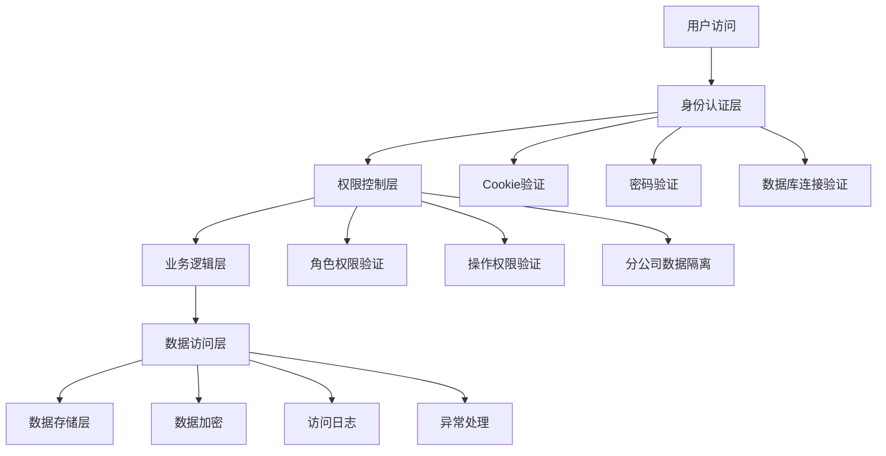

### 安全组件交互图

系统各安全组件之间的交互关系和数据流向如下所示：

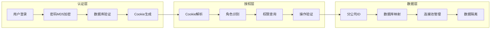

### 安全威胁模型

系统面临的主要安全威胁及对应防护措施：

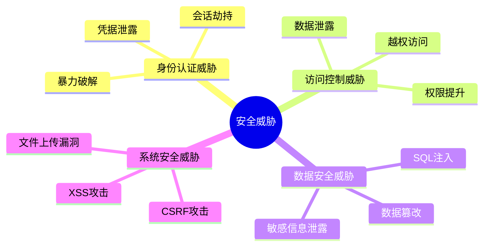

### 认证与授权流程

系统认证授权流程采用标准的"身份验证-权限分配-资源访问"模式，确保只有经过验证的用户才能访问相应资源。

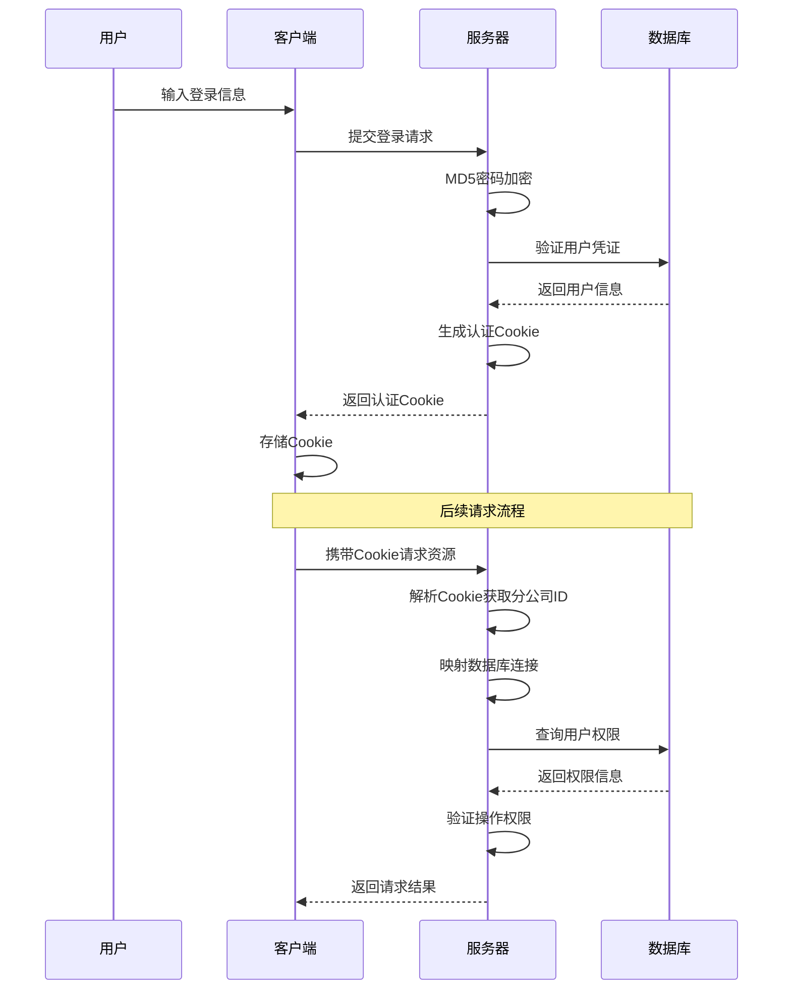

### 权限验证决策树

系统权限验证采用多层决策机制，确保访问控制的准确性：

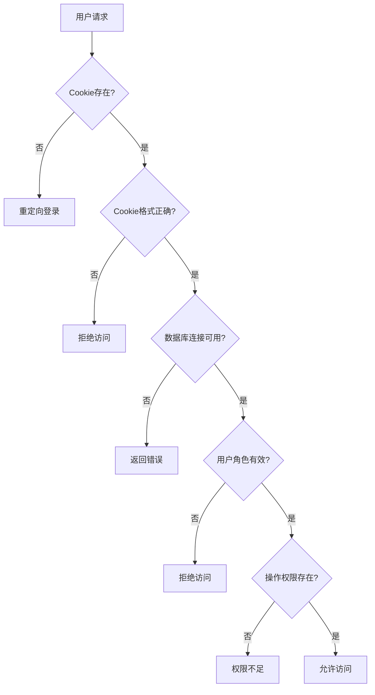

## 认证机制

### Cookie认证实现

HRMS系统采用基于Cookie的会话管理机制，通过自定义Cookie格式存储用户身份信息与权限数据。Cookie格式为：`角色_工号_分公司ID_员工姓名(base64编码)`，实现了用户身份与所属分公司的绑定。

**Cookie安全设计分析**：
- **数据结构**：采用下划线分隔的四段式结构，确保信息完整性和可解析性
- **编码方式**：员工姓名采用Base64编码，防止特殊字符导致的解析错误
- **时效性**：Cookie有效期设置为0，表示会话Cookie，浏览器关闭后自动失效
- **作用域**：设置为根路径"/"，确保在整个应用域内有效

在[`handler/account.go`](handler/account.go:149)中的登录实现展示了Cookie的生成过程：

```go
// set cookie user_cookie=角色_工号_分公司ID_员工姓名(base64编码)
c.SetCookie("user_cookie", fmt.Sprintf("%v_%v_%v_%v", loginDb.UserType, loginDb.StaffId, loginR.BranchId,
    base64.StdEncoding.EncodeToString([]byte(staff.StaffName))), 0, "/", "*", false, false)
```

**Cookie解析算法复杂度分析**：
- 时间复杂度：O(n)，其中n为Cookie字符串长度，主要来自字符串分割操作
- 空间复杂度：O(n)，需要存储分割后的字符串数组

系统在[`resource/resource.go`](resource/resource.go:30)中实现了Cookie解析与数据库连接映射，确保用户只能访问其所属分公司的数据：

```go
func HrmsDB(c *gin.Context) *gorm.DB {
    cookie, err := c.Cookie("user_cookie")
    if err != nil || cookie == "" {
        c.Abort()
        return nil
    }
    
    // 安全检查：确保cookie格式正确
    parts := strings.Split(cookie, "_")
    if len(parts) < 3 {
        log.Printf("HrmsDB: cookie格式错误，期望格式为 'xxx_xxx_xxx'，实际为: %s", cookie)
        c.Abort()
        return nil
    }
    
    branchId := parts[2]
    dbName := fmt.Sprintf("hrms_%v", branchId)
    if db, ok := DbMapper[dbName]; ok {
        return db
    }
    c.Abort()
    return nil
}
```

**数据库连接映射机制**：
- 使用Go语言的map数据结构实现分公司ID到数据库连接的映射
- 时间复杂度：O(1)，基于哈希表的查找操作
- 空间复杂度：O(m)，其中m为分公司数量
- 该设计确保了数据库连接的高效检索和分公司数据的安全隔离

### 密码安全策略

系统采用MD5哈希算法对用户密码进行加密存储，在[`service/biz.go`](service/biz.go:167)中实现了密码加密函数：

```go
func MD5(input string) string {
    data := []byte(input)
    md5Ctx := md5.New()
    md5Ctx.Write(data)
    cipherStr := md5Ctx.Sum(nil)
    return hex.EncodeToString(cipherStr)
}
```

**密码加密算法分析**：
- **哈希函数**：MD5产生128位(16字节)的哈希值，转换为32位十六进制字符串
- **时间复杂度**：O(n)，其中n为输入密码的长度
- **空间复杂度**：O(1)，固定大小的输出结果
- **安全性评估**：MD5算法存在碰撞攻击风险，建议升级为SHA-256或bcrypt等更安全的哈希算法

在登录验证过程中，系统对用户输入的密码进行MD5加密后与数据库存储的密码哈希值进行比对，确保密码安全性。

**密码验证流程**：
1. 接收用户输入的明文密码
2. 应用MD5哈希算法生成密码摘要
3. 从数据库查询存储的密码哈希值
4. 比较两个哈希值是否一致
5. 验证通过则建立会话，否则拒绝访问

**安全增强建议**：
- 实现密码盐值(Salt)机制，防止彩虹表攻击
- 采用迭代哈希算法，增加暴力破解难度
- 实现密码强度检查，强制用户使用复杂密码

## RBAC权限设计

### 角色体系架构

HRMS系统采用基于角色的访问控制(RBAC)模型，定义了三种核心用户角色，每种角色具有不同的系统访问权限：

1. **超级管理员(supersys)**：系统最高权限管理者，负责定义基本数据和管理所有部门信息
2. **系统管理员(sys)**：各部门人力资源专员，负责员工信息管理、薪资管理及信息发布
3. **普通员工(normal)**：各部门普通员工，可查看修改自身信息和公司通知

角色定义在[`static/api/user_type.json`](static/api/user_type.json:6)中明确描述：

```json
{
  "id": 1,
  "user_type_name": "超级管理员",
  "user_type": "supersys",
  "desc": "系统最高权限管理者，负责定义基本数据，以及所有部门、员工信息管理、密码管理和权限管理"
}
```

### RBAC模型关系图

系统RBAC模型的核心实体关系如下所示：

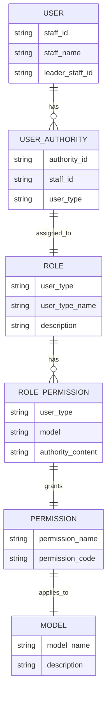

### 权限继承层次图

系统权限继承关系采用严格的层级结构，确保高级角色拥有低级角色的所有权限：

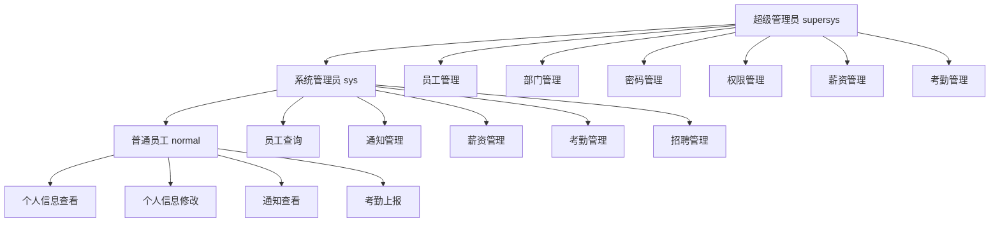

### 权限控制实现

系统通过[`authority_detail`](sql/sqlite_init.sql:31)表实现细粒度的权限控制，每个角色对应不同功能模块的权限集合：

```sql
CREATE TABLE `authority_detail` (
  `id` INTEGER PRIMARY KEY AUTOINCREMENT,
  `user_type` varchar(32) NOT NULL,
  `model` varchar(32) NOT NULL,
  `authority_content` varchar(32) NOT NULL,
  `name` varchar(32) NOT NULL
);
```

**权限数据模型分析**：
- **主键设计**：采用自增整数主键，确保权限记录的唯一性
- **角色关联**：user_type字段关联用户角色，实现角色-权限映射
- **模块划分**：model字段标识功能模块，实现模块化权限管理
- **权限编码**：authority_content字段采用位图模式的字符串编码，支持权限组合

权限内容采用"|"分隔的字符串格式，支持以下操作类型：
- **create**：创建资源权限
- **query**：查询/查看资源权限
- **update**：修改/编辑资源权限
- **delete**：删除资源权限
- **excel_add**：Excel导入权限

例如，超级管理员对员工管理的权限配置为：`create|delete|update|query`，表示拥有完整的CRUD操作权限。

**权限解析算法**：
```go
// 权限解析实现
autoMap := make(map[string]bool)
autoList := strings.Split(autoContent, "|")
for _, autority := range autoList {
    autoMap[autority] = true
}
```

**算法复杂度分析**：
- 时间复杂度：O(n)，其中n为权限字符串中"|"分隔符的数量
- 空间复杂度：O(n)，需要存储解析后的权限映射表
- 优化建议：考虑使用位运算替代字符串分割，提高权限检查效率

**权限继承机制**：
系统实现了隐式的权限继承关系，高级角色自动拥有低级角色的权限。权限继承层次为：supersys > sys > normal，这种设计简化了权限管理复杂度。

### 权限验证流程

系统在[`handler/account.go`](handler/account.go:53)中实现了权限渲染验证机制：

```go
func RenderAuthority(c *gin.Context) {
    cookie, err := c.Cookie("user_cookie")
    if err != nil || cookie == "" {
        HTMLWithNoCache(c, http.StatusOK, "login.html", nil)
        return
    }
    modelName := c.Param("modelName")
    userType := strings.Split(cookie, "_")[0]
    dto := &model.GetAuthorityDetailDTO{
        UserType: userType,
        Model:    modelName,
    }
    autoContent, err := service.GetAuthorityDetailByUserTypeAndModel(c, dto)
    if err != nil {
        HTMLWithNoCache(c, http.StatusOK, "login.html", nil)
        return
    }
    autoMap := make(map[string]bool)
    autoList := strings.Split(autoContent, "|")
    for _, autority := range autoList {
        autoMap[autority] = true
    }
    HTMLWithNoCache(c, http.StatusOK, modelName+".html", autoMap)
}
```

该机制确保用户只能访问其角色权限范围内的功能，前端根据权限映射控制页面元素的显示与隐藏。

## 数据安全

### 数据库隔离策略

HRMS系统采用分公司级别的数据隔离机制，每个分公司使用独立的数据库实例。系统通过Cookie中的分公司ID自动映射到对应的数据库连接，确保数据访问的安全性。

**多租户架构设计**：
系统采用"数据库分离"的多租户架构模式，每个分公司拥有独立的数据库实例，实现了最强的数据隔离级别。这种设计相比"共享数据库、模式分离"和"共享数据库、共享模式"提供了更高的安全性和性能。

**数据隔离层次分析**：
1. **物理隔离**：不同分公司的数据存储在不同的数据库文件中
2. **逻辑隔离**：通过数据库连接映射实现逻辑上的数据分离
3. **访问隔离**：用户只能访问其所属分公司的数据库连接

### 多租户架构对比图

不同多租户隔离级别的安全性和成本对比如下：

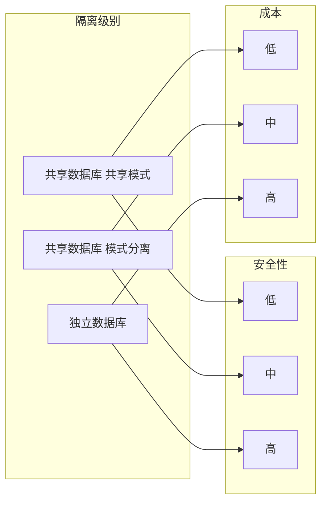

### 数据库连接映射流程

系统数据库连接映射的详细流程如下：

```mermaid
flowchart TD
    A[用户请求] --> B[解析Cookie获取分公司ID]
    B --> C[构造数据库名称 hrms_{branchId}]
    C --> D{数据库连接存在?}
    D -->|是| E[返回数据库连接]
    D -->|否| F[创建新的数据库连接]
    F --> G[添加到连接映射表]
    G --> E
    E --> H[执行数据库操作]
```

### 数据隔离安全机制

系统实现了多层次的数据隔离安全机制：

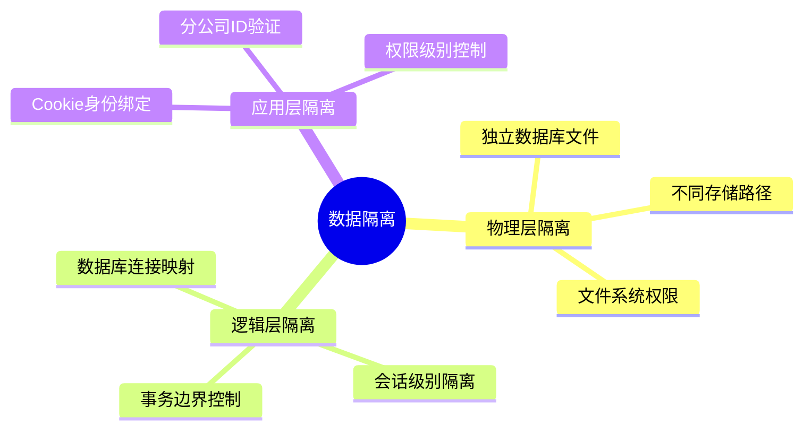

在[`main.go`](main.go:221)中实现了多数据库初始化逻辑：

```go
func InitGorm() error {
    // 对每个分公司数据库进行连接
    dbNames := resource.HrmsConf.Db.DbName
    dbNameList := strings.Split(dbNames, ",")
    
    for index, dbName := range dbNameList {
        // 根据数据库类型选择不同的连接方式
        switch dbType {
        case "sqlite":
            // SQLite 连接实现
            dbPath := filepath.Join(".", "data", dbName+".db")
            db, err = gorm.Open(sqlite.Dialector{
                DriverName: "sqlite",
                DSN:        dbPath + "?_pragma=foreign_keys(1)",
            }, &gorm.Config{...})
        default:
            // MySQL 连接实现
            dsn := fmt.Sprintf("%v:%v@tcp(%v:%v)/%v?charset=utf8mb4&parseTime=True&loc=Local", ...)
            db, err = gorm.Open(mysql.Open(dsn), &gorm.Config{...})
        }
        
        // 添加到映射表中
        resource.DbMapper[dbName] = db
    }
}
```

**数据库连接池管理**：
- **连接复用**：同一分公司的多个请求共享数据库连接，提高资源利用率
- **连接池配置**：通过GORM框架的默认连接池管理数据库连接
- **并发安全**：使用map结构存储数据库连接，需要考虑并发访问的安全性

**数据库连接映射算法**：
```go
// 数据库连接查找实现
branchId := parts[2]
dbName := fmt.Sprintf("hrms_%v", branchId)
if db, ok := DbMapper[dbName]; ok {
    return db
}
```

**算法性能分析**：
- 时间复杂度：O(1)，基于哈希表的常数时间查找
- 空间复杂度：O(m)，其中m为分公司数量
- 扩展性：支持动态添加新的分公司数据库连接

**数据一致性保障**：
系统通过外键约束(`_pragma=foreign_keys(1)`)确保数据引用完整性，防止数据不一致问题。每个分公司的数据库独立管理，避免了跨分公司的数据冲突。

### 敏感数据保护

系统对用户密码等敏感信息采用MD5哈希加密存储，避免明文保存带来的安全风险。在[`handler/password.go`](handler/password.go:112)中实现了密码修改时的加密处理：

```go
password := service.MD5(passwordEditDTO.Password)
db := resource.HrmsDB(c)
if db == nil {
    c.JSON(http.StatusUnauthorized, gin.H{"status": 401, "message": "Unauthorized"})
    return
}
if err := db.Where("staff_id = ?", staffId).Updates(&model.Authority{
    UserPassword: password,
}).Error; err != nil {
    // 错误处理
}
```

### 数据访问安全

系统在所有数据访问操作前都进行数据库连接验证，确保用户只能访问其所属分公司的数据。在[`service/authority.go`](service/authority.go:11)中的权限服务实现展示了这一安全机制：

```go
func AddAuthorityDetail(c *gin.Context, dto *model.AddAuthorityDetailDTO) error {
    var detail model.AuthorityDetail
    Transfer(&dto, &detail)
    db := resource.HrmsDB(c)
    if db == nil {
        log.Printf("AddAuthorityDetail: 数据库连接为空，鉴权失败")
        return resource.ErrUnauthorized // 返回鉴权失败错误
    }
    if err := db.Create(&detail).Error; err != nil {
        log.Printf("AddAuthorityDetail err = %v", err)
        return err
    }
    return nil
}
```

## 访问控制

### 多层访问控制架构

HRMS系统实现了多层次的访问控制机制，包括网络访问控制、应用层权限控制、数据行级安全和分公司数据隔离。这种多层防护架构确保了系统安全性，符合深度防御的安全设计原则。

1. **网络访问控制**：通过Gin框架的路由机制实现URL级别的访问控制
2. **应用层权限控制**：基于角色和权限的功能点访问控制
3. **数据行级安全**：通过数据库连接映射实现分公司级别的数据隔离
4. **操作级控制**：针对具体操作的细粒度权限验证

### 访问控制决策流程

系统访问控制的完整决策流程如下：

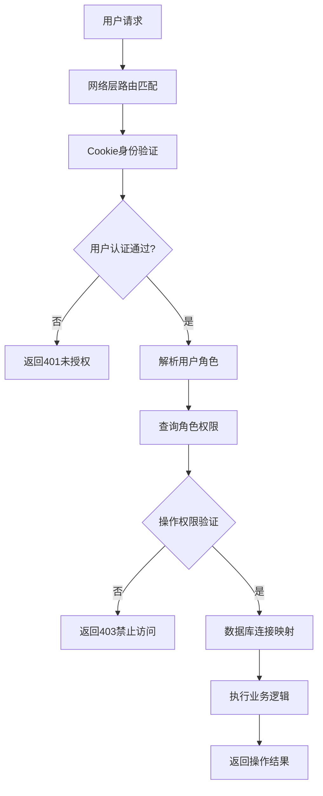

### 路由权限控制

系统在[`main.go`](main.go:74)中定义了完整的路由体系，每个功能模块都实现了相应的权限控制：

```go
// 账户相关
accountGroup := server.Group("/account")
accountGroup.POST("/login", handler.Login)
accountGroup.POST("/quit", handler.Quit)

// 授权信息相关
authorityGroup := server.Group("/authority")
authorityGroup.POST("/create", handler.AddAuthorityDetail)
authorityGroup.POST("/edit", handler.UpdateAuthorityDetailById)
authorityGroup.GET("/query_by_user_type/:user_type", handler.GetAuthorityDetailListByUserType)
```

### 权限验证中间件

系统实现了权限验证中间件，对所有需要权限控制的路由进行统一验证：

```go
// 权限验证中间件示例
func AuthMiddleware(requiredPermission string) gin.HandlerFunc {
    return func(c *gin.Context) {
        // 获取用户Cookie
        cookie, err := c.Cookie("user_cookie")
        if err != nil {
            c.JSON(http.StatusUnauthorized, gin.H{"error": "未授权访问"})
            c.Abort()
            return
        }
        
        // 解析用户角色和权限
        userType := strings.Split(cookie, "_")[0]
        permissions := getUserPermissions(userType)
        
        // 验证权限
        if !hasPermission(permissions, requiredPermission) {
            c.JSON(http.StatusForbidden, gin.H{"error": "权限不足"})
            c.Abort()
            return
        }
        
        c.Next()
    }
}
```

### 前端权限渲染

系统通过动态权限渲染机制，根据用户权限控制前端页面元素的显示与隐藏。在权限验证成功后，系统会将权限信息传递给前端模板，前端根据权限映射控制UI元素的可见性。

```javascript
// 前端权限控制示例
if (authority.create) {
    $("#createBtn").show();
} else {
    $("#createBtn").hide();
}

// 更复杂的权限控制示例
function renderPageByPermissions(permissions) {
    // 根据权限动态渲染页面元素
    if (permissions.includes('staff_manage')) {
        renderStaffManagementModule();
    }
    
    if (permissions.includes('salary_manage')) {
        renderSalaryManagementModule();
    }
    
    // 根据具体操作权限控制按钮显示
    if (permissions.includes('create')) {
        $(".create-btn").removeClass('hidden');
    } else {
        $(".create-btn").addClass('hidden');
    }
}
```

### 分公司数据隔离

系统通过数据库连接映射实现分公司级别的数据隔离，确保不同分公司的数据完全隔离。每个用户只能访问其所属分公司的数据，有效防止了数据泄露风险。

**数据隔离实现示例**：
```go
// 数据访问时的分公司隔离
func GetStaffByDepartment(c *gin.Context, departmentId string) ([]model.Staff, error) {
    // 自动获取用户所属分公司的数据库连接
    db := resource.HrmsDB(c)
    if db == nil {
        return nil, resource.ErrUnauthorized
    }
    
    var staffList []model.Staff
    // 查询当前分公司的员工数据
    err := db.Where("dep_id = ?", departmentId).Find(&staffList).Error
    return staffList, err
}
```

## 安全审计

### 操作日志记录

系统在关键操作点实现了日志记录机制，记录用户的重要操作行为。日志内容包括操作时间、操作用户、操作类型和相关数据，为安全审计提供依据。

```go
log.Printf("[handler.Login] user login success, user = %v", loginR)
log.Printf("[AddAuthorityDetail] err = %v", err)
```

### 安全审计系统架构

系统安全审计的整体架构如下：

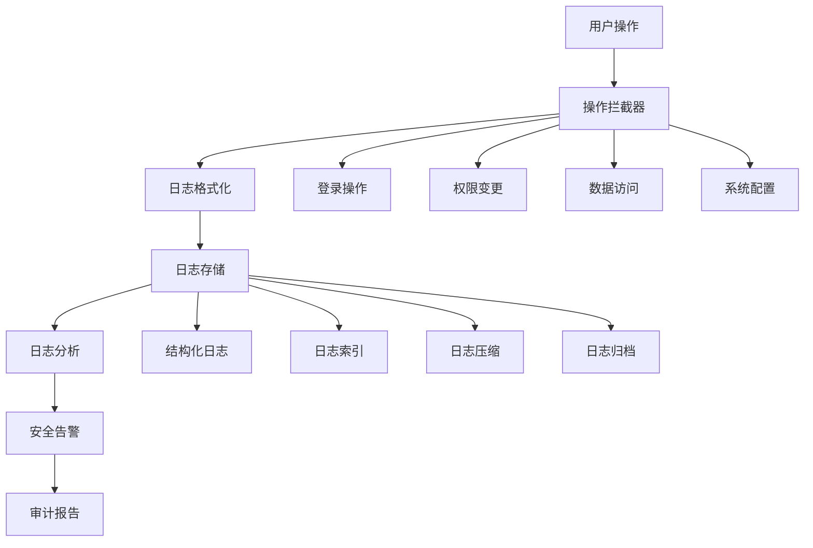

### 日志记录实现

系统实现了结构化的日志记录机制，便于后续的审计分析：

```go
// 安全日志记录结构
type SecurityLog struct {
    Timestamp   time.Time `json:"timestamp"`
    UserID      string    `json:"user_id"`
    UserName    string    `json:"user_name"`
    Action      string    `json:"action"`
    Resource    string    `json:"resource"`
    IPAddress   string    `json:"ip_address"`
    UserAgent   string    `json:"user_agent"`
    Success     bool      `json:"success"`
    Description string    `json:"description"`
}

// 记录安全日志
func LogSecurityEvent(c *gin.Context, action, resource, description string, success bool) {
    cookie, _ := c.Cookie("user_cookie")
    userType := strings.Split(cookie, "_")[0]
    userID := strings.Split(cookie, "_")[1]
    
    log := SecurityLog{
        Timestamp:   time.Now(),
        UserID:      userID,
        UserAgent:   c.GetHeader("User-Agent"),
        Action:      action,
        Resource:    resource,
        IPAddress:   c.ClientIP(),
        Success:     success,
        Description: description,
    }
    
    // 将日志写入文件或数据库
    saveSecurityLog(log)
}
```

### 异常处理机制

系统实现了完善的异常处理机制，对安全相关的异常进行了特殊处理：

1. **认证失败**：当Cookie无效或过期时，系统会重定向到登录页面
2. **权限不足**：当用户尝试访问超出权限的资源时，系统返回401未授权错误
3. **数据库连接失败**：当无法获取到用户所属分公司的数据库连接时，系统拒绝访问

在[`resource/resource.go`](resource/resource.go:14)中定义了标准的鉴权失败错误：

```go
var ErrUnauthorized = errors.New("unauthorized")
```

### 安全监控点

系统在以下关键点实现了安全监控：

1. **用户登录**：记录登录成功和失败事件
2. **权限变更**：记录权限分配和修改操作
3. **敏感数据访问**：记录对敏感数据的访问操作
4. **异常操作**：记录异常或可疑的操作行为

### 安全事件检测

系统实现了基本的安全事件检测机制：

```go
// 异常登录检测
func detectAbnormalLogin(userID string, ipAddress string) bool {
    // 检查最近登录记录
    recentLogins := getRecentLogins(userID, 24*time.Hour)
    
    // 检测异常IP
    knownIPs := getKnownIPs(userID)
    if !contains(knownIPs, ipAddress) {
        return true
    }
    
    // 检测频繁登录
    if len(recentLogins) > 10 {
        return true
    }
    
    return false
}

// 权限提升检测
func detectPrivilegeEscalation(userID string, requestedPermission string) bool {
    userPermissions := getUserPermissions(userID)
    
    // 检查是否请求了超出用户角色的权限
    if !isPermissionAllowedForRole(userPermissions, requestedPermission) {
        return true
    }
    
    return false
}
```

## 安全最佳实践

### 密码安全建议

1. **密码复杂度**：建议用户使用包含大小写字母、数字和特殊字符的复杂密码
2. **密码定期更换**：建议定期更换密码，提高账户安全性
3. **密码存储**：系统已采用MD5加密存储密码，建议未来升级为更安全的哈希算法

**密码强度检查实现示例**：
```go
func validatePasswordStrength(password string) error {
    if len(password) < 8 {
        return errors.New("密码长度不能少于8位")
    }
    
    hasLower := regexp.MustCompile(`[a-z]`).MatchString(password)
    hasUpper := regexp.MustCompile(`[A-Z]`).MatchString(password)
    hasNumber := regexp.MustCompile(`[0-9]`).MatchString(password)
    hasSpecial := regexp.MustCompile(`[!@#$%^&*(),.?":{}|<>]`).MatchString(password)
    
    if !(hasLower && hasUpper && hasNumber && hasSpecial) {
        return errors.New("密码必须包含大小写字母、数字和特殊字符")
    }
    
    return nil
}
```

### 会话安全建议

1. **Cookie安全**：当前Cookie设置中`secure`和`httpOnly`参数为false，建议在生产环境中启用
2. **会话超时**：建议设置合理的会话超时时间，避免长期未操作的会话被恶意利用
3. **并发会话控制**：建议实现同一用户并发会话数量限制

**安全Cookie设置示例**：
```go
// 生产环境安全Cookie设置
c.SetCookie("user_cookie", cookieValue, 3600, "/", "yourdomain.com", true, true)
// 参数说明：
// maxAge: 3600秒(1小时)后过期
// path: "/"整个域名下有效
// domain: 限制为特定域名
// secure: true仅通过HTTPS传输
// httpOnly: true防止JavaScript访问
```

### 权限管理建议

1. **最小权限原则**：用户应只被授予完成其工作所需的最小权限
2. **权限定期审查**：建议定期审查用户权限，及时撤销不再需要的权限
3. **权限变更记录**：所有权限变更操作都应记录审计日志

**权限审查实现示例**：
```go
// 权限审查定期任务
func reviewUserPermissions() {
    // 获取所有用户权限
    users := getAllUsers()
    
    for _, user := range users {
        // 检查权限是否过多
        if hasExcessivePermissions(user) {
            // 记录安全警告
            logSecurityWarning(user.ID, "权限过多")
        }
        
        // 检查长期未使用的权限
        unusedPermissions := getUnusedPermissions(user.ID, 90*24*time.Hour)
        if len(unusedPermissions) > 0 {
            // 建议撤销未使用权限
            suggestPermissionRevocation(user.ID, unusedPermissions)
        }
    }
}
```

### 数据安全建议

1. **数据备份**：建议定期备份数据库，防止数据丢失
2. **数据传输加密**：建议在生产环境中使用HTTPS加密数据传输
3. **敏感数据脱敏**：对日志和导出数据中的敏感信息进行脱敏处理

**数据脱敏实现示例**：
```go
// 敏感数据脱敏函数
func maskSensitiveData(data interface{}) interface{} {
    switch v := data.(type) {
    case string:
        if isIDCardNumber(v) {
            return maskIDCard(v)
        } else if isPhoneNumber(v) {
            return maskPhoneNumber(v)
        } else if isBankCard(v) {
            return maskBankCard(v)
        }
    case map[string]interface{}:
        for key, value := range v {
            if isSensitiveField(key) {
                v[key] = maskSensitiveData(value)
            }
        }
    }
    return data
}

// 身份证号脱敏
func maskIDCard(idCard string) string {
    if len(idCard) < 8 {
        return "********"
    }
    return idCard[:4] + "********" + idCard[len(idCard)-4:]
}
```

## 常见安全问题

### 跨站脚本攻击(XSS)防护

系统当前未实现输入数据的XSS过滤，建议在用户输入处理中添加XSS防护机制，特别是在富文本内容处理中。

**XSS防护实现示例**：
```go
import "github.com/microcosm-cc/bluemonday"

// HTML内容过滤
func sanitizeHTML(input string) string {
    // 创建严格的HTML策略
    p := bluemonday.StrictPolicy()
    
    // 允许的基本标签
    p.AllowElements("p", "br", "strong", "em")
    
    // 清理输入内容
    return p.Sanitize(input)
}

// 输出编码
func htmlEscape(input string) string {
    return html.EscapeString(input)
}
```

### SQL注入防护

系统使用GORM框架进行数据库操作，GORM已提供基本的SQL注入防护。但建议在自定义SQL查询中使用参数化查询，避免SQL注入风险。

**安全查询实现示例**：
```go
// 不安全的查询方式（易受SQL注入）
func unsafeQuery(userID string) {
    query := fmt.Sprintf("SELECT * FROM users WHERE id = '%s'", userID)
    db.Raw(query) // 危险！
}

// 安全的参数化查询
func safeQuery(userID string) {
    db.Where("id = ?", userID).First(&user) // 安全
}

// 复杂查询的安全实现
func complexSafeQuery(name string, age int) {
    db.Where("name = ? AND age > ?", name, age).Find(&users)
}
```

### 跨站请求伪造(CSRF)防护

系统当前未实现CSRF令牌验证机制，建议在关键操作中添加CSRF防护，防止跨站请求伪造攻击。

**CSRF防护实现示例**：
```go
// CSRF中间件
func CSRFMiddleware() gin.HandlerFunc {
    return func(c *gin.Context) {
        if c.Request.Method != "GET" {
            token := c.GetHeader("X-CSRF-Token")
            sessionToken := getSessionCSRFToken(c)
            
            if token == "" || token != sessionToken {
                c.JSON(http.StatusForbidden, gin.H{"error": "CSRF令牌无效"})
                c.Abort()
                return
            }
        }
        c.Next()
    }
}

// 生成CSRF令牌
func generateCSRFToken() string {
    b := make([]byte, 32)
    rand.Read(b)
    return hex.EncodeToString(b)
}
```

### 文件上传安全

系统支持文件上传功能，建议实现文件类型检查、文件大小限制和病毒扫描等安全措施，防止恶意文件上传。

**安全文件上传实现示例**：
```go
// 安全文件上传处理
func secureFileUpload(c *gin.Context) error {
    file, header, err := c.Request.FormFile("file")
    if err != nil {
        return err
    }
    defer file.Close()
    
    // 文件大小检查
    if header.Size > 10*1024*1024 { // 10MB限制
        return errors.New("文件大小超过限制")
    }
    
    // 文件类型检查
    allowedTypes := []string{"image/jpeg", "image/png", "application/pdf"}
    fileType := header.Header.Get("Content-Type")
    if !contains(allowedTypes, fileType) {
        return errors.New("不支持的文件类型")
    }
    
    // 文件扩展名检查
    ext := filepath.Ext(header.Filename)
    allowedExts := []string{".jpg", ".jpeg", ".png", ".pdf"}
    if !contains(allowedExts, ext) {
        return errors.New("不支持的文件扩展名")
    }
    
    // 生成安全的文件名
    fileName := generateSecureFileName(header.Filename)
    
    // 保存文件
    return c.SaveUploadedFile(header, fmt.Sprintf("./uploads/%s", fileName)
}
```

## 安全扩展建议

### 多因素认证

建议实现多因素认证机制，如短信验证码、邮箱验证或身份验证器应用，提高账户安全性。

**多因素认证实现示例**：
```go
// TOTP二次验证
func enableTOTP(userID string) (string, error) {
    // 生成密钥
    key, err := totp.Generate(totp.GenerateOpts{
        Issuer:      "HRMS系统",
        AccountName: getUserEmail(userID),
    })
    if err != nil {
        return "", err
    }
    
    // 保存密钥到数据库
    saveTOTPSecret(userID, key.Secret())
    
    // 返回二维码URL
    return key.URL(), nil
}

// 验证TOTP
func verifyTOTP(userID, token string) bool {
    secret := getTOTPSecret(userID)
    return totp.Validate(token, secret)
}
```

### 单点登录(SSO)

对于企业级应用，建议实现单点登录机制，简化用户登录流程的同时提高安全性。

**SSO实现流程**：
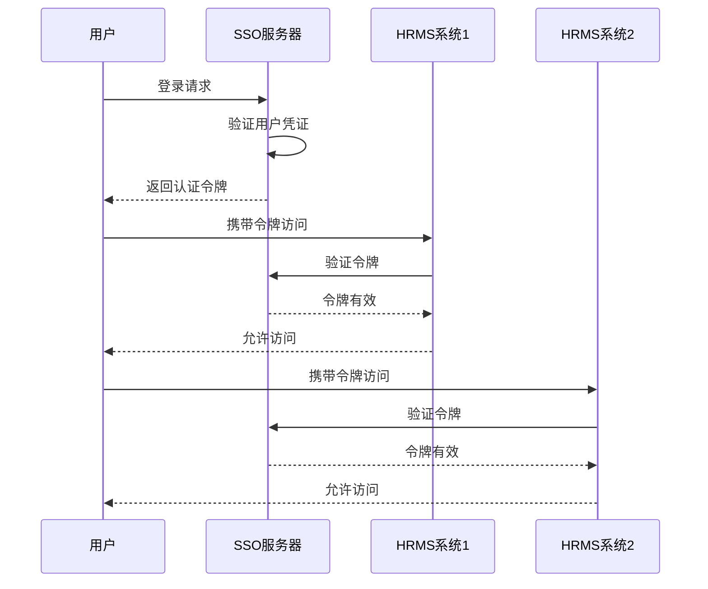

### 数据加密

建议对敏感数据字段进行加密存储，如身份证号、银行卡号等个人信息，进一步提高数据安全性。

**字段级加密实现示例**：
```go
// AES加密工具
type AESEncryption struct {
    key []byte
}

func NewAESEncryption(key string) *AESEncryption {
    hash := sha256.Sum256([]byte(key))
    return &AESEncryption{key: hash[:]}
}

func (a *AESEncryption) Encrypt(plaintext string) (string, error) {
    block, err := aes.NewCipher(a.key)
    if err != nil {
        return "", err
    }
    
    gcm, err := cipher.NewGCM(block)
    if err != nil {
        return "", err
    }
    
    nonce := make([]byte, gcm.NonceSize())
    if _, err = io.ReadFull(rand.Reader, nonce); err != nil {
        return "", err
    }
    
    ciphertext := gcm.Seal(nonce, nonce, []byte(plaintext), nil)
    return base64.StdEncoding.EncodeToString(ciphertext), nil
}

// 敏感数据模型
type SensitiveData struct {
    ID           string `gorm:"primaryKey"`
    EncryptedIDCard string `gorm:"column:encrypted_id_card"`
    EncryptedPhone  string `gorm:"column:encrypted_phone"`
    // 其他字段...
}

// 加密存储敏感数据
func (s *SensitiveData) BeforeSave() error {
    if s.EncryptedIDCard != "" {
        encrypted, err := encryption.Encrypt(s.EncryptedIDCard)
        if err != nil {
            return err
        }
        s.EncryptedIDCard = encrypted
    }
    return nil
}
```

### 安全审计系统

建议构建完整的安全审计系统，实现安全事件的实时监控、告警和分析功能。

**安全审计系统架构**：
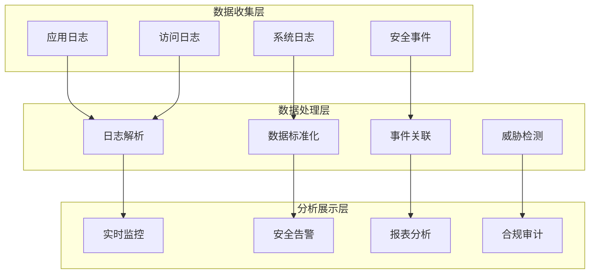

**实时威胁检测实现示例**：
```go
// 异常行为检测
func detectAnomalousBehavior(userID string) {
    recentActivities := getRecentActivities(userID, 24*time.Hour)
    
    // 检测异常登录地点
    if hasUnusualLocation(recentActivities) {
        triggerSecurityAlert("异常登录地点", userID)
    }
    
    // 检测异常访问时间
    if hasUnusualAccessTime(recentActivities) {
        triggerSecurityAlert("异常访问时间", userID)
    }
    
    // 检测批量操作
    if hasBulkOperations(recentActivities) {
        triggerSecurityAlert("批量操作检测", userID)
    }
}

// 安全告警处理
func triggerSecurityAlert(alertType, userID string) {
    alert := SecurityAlert{
        Type:      alertType,
        UserID:    userID,
        Timestamp: time.Now(),
        Severity:  calculateSeverity(alertType),
    }
    
    // 记录告警
    saveSecurityAlert(alert)
    
    // 发送通知
    sendSecurityNotification(alert)
    
    // 自动响应
    autoResponse(alert)
}
```

## 总结

HRMS系统通过基于角色的权限控制、Cookie认证机制、数据隔离策略和多层访问控制，构建了相对完善的安全防护体系。系统在认证授权、数据保护和访问控制方面实现了核心安全功能，为企业人力资源数据提供了基本安全保障。

然而，系统在密码加密算法、Cookie安全设置、XSS/CSRF防护等方面仍有改进空间。建议按照本文档提出的安全建议，逐步完善系统的安全机制，提高整体安全防护能力。